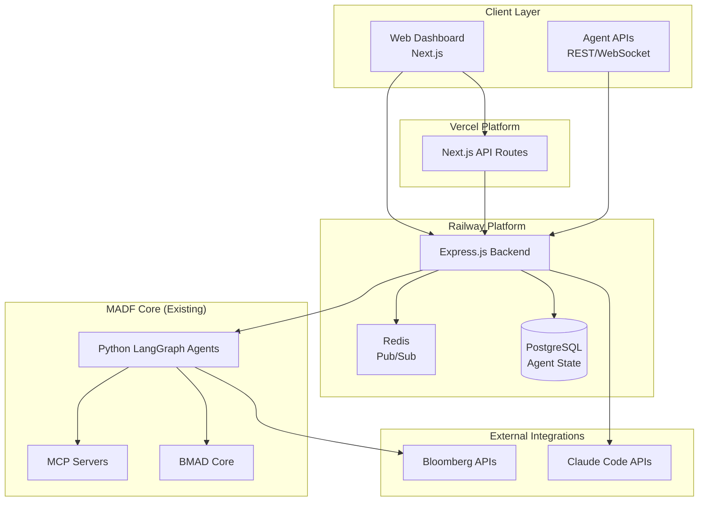

# MADF Fullstack Architecture Document

## Introduction

This document outlines the complete fullstack architecture for MADF (Multi-Agent Development Framework), including backend systems, frontend implementation, and their integration. It serves as the single source of truth for AI-driven development, ensuring consistency across the entire technology stack.

This unified approach combines what would traditionally be separate backend and frontend architecture documents, streamlining the development process for modern fullstack applications where these concerns are increasingly intertwined.

### Starter Template or Existing Project

Based on reviewing the project structure, this is primarily a **Node.js-based Multi-Agent Development Framework** with an existing codebase that includes:

- Python components (LangGraph, multi-agent systems)
- Node.js infrastructure (MCP integration, Claude Code tooling)
- Complex agent orchestration system
- Bloomberg/financial data integration capabilities

**Decision**: This is an **extension/enhancement project** rather than greenfield, building upon the existing MADF foundation with a focus on creating a fullstack interface for agent management and orchestration.

**Constraints Imposed**:
- Must integrate with existing Python LangGraph agents
- Must preserve current MCP server infrastructure
- Must work within Node.js + TypeScript ecosystem
- Must support real-time agent communication and status monitoring

### Change Log

| Date | Version | Description | Author |
|------|---------|-------------|---------|
| 2025-01-23 | 1.0 | Initial fullstack architecture for MADF PM handoff | Winston (Architect) |

## High Level Architecture

### Technical Summary

The MADF fullstack architecture implements a **hybrid agent orchestration platform** combining real-time web interfaces with programmatic API access. The system uses **Next.js with TypeScript** for the frontend dashboard, **Node.js Express APIs** for agent coordination, and integrates with existing **Python LangGraph agents** via IPC and message queues. **PostgreSQL** serves as the primary data store for agent state and execution history, while **Redis** handles real-time pub/sub for live agent communication. The platform deploys on **Vercel** for the web interface with **Railway** hosting the backend services, enabling both human oversight and autonomous agent-to-agent coordination within the existing MADF ecosystem.

### Platform and Infrastructure Choice

**Option 1: Vercel + Railway (Recommended)**
- **Pros**: Excellent Next.js integration, separate scaling for backend services, good pricing for startups
- **Cons**: Vendor lock-in, limited backend compute options

**Option 2: AWS Full Stack (Lambda + ECS)**
- **Pros**: Enterprise scale, comprehensive services, existing Python Lambda support
- **Cons**: Higher complexity, cost overhead for smaller workloads

**Option 3: Self-hosted (Digital Ocean + Docker)**
- **Pros**: Full control, cost-effective at scale
- **Cons**: DevOps overhead, less managed services

**Recommendation: Vercel + Railway** - Optimal for rapid development with existing Node.js/Python hybrid architecture, provides necessary real-time capabilities for agent monitoring.

**Platform:** Vercel (Frontend) + Railway (Backend Services)
**Key Services:** Next.js App Router, Express.js APIs, PostgreSQL, Redis, Docker containers
**Deployment Host and Regions:** US-East (Vercel), US-West (Railway) for latency optimization

### Repository Structure

For MADF's complex multi-language, multi-agent architecture, a **monorepo with workspaces** is essential to manage shared types between frontend, backend, and Python agents.

**Structure:** Monorepo with npm workspaces
**Monorepo Tool:** npm workspaces (lightweight, built-in)
**Package Organization:** Apps (web, api) + Packages (shared types, utilities) + Integration layer for Python agents

### High Level Architecture Diagram



### Architectural Patterns

- **Event-Driven Architecture:** Real-time agent state updates via Redis pub/sub - _Rationale:_ Essential for monitoring distributed agent execution and providing live dashboard updates
- **Microservices with Shared Data:** Independent web and API services sharing PostgreSQL - _Rationale:_ Allows independent scaling while maintaining data consistency for agent coordination
- **Backend for Frontend (BFF):** Next.js API routes for dashboard-specific data aggregation - _Rationale:_ Optimizes frontend performance while keeping complex logic in dedicated backend services
- **Adapter Pattern:** Node.js wrappers for Python agent communication - _Rationale:_ Bridges language boundaries without requiring Python rewrite of existing LangGraph agents
- **Repository Pattern:** Abstracted data access for agent state management - _Rationale:_ Enables testing and future database migration flexibility for rapidly evolving agent schemas

## Tech Stack

### Technology Stack Table

| Category | Technology | Version | Purpose | Rationale |
|----------|------------|---------|---------|-----------|
| Frontend Language | TypeScript | 5.3+ | Type-safe frontend development | Shared types with backend, existing MADF codebase uses TS |
| Frontend Framework | Next.js | 14.x | React-based fullstack framework | App Router for modern routing, built-in API routes, Vercel optimization |
| UI Component Library | Shadcn/ui | Latest | Accessible component system | Tailwind-based, highly customizable, excellent TypeScript support |
| State Management | Zustand | 4.x | Lightweight client state | Simpler than Redux, perfect for agent dashboard state management |
| Backend Language | Node.js | 20.x LTS | Server-side JavaScript runtime | Consistency with existing MADF infrastructure |
| Backend Framework | Express.js | 4.x | Web application framework | Battle-tested, extensive middleware ecosystem, existing team knowledge |
| API Style | REST + WebSocket | - | HTTP APIs + real-time communication | REST for CRUD operations, WebSocket for live agent status updates |
| Database | PostgreSQL | 15.x | Primary data store | ACID compliance for agent state, JSON support for flexible schemas |
| Cache | Redis | 7.x | In-memory data structure store | Pub/sub for real-time updates, session storage, agent communication queue |
| File Storage | Vercel Blob | Latest | Static asset storage | Integrated with Vercel deployment, CDN distribution |
| Authentication | NextAuth.js | 5.x | Authentication framework | OAuth providers, session management, Next.js integration |
| Frontend Testing | Vitest + Testing Library | Latest | Unit and integration testing | Faster than Jest, excellent TypeScript support |
| Backend Testing | Jest + Supertest | Latest | API testing framework | Mature ecosystem, excellent Express.js integration |
| E2E Testing | Playwright | Latest | End-to-end browser testing | Cross-browser support, excellent debugging tools |
| Build Tool | Next.js | 14.x | Frontend build system | Integrated build, optimization, and deployment |
| Bundler | Turbopack | Latest | Fast bundling for development | Next.js 14 default, significant speed improvements |
| IaC Tool | Railway CLI | Latest | Infrastructure deployment | Simple container deployment, database provisioning |
| CI/CD | GitHub Actions | Latest | Automated testing and deployment | Free for public repos, excellent ecosystem integration |
| Monitoring | Vercel Analytics + Sentry | Latest | Performance and error tracking | Built-in performance monitoring, comprehensive error tracking |
| Logging | Pino | Latest | Structured logging | High-performance JSON logging, excellent Node.js integration |
| CSS Framework | Tailwind CSS | 3.x | Utility-first CSS framework | Rapid styling, excellent component library integration |

## Data Models

### Agent

**Purpose:** Represents individual AI agents within the MADF ecosystem, tracking their configuration, capabilities, and runtime status.

**Key Attributes:**
- id: string - Unique identifier for the agent
- name: string - Human-readable agent name
- type: AgentType - Classification (architect, pm, dev, etc.)
- status: AgentStatus - Current operational state
- capabilities: string[] - List of supported operations
- config: AgentConfig - Agent-specific configuration
- createdAt: Date - Creation timestamp
- updatedAt: Date - Last modification timestamp

#### TypeScript Interface
```typescript
interface Agent {
  id: string;
  name: string;
  type: AgentType;
  status: AgentStatus;
  capabilities: string[];
  config: AgentConfig;
  metadata: Record<string, any>;
  createdAt: Date;
  updatedAt: Date;
}

enum AgentType {
  ARCHITECT = 'architect',
  PM = 'pm',
  DEVELOPER = 'developer',
  QA = 'qa',
  RESEARCHER = 'researcher'
}

enum AgentStatus {
  IDLE = 'idle',
  ACTIVE = 'active',
  BUSY = 'busy',
  ERROR = 'error',
  OFFLINE = 'offline'
}
```

#### Relationships
- Has many ExecutionSessions (one-to-many)
- Has many TaskAssignments (one-to-many)
- Belongs to Projects (many-to-many through ProjectAgents)

### ExecutionSession

**Purpose:** Tracks individual agent execution instances, including input/output, duration, and resource usage for monitoring and debugging.

**Key Attributes:**
- id: string - Unique session identifier
- agentId: string - Reference to executing agent
- taskId: string - Associated task identifier
- status: SessionStatus - Current execution state
- input: any - Initial task parameters
- output: any - Execution results
- startTime: Date - Session start timestamp
- endTime: Date - Session completion timestamp
- duration: number - Execution time in milliseconds

#### TypeScript Interface
```typescript
interface ExecutionSession {
  id: string;
  agentId: string;
  taskId: string;
  status: SessionStatus;
  input: Record<string, any>;
  output: Record<string, any>;
  logs: LogEntry[];
  metrics: SessionMetrics;
  startTime: Date;
  endTime?: Date;
  duration?: number;
}

enum SessionStatus {
  PENDING = 'pending',
  RUNNING = 'running',
  COMPLETED = 'completed',
  FAILED = 'failed',
  CANCELLED = 'cancelled'
}

interface SessionMetrics {
  tokensUsed: number;
  apiCalls: number;
  memoryUsage: number;
  cpuTime: number;
}
```

#### Relationships
- Belongs to Agent (many-to-one)
- Belongs to Task (many-to-one)
- Has many LogEntries (one-to-many)

### Task

**Purpose:** Represents work units assigned to agents, containing requirements, dependencies, and completion criteria for project execution.

**Key Attributes:**
- id: string - Unique task identifier
- title: string - Task description
- description: string - Detailed requirements
- priority: TaskPriority - Urgency level
- status: TaskStatus - Current completion state
- assignedAgentId: string - Responsible agent
- dependencies: string[] - Required prerequisite tasks
- estimatedDuration: number - Expected completion time
- actualDuration: number - Real completion time

#### TypeScript Interface
```typescript
interface Task {
  id: string;
  title: string;
  description: string;
  priority: TaskPriority;
  status: TaskStatus;
  assignedAgentId?: string;
  projectId: string;
  dependencies: string[];
  deliverables: string[];
  estimatedDuration?: number;
  actualDuration?: number;
  createdAt: Date;
  updatedAt: Date;
  completedAt?: Date;
}

enum TaskPriority {
  LOW = 'low',
  MEDIUM = 'medium',
  HIGH = 'high',
  CRITICAL = 'critical'
}

enum TaskStatus {
  BACKLOG = 'backlog',
  TODO = 'todo',
  IN_PROGRESS = 'in_progress',
  REVIEW = 'review',
  COMPLETED = 'completed',
  BLOCKED = 'blocked'
}
```

#### Relationships
- Belongs to Project (many-to-one)
- Assigned to Agent (many-to-one)
- Has many ExecutionSessions (one-to-many)
- Self-referential dependencies (many-to-many)

### Project

**Purpose:** Container for related tasks and agent assignments, providing organizational structure and resource allocation for development initiatives.

**Key Attributes:**
- id: string - Unique project identifier
- name: string - Project title
- description: string - Project overview
- status: ProjectStatus - Current project state
- ownerId: string - Project manager/owner
- budget: number - Allocated resources
- deadline: Date - Target completion date

#### TypeScript Interface
```typescript
interface Project {
  id: string;
  name: string;
  description: string;
  status: ProjectStatus;
  ownerId: string;
  budget?: number;
  deadline?: Date;
  technologies: string[];
  repositories: string[];
  createdAt: Date;
  updatedAt: Date;
}

enum ProjectStatus {
  PLANNING = 'planning',
  ACTIVE = 'active',
  ON_HOLD = 'on_hold',
  COMPLETED = 'completed',
  CANCELLED = 'cancelled'
}
```

#### Relationships
- Has many Tasks (one-to-many)
- Has many ProjectAgents (one-to-many)
- Owned by User (many-to-one)

## API Specification

### REST API Specification

```yaml
openapi: 3.0.0
info:
  title: MADF Agent Management API
  version: 1.0.0
  description: Multi-Agent Development Framework API for agent orchestration and monitoring
servers:
  - url: https://api.madf.dev
    description: Production API server
  - url: http://localhost:3001
    description: Development server

paths:
  /agents:
    get:
      summary: List all agents
      parameters:
        - name: status
          in: query
          schema:
            type: string
            enum: [idle, active, busy, error, offline]
        - name: type
          in: query
          schema:
            type: string
            enum: [architect, pm, developer, qa, researcher]
      responses:
        '200':
          description: List of agents
          content:
            application/json:
              schema:
                type: array
                items:
                  $ref: '#/components/schemas/Agent'
    post:
      summary: Create new agent
      requestBody:
        required: true
        content:
          application/json:
            schema:
              $ref: '#/components/schemas/CreateAgentRequest'
      responses:
        '201':
          description: Agent created successfully
          content:
            application/json:
              schema:
                $ref: '#/components/schemas/Agent'

  /agents/{agentId}:
    get:
      summary: Get agent by ID
      parameters:
        - name: agentId
          in: path
          required: true
          schema:
            type: string
      responses:
        '200':
          description: Agent details
          content:
            application/json:
              schema:
                $ref: '#/components/schemas/Agent'
    patch:
      summary: Update agent
      parameters:
        - name: agentId
          in: path
          required: true
          schema:
            type: string
      requestBody:
        content:
          application/json:
            schema:
              $ref: '#/components/schemas/UpdateAgentRequest'
      responses:
        '200':
          description: Agent updated successfully

  /agents/{agentId}/execute:
    post:
      summary: Execute task with agent
      parameters:
        - name: agentId
          in: path
          required: true
          schema:
            type: string
      requestBody:
        required: true
        content:
          application/json:
            schema:
              $ref: '#/components/schemas/ExecuteTaskRequest'
      responses:
        '202':
          description: Task execution started
          content:
            application/json:
              schema:
                $ref: '#/components/schemas/ExecutionSession'

  /projects:
    get:
      summary: List projects
      responses:
        '200':
          description: List of projects
          content:
            application/json:
              schema:
                type: array
                items:
                  $ref: '#/components/schemas/Project'
    post:
      summary: Create new project
      requestBody:
        required: true
        content:
          application/json:
            schema:
              $ref: '#/components/schemas/CreateProjectRequest'
      responses:
        '201':
          description: Project created successfully

  /projects/{projectId}/tasks:
    get:
      summary: List project tasks
      parameters:
        - name: projectId
          in: path
          required: true
          schema:
            type: string
        - name: status
          in: query
          schema:
            type: string
            enum: [backlog, todo, in_progress, review, completed, blocked]
      responses:
        '200':
          description: List of tasks
          content:
            application/json:
              schema:
                type: array
                items:
                  $ref: '#/components/schemas/Task'

  /tasks/{taskId}:
    get:
      summary: Get task details
      parameters:
        - name: taskId
          in: path
          required: true
          schema:
            type: string
      responses:
        '200':
          description: Task details
          content:
            application/json:
              schema:
                $ref: '#/components/schemas/Task'

  /sessions:
    get:
      summary: List execution sessions
      parameters:
        - name: agentId
          in: query
          schema:
            type: string
        - name: status
          in: query
          schema:
            type: string
            enum: [pending, running, completed, failed, cancelled]
        - name: limit
          in: query
          schema:
            type: integer
            default: 50
      responses:
        '200':
          description: List of execution sessions
          content:
            application/json:
              schema:
                type: array
                items:
                  $ref: '#/components/schemas/ExecutionSession'

  /sessions/{sessionId}:
    get:
      summary: Get session details
      parameters:
        - name: sessionId
          in: path
          required: true
          schema:
            type: string
      responses:
        '200':
          description: Session details with logs
          content:
            application/json:
              schema:
                $ref: '#/components/schemas/ExecutionSession'

  /sessions/{sessionId}/logs:
    get:
      summary: Stream session logs
      parameters:
        - name: sessionId
          in: path
          required: true
          schema:
            type: string
      responses:
        '200':
          description: Server-sent events stream
          content:
            text/event-stream:
              schema:
                type: string

components:
  schemas:
    Agent:
      type: object
      properties:
        id:
          type: string
        name:
          type: string
        type:
          type: string
          enum: [architect, pm, developer, qa, researcher]
        status:
          type: string
          enum: [idle, active, busy, error, offline]
        capabilities:
          type: array
          items:
            type: string
        config:
          type: object
        metadata:
          type: object
        createdAt:
          type: string
          format: date-time
        updatedAt:
          type: string
          format: date-time

    ExecutionSession:
      type: object
      properties:
        id:
          type: string
        agentId:
          type: string
        taskId:
          type: string
        status:
          type: string
          enum: [pending, running, completed, failed, cancelled]
        input:
          type: object
        output:
          type: object
        logs:
          type: array
          items:
            $ref: '#/components/schemas/LogEntry'
        metrics:
          $ref: '#/components/schemas/SessionMetrics'
        startTime:
          type: string
          format: date-time
        endTime:
          type: string
          format: date-time
        duration:
          type: integer

    Task:
      type: object
      properties:
        id:
          type: string
        title:
          type: string
        description:
          type: string
        priority:
          type: string
          enum: [low, medium, high, critical]
        status:
          type: string
          enum: [backlog, todo, in_progress, review, completed, blocked]
        assignedAgentId:
          type: string
        projectId:
          type: string
        dependencies:
          type: array
          items:
            type: string
        deliverables:
          type: array
          items:
            type: string
        estimatedDuration:
          type: integer
        actualDuration:
          type: integer
        createdAt:
          type: string
          format: date-time
        updatedAt:
          type: string
          format: date-time
        completedAt:
          type: string
          format: date-time

    Project:
      type: object
      properties:
        id:
          type: string
        name:
          type: string
        description:
          type: string
        status:
          type: string
          enum: [planning, active, on_hold, completed, cancelled]
        ownerId:
          type: string
        budget:
          type: number
        deadline:
          type: string
          format: date-time
        technologies:
          type: array
          items:
            type: string
        repositories:
          type: array
          items:
            type: string
        createdAt:
          type: string
          format: date-time
        updatedAt:
          type: string
          format: date-time

    LogEntry:
      type: object
      properties:
        timestamp:
          type: string
          format: date-time
        level:
          type: string
          enum: [debug, info, warn, error]
        message:
          type: string
        metadata:
          type: object

    SessionMetrics:
      type: object
      properties:
        tokensUsed:
          type: integer
        apiCalls:
          type: integer
        memoryUsage:
          type: number
        cpuTime:
          type: number

    CreateAgentRequest:
      type: object
      required: [name, type]
      properties:
        name:
          type: string
        type:
          type: string
          enum: [architect, pm, developer, qa, researcher]
        capabilities:
          type: array
          items:
            type: string
        config:
          type: object

    UpdateAgentRequest:
      type: object
      properties:
        name:
          type: string
        status:
          type: string
          enum: [idle, active, busy, error, offline]
        config:
          type: object

    ExecuteTaskRequest:
      type: object
      required: [taskId, input]
      properties:
        taskId:
          type: string
        input:
          type: object
        priority:
          type: string
          enum: [low, medium, high, critical]

    CreateProjectRequest:
      type: object
      required: [name, description]
      properties:
        name:
          type: string
        description:
          type: string
        budget:
          type: number
        deadline:
          type: string
          format: date-time
        technologies:
          type: array
          items:
            type: string

  securitySchemes:
    bearerAuth:
      type: http
      scheme: bearer
      bearerFormat: JWT

security:
  - bearerAuth: []
```

---

*Generated by Winston (Architect) 🏗️ - Your holistic system architect for MADF fullstack development*