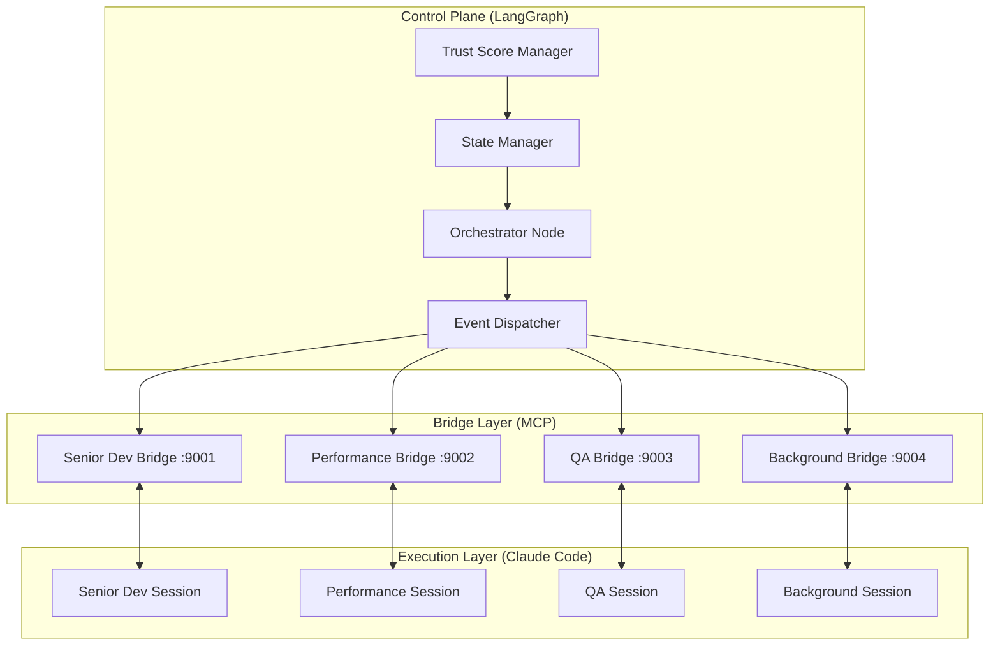

# Multi-Agent Development Framework Management (MADFM)
## LangGraph Orchestration & Agent Lifecycle Architecture

### Executive Summary

MADFM is the intelligent management layer that orchestrates multi-agent development workflows through LangGraph coordination of Claude Code execution environments. The system implements **performance-based agent lifecycle management** with empirical evaluation cycles, trust-based autonomy, and human-guided decision points.

**Core Innovation**: Replace manual agent management with data-driven HR operations that automatically hire, fire, and optimize specialist agents based on measurable performance metrics.

### Hybrid Orchestration Architecture

**Three-Layer System Design**:



#### Layer Functions
- **Control Plane**: Strategic decision-making, event classification, trust evaluation
- **Bridge Layer**: Protocol translation between LangGraph and Claude Code via MCP
- **Execution Layer**: Specialized Claude Code sessions with domain-specific tool access

### Agent Organization: 3 Foundational + HR-Managed Specialists

#### Foundational Team (Always Active)

**Research Agent**
- **Role**: Information gathering, codebase analysis, pattern recognition
- **Output**: Structured analysis reports, context packages, improvement suggestions
- **Tools**: WebSearch, Context7, GitHub search, documentation APIs
- **Success Metrics**: >90% completeness, >95% accuracy, <60s response time

**PM Agent (Project Orchestrator)**
- **Role**: Task coordination, context distribution, agent assignment planning
- **Output**: Task specifications, project timelines, agent assignments, progress reports
- **Decisions**: Single vs parallel task execution, specialist requirements, context allocation
- **Success Metrics**: Efficient resource allocation, clear task breakdown, dependency management

**HR Agent (Innovation Core)**
- **Role**: Agent lifecycle management, performance monitoring, creation/retirement decisions
- **Output**: Performance reports, hiring recommendations, optimization suggestions
- **Evaluation**: 15-task evaluation cycles with empirical data analysis
- **Success Metrics**: >80% success rate, <20% error rate, 15% efficiency improvement

#### Dynamic Specialist Pool (HR-Managed)

**Specialist Creation Logic**: HR Agent analyzes task patterns and proposes specialist agents when >5 similar tasks detected

- **Implementation Agent**: Code generation, TDD development
- **Testing Agent**: Quality assurance, comprehensive test creation
- **Database Agent**: Schema design, query optimization, performance tuning
- **API Agent**: RESTful design, integration, documentation
- **Frontend Agent**: UI/UX development, responsive design
- **Security Agent**: Vulnerability analysis, secure coding practices

### Performance-Based Agent Management

#### Trust Score System (3-Metric Evaluation)
```
Trust Score = (Task Completion Rate × 50) + (Build Success Rate × 30) + (Human Override Rate × -20)

Behavioral Changes by Trust Level:
├── 80-100: Full autonomy on assigned tasks
├── 60-79:  Supervised complex tasks, autonomous simple tasks
├── 40-59:  Simple tasks only with human review
└── <40:    Retraining required, human oversight on all tasks
```

**Why This Works**:
- **Task Completion Rate**: Measures actual productivity
- **Build Success Rate**: Measures code quality and stability
- **Human Override Rate**: Measures decision quality (penalty for reversals)

#### 15-Task Evaluation Cycles

**Evaluation Framework**:
```python
class AgentEvaluation:
    evaluation_period = 15  # tasks

    success_thresholds = {
        'task_success_rate': 0.80,
        'error_frequency': 0.20,  # max 20% error rate
        'efficiency_improvement': 0.15,  # 15% vs baseline
        'cost_effectiveness': 'positive_roi'
    }

    decision_criteria = {
        'keep': 'meets_all_thresholds',
        'retrain': 'below_threshold_single_cycle',
        'fire': 'below_threshold_two_cycles'
    }
```

**HR Agent Decision Process**:
1. **Performance Analysis**: Calculate metrics over 15-task window
2. **Pattern Recognition**: Identify improvement trends vs degradation
3. **Cost-Benefit Analysis**: ROI calculation for agent maintenance
4. **Recommendation Generation**: Keep/retrain/fire with confidence scores
5. **Human Escalation**: Present data-driven recommendations for approval

### Event-Driven Task Assignment

**Trigger Classification & Routing**:

| Priority | Trigger Examples | Response Time | Agent Assignment |
|----------|-----------------|---------------|------------------|
| **Critical** | Security vulnerabilities, critical bugs | <20 minutes | Senior Dev (interrupt current work) |
| **High** | Feature requests, architecture decisions | <4 hours | Specialist assignment via PM Agent |
| **Medium** | Performance optimization, code review | <24 hours | Queue for appropriate specialist |
| **Low** | Documentation, formatting, refactoring | <1 week | Background processing agents |

**Smart Routing Logic**:
```python
def route_task(task, agent_trust_scores):
    if task.priority == "critical":
        return highest_trust_agent("senior_dev")
    elif task.requires_domain_expertise():
        return specialist_agent(task.domain, min_trust=60)
    else:
        return available_agent(min_trust=40)
```

### Human Interaction Design

#### 5 Decision Gates with Smart Defaults

| Gate Type | Trigger | Timeout | Default Action |
|-----------|---------|---------|----------------|
| **Research Validation** | Confidence <70% OR conflicts | 1 hour | Approve |
| **Plan Approval** | High risk OR budget >$1k | 30 minutes | Approve |
| **Quality Gate** | Coverage <80% OR bugs >0 | 1 hour | Fix |
| **Error Escalation** | Errors >3 OR failure >20% | 20 minutes | Retry |
| **Specialist Creation** | New agent needed | 40 minutes | Create |

**Human Experience Design**:
- **Normal Flow (70%)**: Notification summary → System proceeds with defaults
- **Low Confidence (20%)**: Research conflicts → Human guidance → Proceed
- **High Risk (10%)**: Immediate notification → Must respond or safe default

### Cost Management & Optimization

#### Budget Monitoring with Automatic Responses
```
Monthly Budget Allocation: $75-160
├── 70% threshold: Review usage patterns, switch to efficient models
├── 85% threshold: Pause background processing, focus on critical tasks
└── 95% threshold: Emergency mode, human approval for all agent tasks
```

**Cost Optimization Strategies**:
- **Model Selection**: Haiku for simple tasks, Sonnet for complex reasoning
- **Background Throttling**: Reduce non-critical agent activity during budget constraints
- **Caching Intelligence**: Avoid redundant API calls through intelligent result caching
- **Parallel Efficiency**: Optimize MCP bridge communication to reduce latency costs

### Implementation Timeline & ROI Validation

#### Phase 1: Foundation (Week 1-2)
- **Deploy LangGraph orchestrator** with basic event routing
- **Establish 3 foundational agents** with performance monitoring framework
- **Create MCP bridge servers** for Claude Code communication
- **Implement trust score calculation** and basic dashboard

#### Phase 2: Dynamic Creation (Week 3-4)
- **HR Agent analyzes task patterns** and creates first specialist agents
- **Deploy 2-3 specialists** based on alphaseek/TotoRich needs
- **Begin 15-task evaluation cycles** with empirical data collection
- **Establish specialist context distribution** workflows

#### Phase 3: Performance Optimization (Month 2)
- **Execute first HR evaluation cycles** with data-driven hire/fire decisions
- **Optimize specialist job descriptions** based on success patterns
- **Implement cost-per-task monitoring** and ROI tracking
- **Scale successful patterns**, retire underperforming agents

#### Phase 4: Mature Operations (Month 3+)
- **Predictable agent lifecycle management** with consistent evaluation
- **Advanced specialist types** based on emerging project patterns
- **Enterprise-level optimization** with human oversight dashboard
- **Continuous improvement** through feedback loop analysis

### Success Metrics & Monitoring

#### Real-Time Performance Dashboard
```yaml
daily_metrics:
  agent_fleet_status:
    total_active: 5-8
    performance_trending: "up 15%"
    cost_per_task: "$0.28"

  trust_score_summary:
    fleet_average: 84
    above_threshold: "6/8 agents"
    improvement_rate: "+12% vs last week"

  roi_tracking:
    monthly_target: "100% by Month 3"
    current_progress: "47% (Month 2)"
    cost_efficiency: "Framework cost 23% of savings"
```

#### Human Escalation Triggers
- **High agent failure rate** (>50% fire rate): Review hiring criteria
- **Fleet performance below 70%**: Review training and context quality
- **Project delay risk >80%**: Review timeline and resource allocation
- **Budget overrun approaching**: Implement automatic cost reduction

### Risk Mitigation & Contingencies

**Technical Failures**:
- **MCP Bridge Failures**: Fallback to direct Claude Code execution
- **LangGraph Downtime**: Queue events for batch processing when restored
- **State Desynchronization**: Periodic reconciliation with conflict resolution

**Operational Failures**:
- **Human Bottleneck**: Smart defaults and timeout mechanisms activate
- **Agent Performance Collapse**: Immediate replacement with backup specialists
- **Budget Overruns**: Automatic throttling and emergency protocols

**Success Validation**:
- **Go Criteria**: Month 1 (0% ROI), Month 3 (100% ROI), Month 6 (200% ROI)
- **No-Go Criteria**: Month 2 (<25% ROI), Month 3 (<50% ROI)
- **Abort Triggers**: Budget overrun >3x planned costs

### Strategic Benefits

**Empirical Management**: Replace subjective agent evaluation with data-driven decisions
**Dynamic Scaling**: Create specialists only when needed, retire when underperforming
**Cost Optimization**: Automatic budget management with performance-based resource allocation
**Human Efficiency**: Intelligent escalation reduces micromanagement while maintaining control
**Continuous Improvement**: Self-optimizing system that learns from performance patterns

MADFM represents a paradigm shift from manual multi-agent coordination to intelligent, self-managing development orchestration that maximizes productivity while minimizing human overhead and operational costs.