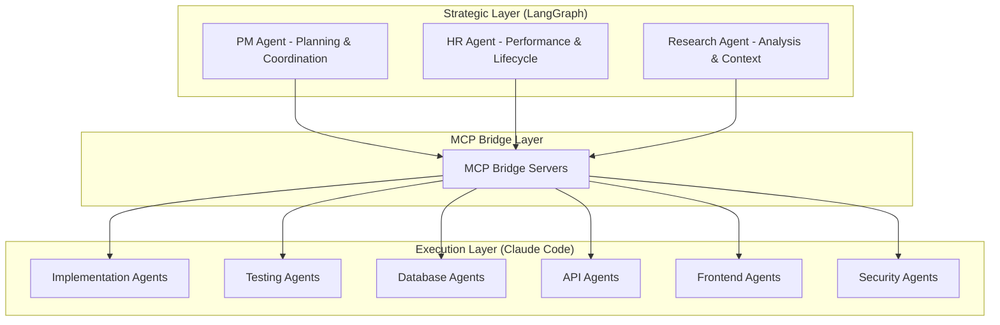

# Multi-Agent Development Framework (MADF)
## Project Ecosystem Strategy & Architecture

### Executive Summary

MADF is a pragmatic multi-agent coordination framework designed for optimizing development across a mature project ecosystem. After comprehensive analysis, the framework discovered that target projects are sophisticated, production-ready platforms requiring **integration and optimization** rather than migration or rescue operations.

**Core Mission**: Coordinate multi-agent workflows to accelerate development velocity, enable component sharing, and optimize resource allocation across a portfolio of well-architected projects.

### Key Discovery: Mature Project Ecosystem

**Original Assumption**: Legacy codebases requiring rescue migration
**Reality Discovered**: Sophisticated, production-ready platforms

| Project | Actual Status | Resource Allocation | Focus Strategy |
|---------|---------------|-------------------|----------------|
| **alphaseek** | Production quant platform (80k LOC, 80% test coverage) | **80%** | Factor framework optimization + component extraction |
| **TotoRich** | Mature full-stack financial platform | **15%** | Workflow optimization + cross-project coordination |
| **Prototypes** | 5 active projects (1clickman, citybadge, etc.) | **5%** | Component reuse + development acceleration |

### Hybrid Architecture: LangGraph + Claude Code

**Two-Layer Orchestration System**:
- **Layer 1 (LangGraph)**: Strategic coordination, event routing, agent lifecycle management
- **Layer 2 (Claude Code)**: Tactical execution, specialized tool usage, direct code manipulation
- **MCP Bridge**: Bi-directional communication between orchestration and execution layers



### AlphaSeek: Primary Focus Project (80% Allocation)

**Project Type**: Quantitative finance factor research platform
**Architecture**: Two-Arm Development Model

#### Tool Arm (Infrastructure Development)
- **Mission**: Build modular factor calculation engines and optimization frameworks
- **Deliverables**: Parameter optimization engine, backtesting framework, Bloomberg integration
- **Success Metrics**: New factor module in <1 day, optimization completes in <30 minutes

#### Research Arm (Strategy Development)
- **Mission**: Define requirements, optimize strategies, validate performance
- **Deliverables**: Optimized trading strategies, performance attribution, research reports
- **Success Metrics**: Sharpe ratio >1.5, max drawdown <15%, statistical significance t-stat >2.0

**Migration Strategy**: Extract proven signals from existing 70-80k LOC codebase into modular framework with bit-exact validation and performance improvement targets.

### Event-Driven Development Model

**Paradigm Shift**: From rigid schedules to trigger-based task assignment

#### Trigger Categories
- **High-Priority** (Interrupt current work): Critical bugs, security vulnerabilities
- **Standard Priority** (Queue for next agent): Feature requests, optimization tasks
- **Automated** (No human intervention): Test failures, performance degradation

#### Daily Operating Windows
```
7:00-12:00 PM: High-Intensity Window 1 (alphaseek critical tasks)
1:00-6:00 PM:  High-Intensity Window 2 (testing & optimization)
6:00-11:00 PM: Human Review & Planning
11:00-7:00 AM: Autonomous Background Mode (formatting, docs)
```

### Project Maturity Model & Resource Allocation

**Maturity Stages** (determine development overhead and agent allocation):

| Stage | Triggers | Overhead Level | Agent Strategy |
|-------|----------|----------------|----------------|
| **Prototype** | <10k LOC, no users | **5%**: Git + docs | 1 Implementation Agent (shared) |
| **Early Stage** | 10k-50k LOC, 1+ customers | **15%**: Testing + monitoring | 2-3 Specialized Agents |
| **Growth Stage** | 50k+ LOC, consistent revenue | **25%**: Full CI/CD + security | 4-6 Agent Team |
| **Scale Stage** | 200k+ LOC, proven economics | **40%**: Enterprise practices | Full Agent Fleet |

**Current Classifications**:
- **alphaseek**: Growth Stage (sophisticated quant platform)
- **TotoRich**: Growth Stage (mature full-stack)
- **Prototypes**: Prototype Stage (rapid development focus)

### Component Sharing Strategy

**Maturity Gates for Component Extraction**:
1. **Stability Test**: Component unchanged for 2+ weeks, zero recent bugs
2. **Generalizability**: Remove project-specific logic, identify config parameters
3. **Pilot Testing**: Implement in 1 prototype project first
4. **Wide Deployment**: Only after successful pilot with version control

**Weekly Component Review**: Friday sessions to identify 1-2 extraction candidates with clear multi-project value.

### Success Metrics & ROI Targets

#### Primary Success Criteria
- **Development Velocity**: 30%+ increase in features delivered per month
- **Code Reuse**: 40%+ component sharing across projects
- **Agent Performance**: Average trust score >70 within 2 months
- **Cost Efficiency**: Framework cost <30% of time savings value

#### ROI Timeline & Gates
- **Month 1**: Break-even (ROI = 0%)
- **Month 3**: 100% ROI + sustainable cost model
- **Month 6**: 200% ROI + proven scalability

#### Abort Criteria
- Month 2: ROI <25% triggers scope reduction
- Month 3: ROI <50% triggers framework redesign
- Any time: Budget overrun >3x triggers immediate review

### Implementation Phases

#### Phase 1: Foundation (Week 1-2)
- Deploy 3 foundational agents with performance monitoring
- Establish alphaseek/TotoRich project analysis
- Create specialist agent job descriptions and success criteria

#### Phase 2: Integration (Week 3-4)
- HR-driven specialist creation based on task pattern analysis
- Begin empirical data collection for agent evaluation cycles
- Implement performance tracking for hire/fire decisions

#### Phase 3: Optimization (Month 2)
- Execute first 15-task evaluation cycles with data-driven decisions
- Scale successful agent types, retire underperforming agents
- Implement cost-per-task monitoring and ROI tracking

#### Phase 4: Mature Operations (Month 3+)
- Predictable agent lifecycle management with consistent evaluation
- Advanced specialist types based on emerging project needs
- Enterprise-level fleet optimization with human oversight dashboard

### Risk Mitigation

**Technical Risks**: Layer communication failures → Fallback to direct Claude Code execution
**Operational Risks**: Human bottleneck → Smart defaults and timeout mechanisms
**Budget Risks**: Cost overruns → Automatic throttling at 70% threshold

**Success Guarantee**: Clear exit strategy with lessons learned if framework underperforms expectations.

### Strategic Vision

MADF transforms development from manual coordination to intelligent orchestration, enabling:
- **Velocity**: Faster feature delivery through specialized agent expertise
- **Quality**: Consistent performance through empirical evaluation and trust scoring
- **Scale**: Dynamic resource allocation based on project maturity and performance data
- **Innovation**: Component reuse and cross-project learning accelerate capability development

The framework provides measurable productivity gains while maintaining human control and cost efficiency, creating a sustainable foundation for multi-project development excellence.