# 2. High Level Architecture

## Technical Summary

The Multi-Agent Development Framework (MADF) implements a LangGraph-based orchestration architecture with 5 specialized agents coordinated through Pydantic state models. The system uses a hybrid MCP integration strategy: performance-critical tools (Serena semantic search, Graphiti knowledge graphs) connect via direct Python MCP SDK, while all other tools route through mapping_mcp_bridge.js with intelligent per-tool strategy selection. This architecture achieves efficient multiagent coding assistance by leveraging calibrated query strategies, minimizing Ollama reasoning overhead, and maintaining clear agent tool boundaries.

## Platform and Infrastructure Choice

**Platform:** Local Development with Hybrid MCP Integration
**Key Services:**
- LangGraph StateGraph for agent orchestration
- Direct Python MCP SDK (stdio) for Serena and Graphiti
- mapping_mcp_bridge.js for all other MCP tools
- Local Ollama (llama3.1:8b or qwen2.5:7b) for $0 tool routing
- Neo4j database for Graphiti knowledge graphs
- Pydantic V2 models for type-safe state management

**Deployment Host:** Initially local development, containerization planned for Phase 2

## Repository Structure

**Structure:** Monorepo with agent-based organization
**Package Organization:**
- `src/agents/` - 5 specialized LangGraph agents
  - `orchestrator_agent.py` - Workflow coordination
  - `analyst_agent.py` - Code analysis (Serena, Context7, Sequential Thinking)
  - `knowledge_agent.py` - Knowledge graphs (Graphiti, Obsidian, Filesystem)
  - `developer_agent.py` - Code implementation (Chrome DevTools)
  - `validator_agent.py` - QA and optimization (DSPy, Sentry, Postgres)
- `src/core/` - Core infrastructure
  - `agent_graph.py` - LangGraph StateGraph orchestration
  - `mcp_bridge.py` - Direct Python MCP SDK integration (Serena, Graphiti)
  - `state_models.py` - Pydantic V2 state models
  - `observability.py` - LangSmith integration
- `mcp-use/` - MCP tool integration
  - `mapping_mcp_bridge.js` - Intelligent MCP bridge with strategy selection
  - `mcp-use-ollama-config.json` - Unified MCP server configuration
  - `mcp-strategy-mapping.json` - Calibrated per-tool strategies
  - `README.md` - Priority order and usage guide
- `tests/` - Test infrastructure
  - `test_story_1_1_real_*.py` - Story 1.1 real tests (5 agents)
  - `test_story_1_2_real_analyst_agent.py` - Story 1.2 Analyst tests
  - `test_story_1_3_real_*.py` - Story 1.3 Knowledge tests (4 files)
  - `conftest.py` - Real test fixtures (NO MOCKS)
- `docs/` - Documentation
  - `prd/` - Product requirements (sharded)
  - `stories/epic-1/` - Epic 1 user stories
  - `architecture/` - Architecture documentation (this file)

## High Level Architecture Diagram

```mermaid
graph TB
    subgraph "User Interface"
        USER[Human Developer]
    end

    subgraph "LangGraph Orchestration Layer"
        GRAPH[StateGraph<br/>Pydantic State Models<br/>Checkpointing Enabled]
    end

    subgraph "Agent Layer - 5 Specialized Agents"
        ORC[Orchestrator Agent<br/>GitHub, Tavily<br/>Workflow Coordination]
        ANA[Analyst Agent<br/>Serena Direct, Context7, SeqThink<br/>Code Analysis]
        KNO[Knowledge Agent<br/>Graphiti Direct, Obsidian, Filesystem<br/>Knowledge Management]
        DEV[Developer Agent<br/>Chrome DevTools<br/>Code Implementation]
        VAL[Validator Agent<br/>DSPy Direct, Sentry, Postgres<br/>QA & Optimization]
    end

    subgraph "MCP Integration Layer"
        subgraph "Direct Python MCP SDK (stdio)"
            SERENA[Serena MCP<br/>Semantic Code Search<br/>LSP-based]
            GRAPHITI[Graphiti MCP<br/>Knowledge Graphs<br/>Neo4j Backend]
        end

        subgraph "mapping_mcp_bridge.js (Intelligent Routing)"
            BRIDGE[mapping_mcp_bridge.js<br/>3-Tier Strategy Selection<br/>Ollama LLM]
            STRATEGY[mcp-strategy-mapping.json<br/>Calibrated Strategies<br/>Per-Tool Optimization]
        end

        subgraph "MCP Servers (via Bridge)"
            CONTEXT7[Context7<br/>Documentation]
            SEQTHINK[Sequential Thinking<br/>Complex Reasoning]
            GITHUB[GitHub<br/>Repository Ops]
            TAVILY[Tavily<br/>Web Search]
            OBSIDIAN[Obsidian<br/>Note Management]
            FILESYSTEM[Filesystem<br/>File Operations]
            SENTRY[Sentry<br/>Error Tracking]
            POSTGRES[Postgres<br/>Data Persistence]
            CHROME[Chrome DevTools<br/>Browser Automation]
        end
    end

    subgraph "Storage & Observability"
        NEO4J[(Neo4j<br/>Knowledge Graph)]
        LANGSMITH[LangSmith<br/>Tracing & Monitoring]
        CHECKPOINTS[(Checkpoints<br/>Workflow Recovery)]
    end

    USER --> GRAPH
    GRAPH --> ORC
    GRAPH --> ANA
    GRAPH --> KNO
    GRAPH --> DEV
    GRAPH --> VAL

    ANA -->|Direct stdio| SERENA
    KNO -->|Direct stdio| GRAPHITI

    ORC -->|subprocess| BRIDGE
    ANA -->|subprocess| BRIDGE
    KNO -->|subprocess| BRIDGE
    DEV -->|subprocess| BRIDGE
    VAL -->|subprocess| BRIDGE

    BRIDGE --> STRATEGY
    BRIDGE --> CONTEXT7
    BRIDGE --> SEQTHINK
    BRIDGE --> GITHUB
    BRIDGE --> TAVILY
    BRIDGE --> OBSIDIAN
    BRIDGE --> FILESYSTEM
    BRIDGE --> SENTRY
    BRIDGE --> POSTGRES
    BRIDGE --> CHROME

    GRAPHITI --> NEO4J
    GRAPH --> LANGSMITH
    GRAPH --> CHECKPOINTS
```



## Architectural Patterns

### Hybrid MCP Integration
- **Performance-Critical**: Direct Python MCP SDK (Serena, Graphiti) using stdio transport
- **All Other Tools**: mapping_mcp_bridge.js with intelligent strategy selection
- **Zero External Dependencies**: All MCP servers launched on-demand by bridge

### Intelligent Tool Routing
- **Tool Mapping**: Uses mcp-strategy-mapping.json for proven strategies
- **Parameter Analysis**: Auto-detects parameter types and selects strategy
- **Fallback Chain**: Retries with different strategies on failure
- **$0 Cost**: Local Ollama execution (no Claude/GPT API calls)

### Agent Specialization
- **Orchestrator**: Workflow coordination, handoffs between agents
- **Analyst**: Semantic code search, documentation retrieval, complex reasoning
- **Knowledge**: Knowledge graph persistence, note management, file operations
- **Developer**: Code implementation, browser automation, debugging
- **Validator**: QA, error tracking, database optimization, self-improvement

### State Management
- **Pydantic V2**: All state models with validation
- **LangGraph**: StateGraph with typed state transitions
- **Checkpointing**: Workflow recovery on failures
- **LangSmith**: Comprehensive tracing and observability

## Communication Patterns

### Inter-Agent Communication
- **Method**: LangGraph StateGraph edges
- **State**: Pydantic V2 models (AgentState, TaskAssignment, ResearchResult)
- **Handoffs**: Explicit agent-to-agent transitions via state
- **Recovery**: Checkpointing enables workflow restart

### MCP Tool Invocation
**Direct (Serena, Graphiti)**:
```python
from mcp import ClientSession, StdioServerParameters
from mcp.client.stdio import stdio_client

async with stdio_client(server_params) as (read, write):
    async with ClientSession(read, write) as session:
        await session.initialize()
        result = await session.call_tool(tool_name, arguments)
```

**Bridge (All Others)**:
```python
import subprocess
import json

result = subprocess.run([
    'node', 'mcp-use/mapping_mcp_bridge.js',
    json.dumps(["server", "tool", {"param": "value"}])
], capture_output=True, text=True, cwd="project_root")
```

## Scalability Considerations

### Current Limitations (MVP)
- Local execution only
- Single-user operations
- No horizontal scaling

### Future Enhancements (Phase 2+)
- Multi-user support via session isolation
- Cloud deployment with containerization
- Distributed agent execution
- Caching layer for MCP responses
- Load balancing for Ollama instances

## Security Architecture

### Authentication
- MCP servers: Environment variable API keys
- Neo4j: Username/password authentication
- LangSmith: API key authentication

### Authorization
- Agent tool boundaries enforced via runtime validation
- Filesystem: Allowed directories restriction
- GitHub: Read-only vs read-write modes
- Postgres: Safety controls (read/write access modes)

### Data Protection
- Sensitive data in .env (not version controlled)
- Knowledge graph data in Neo4j (encrypted at rest)
- Checkpoints stored locally (future: encrypted storage)
