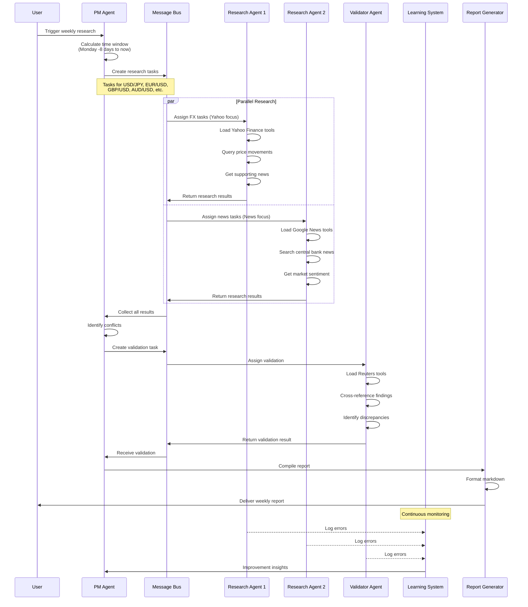
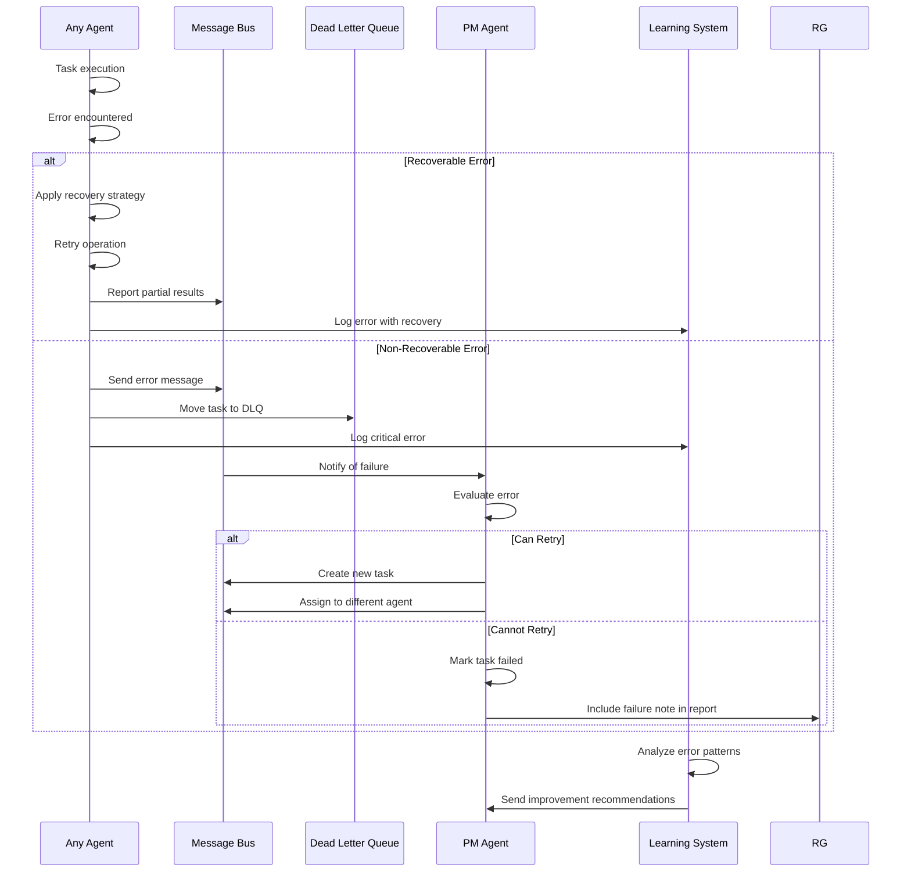

# 8. Core Workflows

## Weekly Research Workflow

```mermaid
sequenceDiagram
    participant User as User
    participant PM as PM Agent
    participant MB as Message Bus
    participant R1 as Research Agent 1
    participant R2 as Research Agent 2
    participant VA as Validator Agent
    participant LS as Learning System
    participant RG as Report Generator

    User->>PM: Trigger weekly research
    PM->>PM: Calculate time window<br/>(Monday -8 days to now)

    PM->>MB: Create research tasks
    Note over PM,MB: Tasks for USD/JPY, EUR/USD,<br/>GBP/USD, AUD/USD, etc.

    par Parallel Research
        MB->>R1: Assign FX tasks (Yahoo focus)
        R1->>R1: Load Yahoo Finance tools
        R1->>R1: Query price movements
        R1->>R1: Get supporting news
        R1->>MB: Return research results
    and
        MB->>R2: Assign news tasks (News focus)
        R2->>R2: Load Google News tools
        R2->>R2: Search central bank news
        R2->>R2: Get market sentiment
        R2->>MB: Return research results
    end

    MB->>PM: Collect all results
    PM->>PM: Identify conflicts

    PM->>MB: Create validation task
    MB->>VA: Assign validation
    VA->>VA: Load Reuters tools
    VA->>VA: Cross-reference findings
    VA->>VA: Identify discrepancies
    VA->>MB: Return validation result

    MB->>PM: Receive validation
    PM->>RG: Compile report
    RG->>RG: Format markdown
    RG->>User: Deliver weekly report

    Note over LS: Continuous monitoring
    R1-->>LS: Log errors
    R2-->>LS: Log errors
    VA-->>LS: Log errors
    LS->>PM: Improvement insights
```

## Error Recovery Workflow

```mermaid
sequenceDiagram
    participant Agent as Any Agent
    participant MB as Message Bus
    participant DLQ as Dead Letter Queue
    participant PM as PM Agent
    participant LS as Learning System

    Agent->>Agent: Task execution
    Agent->>Agent: Error encountered

    alt Recoverable Error
        Agent->>Agent: Apply recovery strategy
        Agent->>Agent: Retry operation
        Agent->>MB: Report partial results
        Agent->>LS: Log error with recovery
    else Non-Recoverable Error
        Agent->>MB: Send error message
        Agent->>DLQ: Move task to DLQ
        Agent->>LS: Log critical error
        MB->>PM: Notify of failure

        PM->>PM: Evaluate error
        alt Can Retry
            PM->>MB: Create new task
            PM->>MB: Assign to different agent
        else Cannot Retry
            PM->>PM: Mark task failed
            PM->>RG: Include failure note in report
        end
    end

    LS->>LS: Analyze error patterns
    LS->>PM: Send improvement recommendations
```
