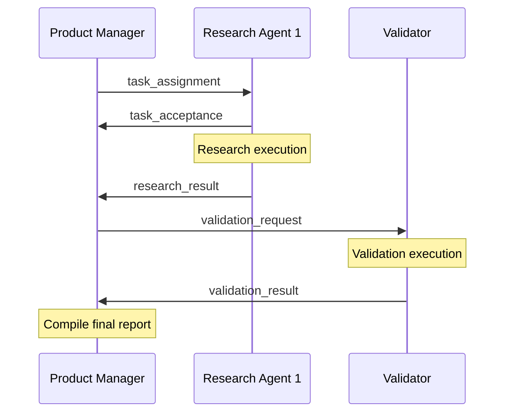
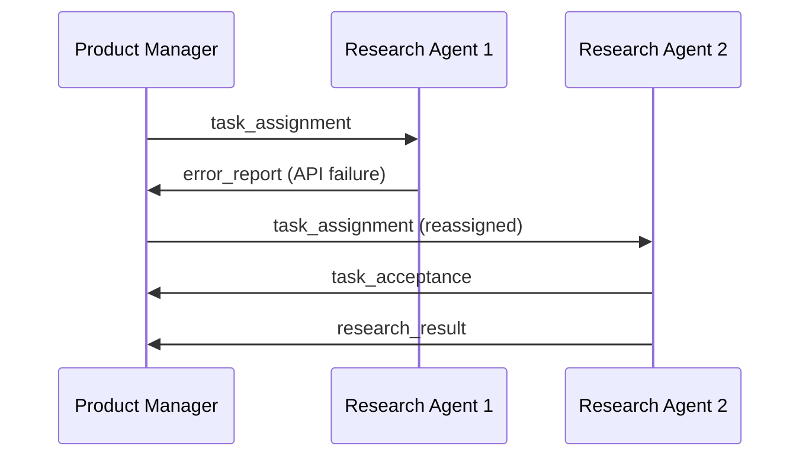

# Inter-Agent API Specification

**CRITICAL DEVELOPMENT BLOCKER RESOLUTION**
*Created: 2025-09-21 | Required for Story 1.1 and 1.5 development*

## 🎯 **OVERVIEW**

This document provides the complete API specification for communication between MADF agents using file-based JSON messaging. This resolves the missing API documentation blocking issue identified in the PO validation.

### **Communication Architecture**
- **Protocol**: File-based JSON messaging
- **Transport**: Local file system
- **Message Format**: Structured JSON with Pydantic validation
- **Delivery**: Asynchronous file polling
- **Reliability**: Atomic file operations with .tmp staging

---

## 📋 **MESSAGE FORMAT SPECIFICATION**

### **Base Message Structure**

```typescript
interface BaseMessage {
  message_id: string;          // Unique identifier: "{from}_{timestamp}_{sequence}"
  from: AgentType;             // Source agent identifier
  to: AgentType;               // Destination agent identifier
  type: MessageType;           // Message type for routing
  timestamp: string;           // ISO 8601 timestamp
  content: MessageContent;     // Type-specific payload
  priority?: Priority;         // Optional priority level
  reply_to?: string;          // Optional parent message ID
  timeout?: number;           // Optional timeout in seconds
}

type AgentType = "product_manager" | "research_agent_1" | "research_agent_2" | "validator_agent";

type MessageType =
  | "task_assignment"
  | "task_acceptance"
  | "task_progress"
  | "research_result"
  | "validation_request"
  | "validation_result"
  | "error_report"
  | "heartbeat"
  | "system_status";

type Priority = "low" | "normal" | "high" | "urgent";
```

### **Pydantic Models**

```python
from pydantic import BaseModel, Field
from datetime import datetime
from typing import Optional, Union, Dict, Any, List
from enum import Enum

class AgentType(str, Enum):
    PRODUCT_MANAGER = "product_manager"
    RESEARCH_AGENT_1 = "research_agent_1"
    RESEARCH_AGENT_2 = "research_agent_2"
    VALIDATOR_AGENT = "validator_agent"

class MessageType(str, Enum):
    TASK_ASSIGNMENT = "task_assignment"
    TASK_ACCEPTANCE = "task_acceptance"
    TASK_PROGRESS = "task_progress"
    RESEARCH_RESULT = "research_result"
    VALIDATION_REQUEST = "validation_request"
    VALIDATION_RESULT = "validation_result"
    ERROR_REPORT = "error_report"
    HEARTBEAT = "heartbeat"
    SYSTEM_STATUS = "system_status"

class Priority(str, Enum):
    LOW = "low"
    NORMAL = "normal"
    HIGH = "high"
    URGENT = "urgent"

class BaseMessage(BaseModel):
    message_id: str = Field(..., description="Unique message identifier")
    from_agent: AgentType = Field(..., alias="from")
    to_agent: AgentType = Field(..., alias="to")
    type: MessageType
    timestamp: datetime
    content: Dict[str, Any]
    priority: Priority = Priority.NORMAL
    reply_to: Optional[str] = None
    timeout: Optional[int] = None

    class Config:
        allow_population_by_field_name = True
```

---

## 📨 **MESSAGE TYPES & CONTENT SPECIFICATIONS**

### **1. Task Assignment** (`task_assignment`)

**Purpose**: Product Manager assigns research tasks to research agents

**Content Schema**:
```python
class TaskAssignmentContent(BaseModel):
    task_type: str                    # "forex_research", "news_analysis", etc.
    focus_area: str                  # "Asia/G10", "EUR markets", etc.
    target_pairs: List[str]          # ["USD/JPY", "EUR/USD"]
    timeframe: str                   # "this_week", "today", "last_24h"
    data_sources: List[str]          # ["alpha_vantage", "newsapi"]
    deadline: datetime               # Task completion deadline
    output_format: str               # "structured_json", "summary_report"
    special_instructions: Optional[str] = None
```

**Example**:
```json
{
  "message_id": "pm_20241220_150000_001",
  "from": "product_manager",
  "to": "research_agent_1",
  "type": "task_assignment",
  "timestamp": "2024-12-20T15:00:00Z",
  "content": {
    "task_type": "forex_research",
    "focus_area": "Asia/G10",
    "target_pairs": ["USD/JPY", "EUR/USD", "GBP/USD"],
    "timeframe": "this_week",
    "data_sources": ["alpha_vantage", "newsapi"],
    "deadline": "2024-12-20T17:00:00Z",
    "output_format": "structured_json",
    "special_instructions": "Focus on central bank policy impacts"
  },
  "priority": "high"
}
```

### **2. Task Acceptance** (`task_acceptance`)

**Purpose**: Research agent confirms task acceptance and estimated completion

**Content Schema**:
```python
class TaskAcceptanceContent(BaseModel):
    task_id: str                     # Reference to original task message_id
    status: str                      # "accepted", "rejected", "queued"
    estimated_completion: datetime   # When agent expects to complete
    agent_capacity: float           # Current load percentage (0.0-1.0)
    rejection_reason: Optional[str] = None
```

### **3. Research Result** (`research_result`)

**Purpose**: Research agent delivers completed research data

**Content Schema**:
```python
class ResearchResultContent(BaseModel):
    task_id: str                    # Reference to original task
    status: str                     # "completed", "partial", "failed"
    execution_time_minutes: float   # Actual time taken
    data_points_collected: int      # Number of data points
    sources_accessed: List[str]     # Which sources were used
    key_findings: List[str]         # Summary of key findings
    raw_data: Dict[str, Any]       # Full research data
    confidence_score: float         # Confidence in results (0.0-1.0)
    data_freshness_hours: float    # Age of newest data point
    warnings: List[str]            # Any warnings or limitations
```

**Example**:
```json
{
  "message_id": "ra1_20241220_170000_001",
  "from": "research_agent_1",
  "to": "product_manager",
  "type": "research_result",
  "timestamp": "2024-12-20T17:00:00Z",
  "content": {
    "task_id": "pm_20241220_150000_001",
    "status": "completed",
    "execution_time_minutes": 45.2,
    "data_points_collected": 127,
    "sources_accessed": ["alpha_vantage", "newsapi"],
    "key_findings": [
      "USD/JPY showing strength on Fed pause speculation",
      "EUR/USD under pressure from ECB growth concerns"
    ],
    "raw_data": {
      "forex_rates": {...},
      "news_articles": {...}
    },
    "confidence_score": 0.87,
    "data_freshness_hours": 2.3,
    "warnings": ["Alpha Vantage rate limit reached, used cached data for 10% of requests"]
  }
}
```

### **4. Validation Request** (`validation_request`)

**Purpose**: Product Manager requests validation of research results

**Content Schema**:
```python
class ValidationRequestContent(BaseModel):
    research_results_to_validate: List[str]  # Message IDs of research results
    validation_type: str                     # "cross_reference", "timing_check", "fact_check"
    validation_sources: List[str]            # Sources for validation
    priority_areas: List[str]               # Focus areas for validation
    deadline: datetime
```

### **5. Validation Result** (`validation_result`)

**Purpose**: Validator agent delivers validation results

**Content Schema**:
```python
class ValidationIssue(BaseModel):
    issue_type: str                 # "conflict", "timing_error", "stale_data"
    severity: str                   # "low", "medium", "high", "critical"
    description: str
    affected_data: Dict[str, Any]
    recommendation: str
    confidence: float

class ValidationResultContent(BaseModel):
    validation_id: str              # Reference to validation request
    research_results_validated: List[str]
    overall_confidence: float       # Overall confidence after validation
    issues_found: List[ValidationIssue]
    validated_findings: List[str]   # Confirmed findings
    execution_time_minutes: float
    sources_consulted: List[str]
```

### **6. Error Report** (`error_report`)

**Purpose**: Any agent reports errors for learning system

**Content Schema**:
```python
class ErrorReportContent(BaseModel):
    error_type: str                 # "api_failure", "data_format", "timeout", etc.
    error_message: str
    context: Dict[str, Any]         # Context when error occurred
    stack_trace: Optional[str] = None
    recovery_action: Optional[str] = None
    impact_level: str               # "low", "medium", "high", "critical"
    related_task_id: Optional[str] = None
```

### **7. System Status** (`system_status`)

**Purpose**: Agents report their health and performance metrics

**Content Schema**:
```python
class SystemStatusContent(BaseModel):
    agent_status: str               # "healthy", "degraded", "error", "offline"
    cpu_usage_percent: float
    memory_usage_mb: float
    active_tasks: int
    completed_tasks_today: int
    error_count_today: int
    last_successful_operation: datetime
    performance_metrics: Dict[str, float]
```

---

## 🗂️ **FILE SYSTEM STRUCTURE**

### **Directory Layout**
```
{MESSAGE_DIR}/
├── inbox/
│   ├── product_manager/         # Messages TO Product Manager
│   ├── research_agent_1/        # Messages TO Research Agent 1
│   ├── research_agent_2/        # Messages TO Research Agent 2
│   └── validator_agent/         # Messages TO Validator Agent
├── outbox/
│   ├── product_manager/         # Messages FROM Product Manager
│   ├── research_agent_1/        # Messages FROM Research Agent 1
│   ├── research_agent_2/        # Messages FROM Research Agent 2
│   └── validator_agent/         # Messages FROM Validator Agent
├── processed/                   # Archived processed messages
└── failed/                      # Failed message processing
```

### **File Naming Convention**
```
{from_agent}_{timestamp}_{sequence}.json

Examples:
- pm_20241220_150000_001.json       # Product Manager message #1
- ra1_20241220_170000_001.json      # Research Agent 1 message #1
- val_20241220_180000_001.json      # Validator Agent message #1
```

### **Atomic File Operations**
1. **Write**: Create `.tmp` file first, then rename to `.json`
2. **Read**: Check for `.json` files, ignore `.tmp` files
3. **Process**: Move from `inbox/` to `processed/` after handling
4. **Error**: Move failed messages to `failed/` directory

---

## 🔄 **MESSAGE FLOW SEQUENCES**

### **Sequence 1: Normal Research Task Flow**



### **Sequence 2: Error Recovery Flow**



---

## ⚙️ **IMPLEMENTATION UTILITIES**

### **Message Factory**

```python
from datetime import datetime
import uuid

class MessageFactory:
    @staticmethod
    def create_task_assignment(from_agent: AgentType, to_agent: AgentType,
                             task_content: Dict[str, Any]) -> BaseMessage:
        return BaseMessage(
            message_id=f"{from_agent.value}_{datetime.utcnow().strftime('%Y%m%d_%H%M%S')}_{uuid.uuid4().hex[:6]}",
            from_agent=from_agent,
            to_agent=to_agent,
            type=MessageType.TASK_ASSIGNMENT,
            timestamp=datetime.utcnow(),
            content=task_content
        )

    @staticmethod
    def create_research_result(from_agent: AgentType, task_id: str,
                             result_content: Dict[str, Any]) -> BaseMessage:
        return BaseMessage(
            message_id=f"{from_agent.value}_{datetime.utcnow().strftime('%Y%m%d_%H%M%S')}_{uuid.uuid4().hex[:6]}",
            from_agent=from_agent,
            to_agent=AgentType.PRODUCT_MANAGER,
            type=MessageType.RESEARCH_RESULT,
            timestamp=datetime.utcnow(),
            content=result_content
        )
```

### **Message Handler**

```python
import aiofiles
import asyncio
from pathlib import Path
import json

class MessageHandler:
    def __init__(self, message_dir: Path, agent_type: AgentType):
        self.message_dir = Path(message_dir)
        self.agent_type = agent_type
        self.inbox = self.message_dir / "inbox" / agent_type.value
        self.outbox = self.message_dir / "outbox" / agent_type.value

        # Create directories
        self.inbox.mkdir(parents=True, exist_ok=True)
        self.outbox.mkdir(parents=True, exist_ok=True)

    async def send_message(self, message: BaseMessage):
        """Send message to another agent."""
        target_inbox = self.message_dir / "inbox" / message.to_agent.value
        target_inbox.mkdir(parents=True, exist_ok=True)

        # Write to temp file first (atomic operation)
        temp_file = target_inbox / f"{message.message_id}.tmp"
        final_file = target_inbox / f"{message.message_id}.json"

        async with aiofiles.open(temp_file, 'w') as f:
            await f.write(message.json(indent=2))

        # Atomic rename
        temp_file.rename(final_file)

    async def receive_messages(self) -> List[BaseMessage]:
        """Receive all pending messages."""
        messages = []
        for message_file in self.inbox.glob("*.json"):
            try:
                async with aiofiles.open(message_file, 'r') as f:
                    content = await f.read()
                    message_data = json.loads(content)
                    message = BaseMessage(**message_data)
                    messages.append(message)

                # Move to processed
                processed_dir = self.message_dir / "processed"
                processed_dir.mkdir(exist_ok=True)
                message_file.rename(processed_dir / message_file.name)

            except Exception as e:
                # Move to failed
                failed_dir = self.message_dir / "failed"
                failed_dir.mkdir(exist_ok=True)
                message_file.rename(failed_dir / message_file.name)
                print(f"Failed to process message {message_file}: {e}")

        return messages
```

---

## 🔍 **VALIDATION AND TESTING**

### **Message Validation**

```python
def validate_message(message_data: Dict[str, Any]) -> bool:
    """Validate message format and content."""
    try:
        message = BaseMessage(**message_data)
        return True
    except ValidationError as e:
        print(f"Message validation failed: {e}")
        return False
```

### **Integration Testing**

```python
async def test_message_flow():
    """Test complete message flow between agents."""
    handler = MessageHandler(Path("test_messages"), AgentType.PRODUCT_MANAGER)

    # Create test task assignment
    task_msg = MessageFactory.create_task_assignment(
        AgentType.PRODUCT_MANAGER,
        AgentType.RESEARCH_AGENT_1,
        {"task_type": "forex_research", "pairs": ["USD/JPY"]}
    )

    # Send message
    await handler.send_message(task_msg)

    # Verify message was delivered
    agent1_handler = MessageHandler(Path("test_messages"), AgentType.RESEARCH_AGENT_1)
    received = await agent1_handler.receive_messages()

    assert len(received) == 1
    assert received[0].type == MessageType.TASK_ASSIGNMENT
```

---

## 📊 **PERFORMANCE SPECIFICATIONS**

### **Message Processing SLA**
- **Message Delivery**: < 1 second (local filesystem)
- **Message Processing**: < 100ms per message
- **Queue Size**: Max 1000 pending messages per agent
- **File Size Limit**: 10MB per message
- **Retention**: 7 days in processed, 30 days in failed

### **Error Handling**
- **Malformed Messages**: Move to failed/ directory
- **Processing Failures**: Retry 3 times, then move to failed/
- **Disk Space**: Alert when message directories exceed 1GB
- **Timeout Handling**: Messages with timeout field are auto-expired

---

**STATUS**: This specification resolves the inter-agent API documentation blocking issue. All message types, formats, and communication patterns are now fully defined for implementation in Stories 1.1 and 1.5.

**NEXT STEPS**:
1. Implement Pydantic models in `agents/python/common/models.py`
2. Implement MessageHandler in `agents/python/common/messaging.py`
3. Add message validation utilities
4. Create integration tests