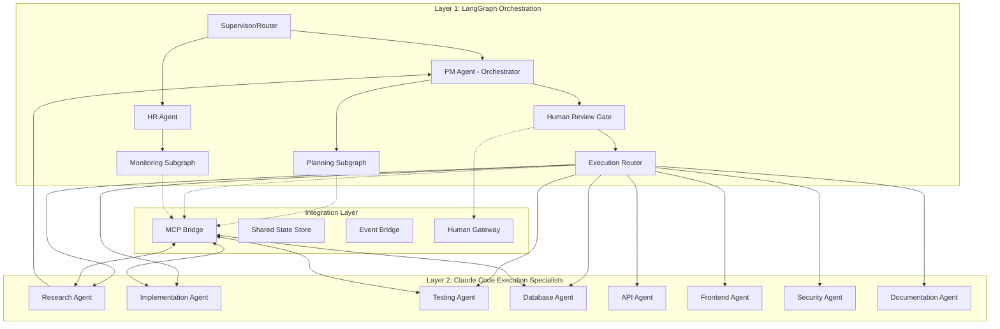

# MADF Strategic Architecture Plan
## Multi-Agent Development Framework Logic Flow & Interaction Design

## Executive Summary

MADF implements a **two-layer agent architecture** where Layer 1 (LangGraph) handles strategic orchestration and Layer 2 (Claude Code) executes specialized tasks. The framework emphasizes **human-guided decision points**, **diverse research perspectives**, and **dynamic specialist management** for AlphaSeek (80%), TotoRich (15%), and prototype projects (5%).

## Architecture Overview

### Two-Layer Agent System



## Project Structure

```
MADF/
├── orchestration/              # Layer 1: LangGraph
│   ├── agents/                # PM, HR agent logic
│   ├── graphs/                # Workflow orchestration
│   ├── workflows/             # Research coordination
│   ├── state/                 # Shared state management
│   └── human_gates/           # Human interaction points
├── .claude/                   # Layer 2: Claude Code
│   ├── agents/               # Specialist profiles (research, implementation, etc.)
│   ├── commands/             # Custom slash commands
│   ├── rules/                # Behavior rules by domain
│   └── hooks/                # Integration hooks
├── projects/                  # Target projects
│   ├── alphaseek/            # 80% resource allocation
│   ├── totorich/             # 15% resource allocation
│   └── prototypes/           # 5% resource allocation
├── monitoring/               # Performance tracking
└── integration/              # MCP bridges & state sync
```

## Layer 1: Strategic Orchestration Logic

### PM Agent (Project Orchestrator)
**Core Logic**: Orchestrates multiple research agents, synthesizes diverse findings, and creates execution plans

**Key Behaviors**:
- Decide on areas of research and dispatches queries n research agents with different focus areas
- Identifies consensus vs. conflicting information across sources and summarise
- Calculates confidence scores based on source reliability
- Triggers human review when confidence < X% (set by human)
- Suggest plans and creates task breakdown for different type of agent with human checkpoints
- Provide task complexity/dependencies details to HR agent
- Suggest single or parallel task run
- Request HR agent to activate/copy different agents for different tasks 
- Control context provided for each agent

**From Human Perspective**:
- Receives research summaries with confidence scores
- Set when to reviews plans, starting with only when risk is high or confidence < 70%
- Gets clear options: approve/modify/provide-guidance

**From Other Agents**:
- Research agents → PM: Raw findings with confidence scores
- PM → HR Agent: Specialist needs, provide underperformer improvement research summary
- PM → Layer 2: Task assignments with context
- Layer 2 → PM: Request more context

### HR Agent (Dynamic Specialist Manager)
**Core Logic**: Creates/enhance/retires specialists based on empirical performance data over 15-task evaluation cycles

**Key Behaviors**:
- Monitors task patterns based on complexity to identify specialist needs (n specialists based on past performance)
- Tracks performance: 80% success rate, <20% error rate, 15% efficiency improvement
- Makes hire/retire recommendations with human approval for critical decisions
- Maintains at least one specialist of each proven type
- Suggest new rule/command/hook suggestion based on error log
- complex repeated error suggest research task to PM

**From Human Perspective**:
- Receives specialist creation/retirement recommendations with data justification
- Receive new research task recommendations
- Gets performance dashboards every 20 taks run

**From Other Agents**:
- PM Agent → HR: "Need database specialist, 8 database tasks identified"
- Specialists → HR: Performance metrics, error logs, completion stats
- HR → PM: "Database specialist created, available for routing", "Setup new research task on highly repeated error."

## Human Interaction Design

### 5 Decision Gates with Smart Defaults

| Gate Type | Trigger | Options | Timeout | Default |
|-----------|---------|---------|---------|---------|
| **Research Validation** | Confidence < 70% OR conflicts | approve/request-more/guide | 1h | approve |
| **Plan Approval** | High risk OR budget > $1k | approve/modify/reject | 30m | approve |
| **Quality Gate** | Coverage < 80% OR bugs > 0 | approve/fix/accept-risk | 1h | fix |
| **Error Escalation** | Errors > 3 OR failure > 20% | retry/reassign/takeover | 20m | retry |
| **Specialist Creation** | New agent needed | create/retrain/delay | 40m | create |

### Human Experience Scenarios

**Scenario 1: Normal Flow (70% of cases)**
- Human gets notification summary
- System proceeds with smart defaults
- Weekly performance review dashboard

**Scenario 2: Low Confidence Research (20% of cases)**
- Human gets research summary with conflicts highlighted
- 3 options: approve anyway, request more research, provide guidance
- Default: approve after 1 hour

**Scenario 3: High Risk Changes (10% of cases)**
- Human gets immediate notification
- Plan details with risk assessment
- Must respond within 30 minutes or system uses safe default

## Core Workflow Logic Flow

### Main Orchestration Sequence
```
1. PM Coordinator → Research Dispatch (3+ parallel research agents)
2. Research Summary → Human Review Gate (if confidence < 70%)
3. Planning → Human Approval Gate (if high risk)
4. HR Evaluation → Specialist Creation (if needed for new type of task, repeated task for >3 times auto approve)
5. Task Routing → Layer 2 Execution (single or parallel specialists)
6. Quality Gate → Performance Monitoring → Improvement Loop
```

### Conditional Routing Logic
- **Research → Human**: Confidence < 70% OR conflicting findings
- **Planning → Human**: Risk = high OR budget impact > $1k
- **Execution → Error Review**: Errors > 3 OR failure rate > 20%
- **Quality → Fix**: Test coverage < 80% OR critical bugs found
```

### Project-Specific Resource Allocation

| Project | Priority | Specialists | Focus Areas | Research Strategy |
|---------|----------|-------------|-------------|------------------|
| **AlphaSeek** | 90%% | 6 agents | RA, IA, TA, AA, DA, DOC | Finance patterns, optimization |
| **TotoRich** | 9% | 8 agents | RA, IA, TA, AA, DA, FA, SA, DOC | Architecture, best practices |
| **Prototypes** | 1% | 1 agent | DOC | Identify newly built components to be copied to which task |

## Layer 2: Specialized Execution Agents

### Agent Types & Interactions

#### Research Agent (Multiple Instances)
**Role**: Parallel information gathering with diverse perspectives
**Key Tools**: WebSearch, Context7, GitHub search, documentation APIs
**Success Metrics**: >90% completeness, >95% accuracy, <60s response
**Output**: Structured findings with confidence scores, citations, alternatives

**Agent Perspective**: "I focus on my assigned area (quant patterns, performance, security, execution improvement) and provide comprehensive analysis with confidence ratings"
**PM Agent Perspective**: "I dispatch 3+ research agents simultaneously and synthesize their diverse findings"

#### Implementation Agent
**Role**: Code generation following TDD principles
**Key Tools**: Edit, Write, MultiEdit, Bash, Sequential thinking integration
**Success Metrics**: Code compiles, tests pass, 80%+ coverage
**Focus**: Clean, maintainable code with comprehensive testing

#### Database Agent
**Role**: Schema design, query optimization, performance tuning
**Key Tools**: SQL databases, schema tools, performance profilers
**Success Metrics**: <100ms queries, normalized schemas, optimized indexes
**Specialization**: Data integrity, scalability, migration strategies

#### Testing Agent
**Role**: Comprehensive quality assurance and test automation
**Key Tools**: Pytest, npm test, Playwright for E2E
**Success Metrics**: All tests pass, >85% coverage, no flaky tests
**Focus**: Unit, integration, E2E, and performance testing
**Log**: log down performance metrics for other agents.

#### API Agent
**Role**: RESTful API design and integration
**Key Tools**: HTTP clients, API documentation, authentication
**Focus**: REST conventions, security, versioning, documentation
**Output**: Well-documented, secure, scalable APIs

#### Frontend Agent
**Role**: Responsive UI/UX development
**Key Tools**: Modern frameworks, browser automation
**Focus**: Accessibility, performance, user experience
**Frameworks**: React/Next.js, Vue/Nuxt, Streamlit, Dash

#### Security Agent
**Role**: Vulnerability analysis and secure coding
**Key Tools**: Security scanners, code analysis, threat modeling
**Focus**: OWASP Top 10, authentication, encryption, dependencies
**Output**: Security assessments, hardened implementations

### Agent Lifecycle Management
**Creation Logic**: HR Agent creates specialists when >5 similar tasks detected
**Performance Tracking**: 15-task evaluation cycles with metrics: 80% success rate, <20% errors, 15% efficiency gain
**Retirement Process**: Underperforming agents retired with data archival and task reassignment

## Integration Scenarios

### Scenario A: AlphaSeek Feature Development
```
1. Human: "Add risk management dashboard to AlphaSeek"
2. PM → 3 Research Agents (parallel):
   - Agent 1: Quant risk modeling patterns
   - Agent 2: Dashboard performance optimization
   - Agent 3: Financial testing strategies
3. PM synthesizes findings (confidence: 85%)
4. Plan created → Human approval not needed (confidence > 70%)
5. HR evaluates: Need Frontend + Database + Testing specialists
6. Task routing → 3 specialists work in parallel
7. Quality gate → All tests pass, coverage 87%
8. Performance monitoring → Success metrics updated
```

### Scenario B: Low Confidence Research Requires Human Input
```
1. Human: "Implement new trading algorithm framework"
2. PM → 3 Research Agents find conflicting approaches
3. PM synthesis shows confidence: 45% (below threshold)
4. Human review gate triggered → Gets summary with conflicts
5. Human provides guidance: "Focus on real-time processing"
6. Research repeated with new constraints
7. Plan proceeds with human-approved direction
```

### Scenario C: Error Escalation to Human
```
1. Implementation Agent fails 4 times on database schema
2. Error escalation triggered (>3 errors)
3. Human review: Database structure conflicts with existing data
4. Human decision: "Create migration script first"
5. HR creates Database specialist for migration tasks
6. New approach succeeds
```

## Integration Architecture

### MCP Bridge Design
**Purpose**: Connects LangGraph strategic decisions to Claude Code tactical execution
**Communication**: Bidirectional JSON-RPC over MCP protocol
**State Sync**: Redis-based shared state with event notifications
**Session Management**: Persistent Claude Code sessions with context preservation

## Success Metrics & Monitoring

### Framework Performance Targets

| Metric Category | Target | Current Baseline |
|-----------------|---------|------------------|
| **Research Quality** | 85% synthesis accuracy from multiple agents | Manual research |
| **Human Efficiency** | 70% automated decisions, 30% human review | 100% human decisions |
| **Development Speed** | 3x faster feature delivery | Current velocity |
| **Code Quality** | 80%+ test coverage, <5% bug rate | Existing standards |
| **Resource Allocation** | AlphaSeek 80%, TotoRich 15%, Proto 5% | Equal distribution |
| **Agent Performance** | 80% success rate, 15% efficiency gain | N/A |
| **Cost Management** | <$200/month operational costs | Manual development |
| **ROI Timeline** | 200% ROI by Month 3 | Baseline investment |

### Decision Gate Effectiveness
- **Research Gates**: Triggered 20% of time (confidence < 70%)
- **Plan Approval**: Triggered 10% of time (high risk/budget)
- **Quality Gates**: Triggered 15% of time (coverage/bugs)
- **Error Escalation**: Triggered 5% of time (failure patterns)
- **Human Response**: 85% within timeout windows

## Strategic Roadmap

### Phase 1: Foundation (Week 1-2)
**Focus**: Core infrastructure and basic agent framework
- Set up LangGraph orchestration with PM/HR agents
- Create Layer 2 agent profiles (Research, Implementation, Testing)
- Establish MCP bridges and state synchronization
- Implement human decision gates with smart defaults

### Phase 2: Integration & Validation (Week 3-4)
**Focus**: End-to-end workflow testing and optimization
- Test research coordination with multiple agents
- Validate human-in-the-loop decision points
- Implement performance tracking and metrics collection
- Fine-tune routing logic for project-specific needs

### Phase 3: Specialization & Scaling (Month 2)
**Focus**: Specialized agents and dynamic management
- Deploy full specialist suite (Database, API, Frontend, Security)
- Implement HR evaluation cycles and hire/fire logic
- Optimize resource allocation (AlphaSeek 80%, TotoRich 15%, Proto 5%)
- Add self-improvement mechanisms

### Phase 4: Production & Optimization (Month 3+)
**Focus**: Performance optimization and ROI validation
- Scale to full production workloads
- Implement advanced monitoring and alerting
- Achieve 200%+ ROI targets
- Establish continuous improvement cycles

## Risk Mitigation & Contingencies

### Technical Risks
- **Layer Communication Failures**: Fallback to direct Claude Code execution
- **State Desynchronization**: Periodic reconciliation with conflict resolution
- **Agent Performance Degradation**: Automatic retraining and replacement

### Operational Risks
- **Human Bottleneck**: Smart defaults and timeout mechanisms
- **Budget Overruns**: Automatic throttling at 70% threshold
- **Quality Degradation**: Mandatory quality gates and testing requirements

## Next Steps

1. **Initialize project structure** following the defined architecture
2. **Set up development environment** with LangGraph and Claude Code integration
3. **Create minimal viable implementation** focusing on PM Agent and Research coordination
4. **Test human interaction flows** with sample scenarios
5. **Validate MCP bridge communication** between layers
6. **Deploy to AlphaSeek pilot project** for initial validation

*See `MADF_setup_draft.md` for detailed technical implementation code and configuration examples.*