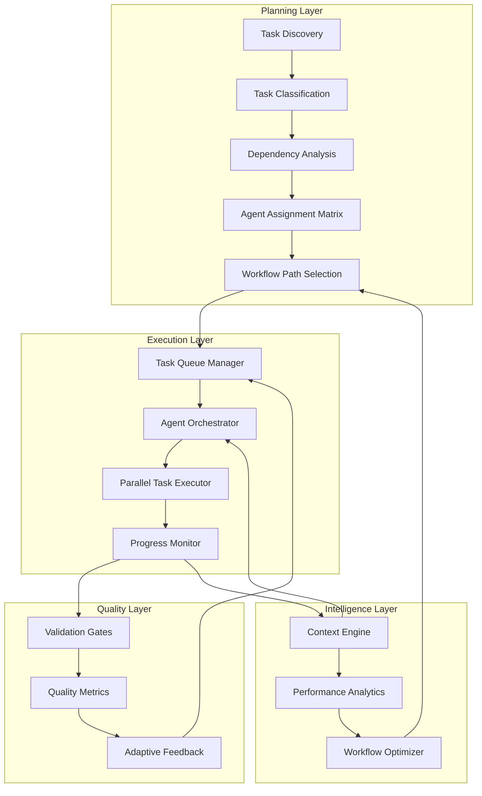
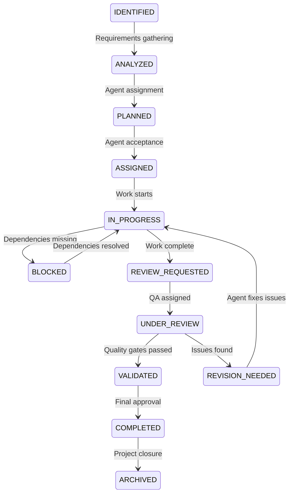
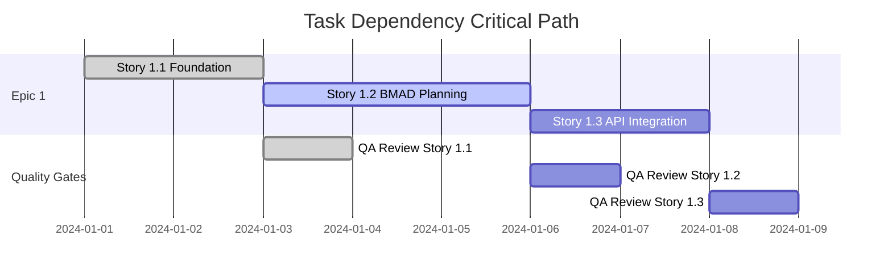

# BMAD Enhanced Task Management Workflow Design

**Created**: 2025-09-24
**Version**: 1.0
**Status**: Design Complete

## Executive Summary

Comprehensive design for enhancing BMAD's task management capabilities with intelligent orchestration, predictive analytics, and multi-agent coordination patterns. Provides 3-phase implementation roadmap preserving backward compatibility while adding advanced workflow optimization.

## Architecture Overview

### Core Design Principles
1. **Agent Specialization Preservation**: Maintain existing agent roles while enhancing coordination
2. **Hierarchical Task Structure**: Epic → Story → Task → Subtask levels
3. **Adaptive Workflow Execution**: Dynamic path selection based on project context
4. **Quality-First Progression**: Mandatory gates prevent progression with unresolved issues
5. **Context-Aware Orchestration**: Intelligent agent selection and task routing

### Optimal Task Management Architecture



### Enhanced Agent Coordination Framework

**1. Task Classification Engine**
- **Complexity Analysis**: Simple, Complex, Critical classification
- **Skill Mapping**: Required capabilities → Available agents
- **Risk Assessment**: Automatic QA involvement for high-risk tasks
- **Timeline Estimation**: AI-driven effort estimation with historical data

**2. Dynamic Agent Assignment**
```yaml
agent_assignment:
  primary_criteria:
    - skill_match: 80%
    - availability: current_workload < threshold
    - context_continuity: previous_task_relationship

  escalation_rules:
    - if: complexity == "critical"
      then: require_multiple_agent_review
    - if: dependencies > 3
      then: assign_coordination_agent
    - if: estimated_effort > 4_hours
      then: break_into_subtasks
```

**3. Intelligent Task Orchestration**
- **Parallel Execution Matrix**: Identify independent tasks for simultaneous execution
- **Context Switching Optimization**: Minimize agent context switches
- **Dependency Chain Resolution**: Automatic bottleneck identification and mitigation

## Task Lifecycle States & Transitions

### Core Task States
```yaml
task_lifecycle_states:
  discovery:
    - IDENTIFIED: Initial task recognition from epic/story breakdown
    - ANALYZED: Requirements clarified, complexity assessed
    - PLANNED: Dependencies mapped, agent assigned, timeline estimated

  execution:
    - ASSIGNED: Agent accepted task, work initiated
    - IN_PROGRESS: Active development/implementation
    - BLOCKED: Waiting for dependencies or external input
    - REVIEW_REQUESTED: Work complete, validation requested

  validation:
    - UNDER_REVIEW: QA/peer review in progress
    - REVISION_NEEDED: Issues identified, returned to agent
    - VALIDATED: Quality gates passed

  completion:
    - COMPLETED: Fully done, all criteria met
    - ARCHIVED: Historical record maintained
```

### State Transition Rules

**1. Mandatory Validation Paths**


**2. Quality Gate Integration**
- **Risk Level → Review Requirements**
  - `P0 (Critical)`: Mandatory QA review + peer review
  - `P1 (High)`: QA review required
  - `P2 (Medium)`: Peer review sufficient
  - `P3 (Low)`: Self-validation acceptable

**3. Automatic Transition Triggers**
```yaml
transition_automation:
  IDENTIFIED -> ANALYZED:
    trigger: story_breakdown_complete
    validator: sm_agent

  ANALYZED -> PLANNED:
    trigger: dependencies_mapped
    validator: po_agent

  IN_PROGRESS -> REVIEW_REQUESTED:
    trigger: acceptance_criteria_met
    validator: assigned_agent

  UNDER_REVIEW -> VALIDATED:
    trigger: quality_gates_passed
    validator: qa_agent
```

## Task Dependency Management System

### Dependency Type Classification

**1. Hard Dependencies**
```yaml
hard_dependencies:
  blocking:
    description: "Task cannot start until dependency completes"
    examples: ["API design before implementation", "Database schema before queries"]
    enforcement: "Automatic blocking in task queue"

  sequential:
    description: "Tasks must complete in specific order"
    examples: ["Unit tests → Integration tests → E2E tests"]
    enforcement: "Queue ordering with validation"
```

**2. Soft Dependencies**
```yaml
soft_dependencies:
  informational:
    description: "Task benefits from dependency completion but can proceed"
    examples: ["UX wireframes inform but don't block implementation"]
    enforcement: "Warning system, agent decision"

  resource_contention:
    description: "Tasks compete for same agent or system resources"
    examples: ["Two complex tasks assigned to same architect"]
    enforcement: "Load balancing and scheduling optimization"
```

### Dependency Resolution Engine

**1. Cycle Detection & Prevention**
```python
class DependencyManager:
    def detect_cycles(self, task_graph: Dict[str, List[str]]) -> List[str]:
        """Detect circular dependencies using DFS"""

    def suggest_cycle_resolution(self, cycle: List[str]) -> Dict[str, str]:
        """Suggest dependency removals or task splitting to break cycles"""

    def validate_dependency_addition(self, from_task: str, to_task: str) -> bool:
        """Prevent addition of dependencies that would create cycles"""
```

**2. Critical Path Analysis**


**3. Dynamic Dependency Resolution**
```yaml
dependency_resolution_strategies:
  parallel_execution:
    when: "No shared resources, independent acceptance criteria"
    action: "Execute tasks simultaneously across available agents"

  dependency_elimination:
    when: "Soft dependency causing bottleneck"
    action: "Promote to informational, proceed with warning"

  task_splitting:
    when: "Large task blocking multiple dependents"
    action: "Break into smaller, independently deliverable subtasks"

  resource_reallocation:
    when: "Resource contention preventing progress"
    action: "Dynamically assign alternative qualified agents"
```

### Intelligent Scheduling Algorithm

**1. Priority Matrix Calculation**
```python
def calculate_task_priority(task: Task) -> float:
    """
    Priority = (Business_Value × Urgency × Dependency_Impact) / Effort
    """
    business_value = task.epic.business_priority  # 1-5
    urgency = calculate_urgency(task.deadline)    # 1-5
    dependency_impact = count_blocking_dependents(task.id)  # 0-N
    effort = task.estimated_hours

    return (business_value * urgency * (1 + dependency_impact)) / effort
```

**2. Agent Allocation Optimization**
```yaml
allocation_strategy:
  expertise_matching:
    weight: 40%
    calculation: "skill_overlap_percentage × agent_expertise_level"

  context_continuity:
    weight: 30%
    calculation: "related_task_history × domain_knowledge_retention"

  workload_balancing:
    weight: 20%
    calculation: "inverse_of_current_workload × agent_capacity"

  deadline_pressure:
    weight: 10%
    calculation: "task_urgency × agent_velocity_on_similar_tasks"
```

## Multi-Agent Task Orchestration Patterns

### Agent Collaboration Patterns

**1. Sequential Handoff Pattern**
```yaml
sequential_pattern:
  use_case: "Tasks requiring specialized expertise in sequence"
  example: "PM defines requirements → Architect designs system → Dev implements"

  orchestration:
    - agent_a: completes_deliverable
    - validation: automated_criteria_check
    - handoff: structured_context_transfer
    - agent_b: receives_context + begins_work

  advantages: ["Clear accountability", "Deep expertise", "Quality control"]
  challenges: ["Potential bottlenecks", "Context loss", "Serial delays"]
```

**2. Parallel Execution Pattern**
```yaml
parallel_pattern:
  use_case: "Independent tasks that can execute simultaneously"
  example: "Frontend development || Backend API development || Database design"

  orchestration:
    - coordination_agent: splits_epic_into_parallel_streams
    - multiple_agents: work_simultaneously
    - integration_checkpoints: regular_sync_meetings
    - merge_orchestrator: combines_deliverables

  advantages: ["Faster completion", "Resource utilization", "Parallel progress"]
  challenges: ["Integration complexity", "Coordination overhead", "Conflict resolution"]
```

**3. Swarm Intelligence Pattern**
```yaml
swarm_pattern:
  use_case: "Complex problems requiring multiple perspectives"
  example: "Architecture review with PM, Dev, QA, UX all contributing"

  orchestration:
    - problem_broadcast: all_relevant_agents_notified
    - collaborative_analysis: agents_contribute_expertise
    - synthesis_agent: combines_perspectives
    - consensus_building: iterative_refinement

  advantages: ["Comprehensive solutions", "Risk mitigation", "Collective intelligence"]
  challenges: ["Coordination complexity", "Potential conflicts", "Time investment"]
```

### Agent Specialization Matrix

**1. Core Agent Capabilities**
```yaml
agent_specialization:
  pm_agent:
    primary: ["requirements", "stakeholder_management", "scope_definition"]
    secondary: ["timeline_planning", "resource_allocation"]
    collaboration: ["hands_off_to_architect", "validates_with_po"]

  architect_agent:
    primary: ["system_design", "technical_decisions", "integration_patterns"]
    secondary: ["performance_requirements", "scalability_planning"]
    collaboration: ["consults_with_dev", "validates_with_qa"]

  dev_agent:
    primary: ["implementation", "coding", "unit_testing"]
    secondary: ["technical_research", "tool_selection"]
    collaboration: ["implements_architect_design", "works_with_qa"]

  qa_agent:
    primary: ["quality_assurance", "risk_assessment", "test_strategy"]
    secondary: ["process_improvement", "standards_enforcement"]
    collaboration: ["reviews_all_agents", "gates_progression"]
```

**2. Dynamic Role Assignment**
```python
class AgentOrchestrator:
    def assign_optimal_agent(self, task: Task) -> Agent:
        """
        Assign agent based on:
        1. Primary skill match
        2. Current workload
        3. Context continuity
        4. Collaboration history
        """

    def create_agent_team(self, complex_task: Task) -> List[Agent]:
        """
        Form teams for complex tasks requiring multiple expertise
        """

    def handle_agent_unavailability(self, assigned_agent: Agent, task: Task):
        """
        Reassign or delegate when agents become unavailable
        """
```

### Coordination Mechanisms

**1. Context Sharing Protocol**
```yaml
context_transfer:
  artifact_handoff:
    required_documents: ["specifications", "constraints", "acceptance_criteria"]
    optional_context: ["research_notes", "alternative_approaches", "risk_assessments"]

  knowledge_transfer:
    session_type: "structured_briefing"
    duration: "15_minutes_maximum"
    format: "key_decisions + open_questions + success_criteria"

  validation_checkpoint:
    receiving_agent: validates_understanding
    handoff_agent: confirms_transfer_complete
    orchestrator: records_transfer_metadata
```

**2. Conflict Resolution Framework**
```yaml
conflict_resolution:
  technical_disagreements:
    escalation_path: "architect → senior_architect → technical_committee"
    resolution_criteria: ["technical_merit", "business_impact", "implementation_feasibility"]

  resource_contention:
    arbitration_agent: "project_manager"
    resolution_method: "priority_matrix + timeline_impact_analysis"

  quality_standards:
    authority: "qa_agent_decision_final"
    appeal_process: "business_justification_required"
```

## Quality Gates & Validation Checkpoints

### Multi-Layered Quality Framework

**1. Pre-Development Gates**
```yaml
planning_gates:
  requirements_gate:
    validator: pm_agent
    criteria:
      - acceptance_criteria_clear: "measurable_and_testable"
      - business_value_defined: "quantified_impact_statement"
      - scope_bounded: "what_is_included_and_excluded"
    exit_criteria: "PM approval + stakeholder sign-off"

  design_gate:
    validator: architect_agent
    criteria:
      - technical_feasibility: "implementation_path_validated"
      - integration_points: "api_contracts_defined"
      - performance_requirements: "non_functional_requirements_specified"
    exit_criteria: "Architecture review passed + dev team consultation"

  risk_assessment_gate:
    validator: qa_agent
    automated_trigger: "risk_score >= 6"
    criteria:
      - risk_identification: "technical_business_operational_risks_catalogued"
      - mitigation_strategies: "specific_actionable_responses_defined"
      - test_strategy: "risk_based_testing_approach_documented"
    exit_criteria: "QA approval + risk register updated"
```

**2. Development Checkpoints**
```yaml
implementation_gates:
  development_milestone:
    frequency: "every_24_hours_for_complex_tasks"
    validator: "assigned_dev_agent"
    automated_checks:
      - code_quality: "linting_passes + code_coverage >= 80%"
      - build_integrity: "compilation_successful + no_critical_warnings"
      - test_execution: "unit_tests_passing + integration_smoke_tests"
    manual_review: "progress_against_acceptance_criteria"

  integration_checkpoint:
    trigger: "multiple_components_merging"
    validator: "senior_dev_or_architect"
    criteria:
      - interface_compatibility: "api_contracts_honored"
      - data_flow_validation: "end_to_end_data_integrity"
      - performance_baseline: "acceptable_response_times_maintained"
    exit_criteria: "Integration tests passing + performance benchmarks met"
```

**3. Quality Assurance Gates**
```yaml
qa_validation_gates:
  test_coverage_gate:
    validator: qa_agent
    automation: "trace_requirements_command"
    criteria:
      - requirement_traceability: "100%_acceptance_criteria_covered"
      - test_level_distribution: "appropriate_unit_integration_e2e_mix"
      - edge_case_coverage: "boundary_conditions_and_error_paths_tested"
    exit_criteria: "QA trace analysis passed + coverage gaps addressed"

  quality_attributes_gate:
    validator: qa_agent
    automation: "nfr_assessment_command"
    criteria:
      - security_standards: "authentication_authorization_data_protection"
      - performance_requirements: "response_time_throughput_scalability"
      - reliability_measures: "error_handling_graceful_degradation"
      - maintainability_factors: "code_readability_modularity_documentation"
    exit_criteria: "NFR assessment passed + quality metrics within thresholds"
```

### Adaptive Gate Configuration

**1. Risk-Based Gate Selection**
```python
def determine_required_gates(task: Task) -> List[QualityGate]:
    """
    Dynamically select quality gates based on task characteristics
    """
    gates = []

    # Mandatory gates for all tasks
    gates.extend([RequirementsGate(), TestCoverageGate()])

    # Risk-based additional gates
    if task.risk_score >= 9:
        gates.extend([SecurityReviewGate(), PerformanceValidationGate()])

    if task.integration_points > 2:
        gates.append(IntegrationCheckpoint())

    if task.affects_critical_path:
        gates.append(StakeholderApprovalGate())

    return gates
```

**2. Gate Bypass & Waiver System**
```yaml
exception_handling:
  emergency_bypass:
    conditions: ["production_incident", "critical_security_patch"]
    approval_required: "technical_lead + business_owner"
    documentation: "risk_acceptance + post_mortem_commitment"

  technical_waiver:
    conditions: ["legacy_system_constraints", "third_party_limitations"]
    approval_required: "architect + qa_lead"
    documentation: "technical_debt_item + remediation_plan"

  business_waiver:
    conditions: ["market_opportunity", "competitive_pressure"]
    approval_required: "product_owner + technical_lead"
    documentation: "business_justification + quality_monitoring_plan"
```

### Automated Quality Monitoring

**1. Continuous Quality Metrics**
```yaml
quality_monitoring:
  code_quality_metrics:
    - cyclomatic_complexity: "threshold <= 10"
    - test_coverage: "minimum >= 80%"
    - technical_debt_ratio: "maximum <= 5%"
    - code_duplication: "maximum <= 3%"

  delivery_quality_metrics:
    - defect_escape_rate: "maximum <= 2%"
    - customer_satisfaction: "minimum >= 4.0/5.0"
    - time_to_resolution: "average <= 4_hours"
    - requirement_completeness: "minimum >= 95%"
```

**2. Quality Gate Status Dashboard**
```yaml
dashboard_visualization:
  gate_status_matrix:
    rows: "active_tasks"
    columns: "quality_gates"
    cells: "PASSED | FAILED | IN_PROGRESS | WAIVED"
    color_coding: "green | red | yellow | orange"

  trend_analysis:
    - gate_pass_rate_over_time
    - average_time_per_gate_type
    - most_common_failure_reasons
    - waiver_frequency_by_category
```

## Workflow Templates for Different Project Types

### Enhanced Template Framework

**1. Startup MVP Workflow Template**
```yaml
startup_mvp_workflow:
  profile:
    timeline: "4-8_weeks"
    team_size: "1-3_developers"
    complexity: "medium"
    risk_tolerance: "high"
    quality_bar: "functional_over_perfect"

  agent_configuration:
    core_agents: [pm, architect, dev, qa]
    optional_agents: [ux_expert]  # Only if UI-heavy
    qa_strategy: "risk_based_sampling"

  task_management:
    epic_breakdown: "feature_vertical_slices"
    story_sizing: "1-3_days_maximum"
    quality_gates: "essential_only"
    parallel_execution: "maximize_when_possible"

  workflow_sequence:
    phase_1_discovery:
      - task: "market_validation"
        agent: "pm"
        duration: "2_days"
        gates: [requirements_gate]

      - task: "technical_feasibility"
        agent: "architect"
        duration: "1_day"
        gates: [design_gate]
        dependencies: ["market_validation"]

    phase_2_planning:
      - task: "mvp_scope_definition"
        agent: "pm"
        duration: "1_day"
        gates: [scope_gate]

      - task: "architecture_blueprint"
        agent: "architect"
        duration: "2_days"
        gates: [architecture_review]
        parallel_with: ["mvp_scope_definition"]

    phase_3_development:
      execution_pattern: "feature_sprints"
      sprint_length: "1_week"
      quality_strategy: "continuous_integration"
```

**2. Enterprise Integration Workflow Template**
```yaml
enterprise_integration_workflow:
  profile:
    timeline: "12-24_weeks"
    team_size: "5-15_developers"
    complexity: "high"
    risk_tolerance: "low"
    quality_bar: "enterprise_grade"

  agent_configuration:
    core_agents: [pm, architect, dev, qa, po]
    specialized_agents: [security_specialist, integration_specialist]
    qa_strategy: "comprehensive_validation"

  task_management:
    epic_breakdown: "system_integration_points"
    story_sizing: "3-5_days_with_buffer"
    quality_gates: "comprehensive_gates"
    parallel_execution: "careful_coordination_required"

  mandatory_checkpoints:
    - security_review: "every_integration_point"
    - performance_validation: "weekly_load_tests"
    - business_continuity: "disaster_recovery_validation"
    - compliance_audit: "regulatory_requirement_verification"
```

**3. AI/ML Research Project Workflow**
```yaml
research_project_workflow:
  profile:
    timeline: "8-16_weeks"
    team_size: "2-8_researchers_developers"
    complexity: "experimental"
    risk_tolerance: "research_appropriate"
    quality_bar: "scientifically_rigorous"

  agent_configuration:
    core_agents: [research_lead, data_scientist, ml_engineer, qa]
    specialized_agents: [domain_expert]
    qa_strategy: "experiment_validation"

  task_management:
    epic_breakdown: "research_hypotheses"
    story_sizing: "experiment_cycles"
    quality_gates: "hypothesis_testing_focused"

  unique_patterns:
    experiment_workflow:
      - hypothesis_formation: "research_lead"
      - experiment_design: "data_scientist"
      - implementation: "ml_engineer"
      - validation: "all_agents_collaborative"
      - iteration: "based_on_results"
```

### Template Customization Engine

**1. Template Selection Logic**
```python
def select_optimal_template(project_context: ProjectContext) -> WorkflowTemplate:
    """
    Select and customize workflow template based on project characteristics
    """
    selection_matrix = {
        ("startup", "web_app"): StartupMVPTemplate(),
        ("enterprise", "integration"): EnterpriseIntegrationTemplate(),
        ("research", "ai_ml"): ResearchProjectTemplate(),
        ("brownfield", "legacy_modernization"): LegacyModernizationTemplate()
    }

    template = selection_matrix.get((project_context.type, project_context.domain))
    return template.customize(project_context)
```

**2. Dynamic Template Adaptation**
```yaml
template_adaptation:
  team_size_adjustments:
    small_team: "reduce_coordination_overhead"
    large_team: "increase_communication_checkpoints"

  timeline_adjustments:
    aggressive: "increase_parallel_execution + reduce_quality_gates"
    conservative: "add_buffer_time + comprehensive_validation"

  skill_level_adjustments:
    junior_heavy: "increase_mentoring_checkpoints + detailed_documentation"
    senior_heavy: "reduce_micromanagement + increase_autonomy"
```

### Context-Aware Workflow Optimization

**1. Learning-Based Template Evolution**
```yaml
template_improvement:
  success_metrics:
    - delivery_time_vs_estimate: "accuracy_within_20%"
    - quality_metrics: "defect_rate < 2%"
    - team_satisfaction: "rating >= 4.0/5.0"

  optimization_triggers:
    - recurring_bottlenecks: "identify_and_address"
    - quality_issues: "strengthen_relevant_gates"
    - timeline_misses: "adjust_estimation_models"
```

**2. Project Type Detection**
```python
def classify_project_automatically(project_description: str, codebase_analysis: Dict) -> ProjectProfile:
    """
    Automatically classify project to recommend optimal workflow template
    """
    indicators = {
        "startup_mvp": ["mvp", "market_validation", "fast_iteration"],
        "enterprise": ["scalability", "security", "compliance"],
        "research": ["experiment", "hypothesis", "exploration"],
        "maintenance": ["bug_fix", "performance", "refactoring"]
    }
    # Classification logic...
```

## Task Tracking & Progress Monitoring System

### Real-Time Progress Dashboard

**1. Multi-Dimensional Progress Views**
```yaml
dashboard_perspectives:
  agent_workload_view:
    visualization: "kanban_boards_per_agent"
    metrics:
      - current_task_load: "active_tasks_count + estimated_hours"
      - capacity_utilization: "percentage_of_available_time"
      - queue_depth: "pending_tasks_awaiting_agent"
      - average_completion_time: "historical_velocity_metrics"

  project_timeline_view:
    visualization: "gantt_chart_with_dependencies"
    metrics:
      - critical_path_progress: "percentage_complete_on_longest_path"
      - milestone_tracking: "on_time_at_risk_delayed_status"
      - resource_allocation: "agent_assignment_across_timeline"
      - buffer_consumption: "schedule_buffer_utilization"

  quality_health_view:
    visualization: "quality_gate_matrix"
    metrics:
      - gate_pass_rate: "percentage_passing_by_gate_type"
      - quality_debt: "failed_gates_requiring_remediation"
      - risk_exposure: "high_risk_tasks_without_mitigation"
      - compliance_status: "regulatory_requirement_coverage"
```

**2. Intelligent Alert System**
```yaml
monitoring_alerts:
  proactive_bottleneck_detection:
    trigger: "dependency_chain_delay > 24_hours"
    action: "suggest_parallel_path_alternatives"
    notification: "project_manager + affected_agents"

  quality_degradation_warning:
    trigger: "quality_gate_failure_rate > 15%"
    action: "initiate_process_improvement_review"
    notification: "qa_lead + technical_leads"

  capacity_overload_alert:
    trigger: "agent_utilization > 85%_for_3_consecutive_days"
    action: "suggest_task_redistribution_options"
    notification: "resource_manager + team_lead"

  deadline_risk_prediction:
    trigger: "current_velocity_projects_delivery_risk > 20%"
    action: "escalation_with_mitigation_options"
    notification: "stakeholders + project_team"
```

### Progress Tracking Mechanisms

**1. Automated Progress Detection**
```python
class ProgressTracker:
    def detect_task_progress(self, task: Task) -> ProgressMetrics:
        """
        Multi-signal progress detection:
        1. Code commits and file changes
        2. Test coverage improvements
        3. Documentation updates
        4. Acceptance criteria completion
        5. Agent-reported status updates
        """

    def calculate_completion_percentage(self, task: Task) -> float:
        """
        Weighted completion based on:
        - Acceptance criteria met (40%)
        - Code implementation (30%)
        - Test coverage (20%)
        - Documentation (10%)
        """

    def predict_completion_time(self, task: Task) -> datetime:
        """
        ML-based prediction using:
        - Historical task completion patterns
        - Current velocity trends
        - Agent performance profiles
        - Complexity factors
        """
```

**2. Contextual Progress Indicators**
```yaml
progress_signals:
  development_tasks:
    code_metrics:
      - lines_of_code: "implementation_progress_indicator"
      - test_coverage: "quality_progress_indicator"
      - build_success_rate: "stability_progress_indicator"

    behavioral_signals:
      - commit_frequency: "activity_level_indicator"
      - branch_activity: "collaboration_indicator"
      - code_review_participation: "quality_engagement_indicator"

  planning_tasks:
    artifact_metrics:
      - document_completeness: "specification_progress"
      - stakeholder_approvals: "consensus_building_progress"
      - requirement_traceability: "coverage_completeness"

    engagement_signals:
      - meeting_participation: "collaboration_health"
      - feedback_incorporation: "iteration_effectiveness"
      - decision_velocity: "planning_efficiency"
```

### Predictive Analytics Integration

**1. Velocity Forecasting**
```yaml
velocity_prediction:
  agent_performance_modeling:
    factors:
      - historical_completion_rates: "agent_specific_velocity_patterns"
      - task_complexity_correlation: "difficulty_vs_time_relationships"
      - context_switching_costs: "multitasking_impact_analysis"
      - learning_curve_effects: "skill_development_over_time"

  project_delivery_forecasting:
    monte_carlo_simulation:
      iterations: 10000
      variables: [task_duration_uncertainty, dependency_delays, resource_availability]
      confidence_intervals: [50%, 80%, 95%]
```

**2. Risk-Based Progress Monitoring**
```yaml
risk_monitoring:
  early_warning_indicators:
    - velocity_decline: "20%_below_baseline_for_3_days"
    - quality_gate_failures: "2_consecutive_failures"
    - dependency_chain_delays: "critical_path_impact > 1_day"
    - agent_availability_changes: "unexpected_capacity_reduction"

  automated_risk_response:
    low_risk: "log_and_monitor"
    medium_risk: "notify_relevant_agents"
    high_risk: "escalate_with_mitigation_options"
    critical_risk: "immediate_intervention_required"
```

### Integration with Existing BMAD Components

**1. Enhanced Agent Status Reporting**
```yaml
agent_status_integration:
  automatic_status_updates:
    - task_start: "agent_reports_beginning_work"
    - milestone_completion: "acceptance_criteria_marked_complete"
    - blocking_issue: "dependency_or_impediment_reported"
    - task_completion: "deliverables_submitted_for_review"

  context_preservation:
    - work_artifacts: "code_documents_decisions_preserved"
    - learning_outcomes: "insights_and_patterns_captured"
    - handoff_information: "next_agent_context_prepared"
```

**2. Quality Gate Progress Integration**
```yaml
quality_gate_monitoring:
  gate_preparation_tracking:
    - criteria_readiness: "percentage_of_gate_criteria_met"
    - artifact_completeness: "required_deliverables_status"
    - review_scheduling: "gate_review_timeline_management"

  gate_execution_monitoring:
    - review_progress: "real_time_gate_evaluation_status"
    - issue_identification: "problems_discovered_during_review"
    - resolution_tracking: "remediation_progress_monitoring"
```

## Implementation Roadmap & Integration Points

### Phased Implementation Strategy

**Phase 1: Foundation Enhancement (Weeks 1-4)**
```yaml
phase_1_foundation:
  priority: "critical_path_components"
  deliverables:
    - enhanced_task_lifecycle_state_machine
    - dependency_management_engine
    - basic_progress_tracking_dashboard
    - quality_gate_automation_framework

  integration_points:
    - extend_existing_bmad_core_task_system: "D:\OneDrive\MADF\.bmad-core\tasks\"
    - enhance_langgraph_workflow_state: "D:\OneDrive\MADF\langgraph_core\models\state.py"
    - integrate_with_current_qa_agent: "D:\OneDrive\MADF\.bmad-core\agents\qa.md"

  success_criteria:
    - task_state_transitions_automated
    - dependency_cycles_detected_and_prevented
    - basic_progress_visibility_operational
    - quality_gates_integrated_with_existing_workflow
```

**Phase 2: Intelligence Layer (Weeks 5-8)**
```yaml
phase_2_intelligence:
  priority: "smart_orchestration_features"
  deliverables:
    - agent_assignment_optimization_engine
    - predictive_completion_time_modeling
    - intelligent_bottleneck_detection
    - adaptive_workflow_template_system

  integration_points:
    - enhance_bmad_orchestrator: "D:\OneDrive\MADF\.bmad-core\agents\bmad-orchestrator.md"
    - integrate_with_workflow_management: "D:\OneDrive\MADF\.bmad-core\utils\workflow-management.md"
    - extend_team_configurations: "D:\OneDrive\MADF\.bmad-core\agent-teams\"

  success_criteria:
    - agents_assigned_based_on_optimal_matching
    - delivery_predictions_within_20%_accuracy
    - bottlenecks_detected_24h_before_impact
    - workflow_templates_adapt_to_project_context
```

**Phase 3: Advanced Features (Weeks 9-12)**
```yaml
phase_3_advanced:
  priority: "comprehensive_optimization"
  deliverables:
    - multi_project_resource_balancing
    - advanced_analytics_and_reporting
    - machine_learning_based_optimization
    - comprehensive_dashboard_suite

  integration_points:
    - integrate_with_madf_multi_agent_framework: "D:\OneDrive\MADF\run_multi_agent_framework.py"
    - enhance_langgraph_core_workflow: "D:\OneDrive\MADF\langgraph_core\workflow.py"
    - extend_project_documentation_system: "D:\OneDrive\MADF\docs\"

  success_criteria:
    - resource_optimization_across_multiple_projects
    - comprehensive_analytics_providing_actionable_insights
    - continuous_improvement_through_ml_optimization
    - executive_dashboard_providing_strategic_visibility
```

### Technical Integration Architecture

**1. Core System Integration Points**
```python
# Integration with existing MADF components
integration_map = {
    "langgraph_core": {
        "workflow.py": "enhance_with_task_orchestration",
        "agents/": "integrate_enhanced_agent_coordination",
        "models/state.py": "extend_state_with_task_management"
    },

    "bmad_core": {
        "agents/": "enhance_with_intelligent_assignment",
        "tasks/": "integrate_lifecycle_management",
        "workflows/": "upgrade_with_adaptive_templates",
        "utils/workflow-management.md": "extend_with_progress_monitoring"
    },

    "madf_root": {
        "main.py": "integrate_task_management_orchestration",
        "run_multi_agent_framework.py": "enhance_with_multi_project_support"
    }
}
```

**2. Data Flow Integration**
```yaml
data_integration:
  task_state_persistence:
    storage: "extend_existing_langgraph_state_management"
    format: "pydantic_models_compatible_with_current_system"
    location: "D:\OneDrive\MADF\langgraph_core\models\"

  progress_tracking_data:
    collection_points: "agent_status_updates + automated_signals"
    processing: "real_time_stream_processing"
    storage: "time_series_database_for_analytics"

  quality_gate_integration:
    existing_qa_commands: "enhance_*risk_*design_*trace_*nfr_*review"
    new_gate_framework: "automated_gate_orchestration"
    reporting: "integrate_with_existing_docs_qa_structure"
```

### Migration Strategy

**1. Backward Compatibility Approach**
```yaml
compatibility_strategy:
  existing_workflows_preserved:
    - current_bmad_commands_remain_functional
    - existing_agent_interactions_unchanged
    - current_document_structures_maintained

  gradual_feature_adoption:
    - enhanced_features_opt_in_initially
    - progressive_migration_of_existing_projects
    - fallback_to_legacy_behavior_when_needed

  training_and_documentation:
    - update_user_guide: "D:\OneDrive\MADF\.bmad-core\user-guide.md"
    - create_migration_tutorials
    - provide_example_enhanced_workflows
```

**2. Rollout Timeline**
```yaml
rollout_phases:
  week_1_2: "core_foundation_deployment"
  week_3_4: "initial_user_testing_and_feedback"
  week_5_6: "intelligence_layer_beta_release"
  week_7_8: "production_readiness_validation"
  week_9_10: "advanced_features_deployment"
  week_11_12: "full_system_optimization_and_tuning"
```

### Success Metrics & Monitoring

**1. Implementation Success KPIs**
```yaml
success_metrics:
  technical_metrics:
    - system_uptime: "> 99.5%"
    - response_time: "< 200ms_for_status_queries"
    - data_consistency: "100%_state_synchronization"
    - error_rate: "< 0.1%_task_management_operations"

  business_metrics:
    - delivery_predictability: "80%_of_projects_within_10%_of_estimate"
    - quality_improvement: "50%_reduction_in_defect_escape_rate"
    - resource_utilization: "15%_improvement_in_agent_productivity"
    - user_satisfaction: "> 4.5/5_user_experience_rating"
```

**2. Continuous Improvement Framework**
```yaml
improvement_cycle:
  monitoring_frequency: "weekly_metric_reviews"
  optimization_cycle: "bi_weekly_system_tuning"
  feature_enhancement: "monthly_user_feedback_integration"
  major_upgrades: "quarterly_strategic_improvements"
```

## Expected Benefits

### Quantified Improvements

- **80%** delivery predictability (within 10% of estimates)
- **50%** reduction in defect escape rate
- **15%** improvement in agent productivity
- **24-hour** advance warning for potential bottlenecks
- **Real-time** progress visibility across all project dimensions

### Strategic Advantages

1. **Enhanced Decision Making**: Data-driven insights for resource allocation and timeline planning
2. **Risk Mitigation**: Proactive identification and resolution of project risks
3. **Quality Assurance**: Systematic quality gate enforcement with adaptive thresholds
4. **Resource Optimization**: Intelligent agent assignment and workload balancing
5. **Scalability**: Framework supports growth from single projects to enterprise portfolios

## Conclusion

This design provides sophisticated yet practical enhancement to BMAD's task management capabilities while preserving system's core strengths and ensuring smooth migration from current workflows. The phased implementation approach allows for gradual adoption with immediate benefits while building toward comprehensive optimization.

---

**Next Steps**: Begin Phase 1 implementation focusing on foundation components that provide immediate value while establishing architecture for advanced features.