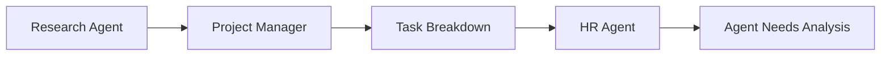

# HR-Managed Dynamic Agent Organization

## Core Architecture: 3 Foundational Agents + Dynamic Specialists

### 1. Foundation Team (Always Present)
```
Core Team:
├── Research Agent     # Information gathering and analysis
├── Project Manager    # Task planning, coordination, context distribution
└── HR Agent          # Agent lifecycle management, performance monitoring
```

### 2. Dynamic Specialist Pool (Created/Managed by HR)
```
Specialist Agents (HR-managed):
├── Implementation Agent    # Code generation, development
├── Testing Agent          # Quality assurance, test creation  
├── Database Agent         # Database design, optimization
├── API Agent             # API design, integration
├── Frontend Agent        # UI/UX development
├── Security Agent        # Security analysis, hardening
└── [Custom Specialists]  # Domain-specific as needed
```

## Agent Responsibilities

### Research Agent
```yaml
role: "Information Collector & Analyzer"
responsibilities:
  - Analyze existing codebase and requirements
  - Research best practices and patterns
  - Gather context for PM and specialists
  - Maintain project knowledge base

output_format:
  - Structured analysis reports
  - Context packages for other agents
  - Research recommendations
  - Knowledge synthesis
```

### Project Manager Agent  
```yaml
role: "Task Coordinator & Context Distributor"
responsibilities:
  - Convert research into actionable tasks
  - Create task breakdown and dependencies
  - Assign tasks to appropriate agents (core + specialists)
  - Manage context distribution and handoffs
  - Track project progress and blockers

output_format:
  - Task specifications with context
  - Project timelines and dependencies
  - Agent assignments and priorities
  - Progress reports and status updates
```

### HR Agent (The Innovation)
```yaml
role: "Agent Lifecycle Manager & Performance Monitor"
responsibilities:
  - Analyze task patterns to identify needed specialists
  - Propose agent creation with specific job descriptions
  - Monitor specialist agent performance and errors
  - Collect performance metrics and learning patterns
  - Make hire/fire decisions based on empirical data

decision_framework:
  evaluation_period: "10-20 task cycles"
  performance_metrics:
    - task_success_rate: ">80% required"
    - error_frequency: "<2 per 10 tasks" 
    - efficiency_improvement: ">15% vs baseline"
    - cost_effectiveness: "positive ROI"
  
keep_criteria:
  - Consistent performance above thresholds
  - Unique value not provided by other agents
  - Positive trend in learning/improvement
  
fire_criteria:
  - Performance below thresholds for 2 evaluation periods
  - Redundant with other agents
  - High error rate without improvement
```

## Workflow: HR-Driven Agent Management

### Phase 1: Initial Analysis & Planning


### Phase 2: Specialist Creation & Assignment
```python
# HR Agent Decision Process
class HRAgent:
    def analyze_task_requirements(self, tasks, current_agents):
        """Identify what specialist agents are needed"""
        needed_specialists = []
        
        for task in tasks:
            if self.requires_database_expertise(task) and not self.has_agent('database'):
                needed_specialists.append(self.create_agent_spec('database', task))
            
            if self.requires_api_expertise(task) and not self.has_agent('api'):
                needed_specialists.append(self.create_agent_spec('api', task))
        
        return needed_specialists
    
    def create_agent_spec(self, agent_type, triggering_task):
        """Create detailed job description for new agent"""
        return {
            'agent_type': agent_type,
            'job_description': self.generate_job_description(agent_type),
            'success_criteria': self.define_success_criteria(agent_type),
            'initial_context': self.prepare_context(triggering_task),
            'evaluation_schedule': '10 tasks, then review',
            'created_date': datetime.now()
        }
```

### Phase 3: Performance Monitoring & Evaluation
```python
class PerformanceMonitor:
    def track_agent_performance(self, agent_id, task_result):
        """Log every task result for performance analysis"""
        self.performance_log.append({
            'agent_id': agent_id,
            'task_id': task_result.task_id,
            'success': task_result.success,
            'duration': task_result.duration,
            'error_count': task_result.error_count,
            'quality_score': task_result.quality_score,
            'cost': task_result.cost,
            'timestamp': datetime.now()
        })
    
    def evaluate_agent_after_cycles(self, agent_id, cycle_count=10):
        """Make hire/fire decision based on empirical data"""
        recent_performance = self.get_recent_performance(agent_id, cycle_count)
        
        metrics = {
            'success_rate': self.calculate_success_rate(recent_performance),
            'avg_duration': self.calculate_avg_duration(recent_performance),
            'error_rate': self.calculate_error_rate(recent_performance),
            'quality_trend': self.calculate_quality_trend(recent_performance),
            'cost_efficiency': self.calculate_cost_efficiency(recent_performance)
        }
        
        decision = self.make_hire_fire_decision(metrics)
        return decision
```

### Phase 4: Validation & Quality Control
```yaml
validation_agent:
  role: "Quality Assurance for All Agent Output"
  responsibilities:
    - Review all specialist agent output
    - Validate against requirements and standards
    - Flag errors and inconsistencies
    - Provide feedback for agent improvement
  
  validation_checklist:
    - Code quality and standards compliance
    - Requirement fulfillment
    - Security best practices
    - Performance considerations
    - Documentation completeness
```

## HR Agent Implementation Details

### Agent Creation Logic
```python
class HRAgentCreationSystem:
    def identify_needed_specialists(self, project_analysis):
        """Analyze project needs and propose specialists"""
        specialist_needs = {}
        
        # Pattern recognition from task analysis
        if self.detect_database_heavy_tasks(project_analysis):
            specialist_needs['database'] = {
                'confidence': 0.85,
                'justification': 'Multiple complex database operations detected',
                'expected_workload': '40% of remaining tasks'
            }
        
        if self.detect_api_integration_tasks(project_analysis):
            specialist_needs['api'] = {
                'confidence': 0.92,
                'justification': 'External API integrations required',
                'expected_workload': '25% of remaining tasks'
            }
        
        return specialist_needs
    
    def generate_job_description(self, agent_type):
        """Create specific job description for agent type"""
        job_descriptions = {
            'database': {
                'primary_role': 'Database design, optimization, and query generation',
                'key_skills': ['SQL optimization', 'Schema design', 'Index management'],
                'success_metrics': ['Query performance', 'Schema efficiency', 'Data integrity'],
                'context_needs': ['Database requirements', 'Performance constraints', 'Data models']
            },
            'api': {
                'primary_role': 'API design, integration, and documentation',
                'key_skills': ['REST design', 'Authentication', 'Error handling'],
                'success_metrics': ['API reliability', 'Integration success', 'Documentation quality'],
                'context_needs': ['Integration requirements', 'Authentication needs', 'Data formats']
            }
        }
        return job_descriptions.get(agent_type)
```

### Performance Evaluation Framework
```python
class AgentPerformanceEvaluator:
    def __init__(self):
        self.evaluation_criteria = {
            'implementation': {
                'success_rate_threshold': 0.80,
                'avg_error_threshold': 2.0,
                'quality_score_threshold': 0.75,
                'efficiency_improvement_threshold': 0.15
            },
            'database': {
                'success_rate_threshold': 0.85,  # Higher for data integrity
                'performance_improvement_threshold': 0.20,
                'query_optimization_score': 0.80
            },
            'api': {
                'success_rate_threshold': 0.90,  # Higher for integrations
                'documentation_quality': 0.80,
                'integration_reliability': 0.85
            }
        }
    
    def make_decision(self, agent_type, performance_data):
        """Make data-driven hire/fire decision"""
        criteria = self.evaluation_criteria[agent_type]
        scores = self.calculate_scores(performance_data)
        
        decision = {
            'action': 'keep' if self.meets_criteria(scores, criteria) else 'fire',
            'confidence': self.calculate_confidence(scores, criteria),
            'reasoning': self.generate_reasoning(scores, criteria),
            'improvement_suggestions': self.generate_improvements(scores)
        }
        
        return decision
```

## Sample Workflow: Database Agent Lifecycle

### 1. HR Identifies Need
```yaml
task_analysis: "Multiple database design and optimization tasks detected"
recommendation:
  action: "create_database_agent"
  justification: "30% of remaining tasks require database expertise"
  expected_roi: "25% efficiency improvement on database tasks"
```

### 2. Agent Creation & Assignment
```yaml
database_agent:
  job_description: "Database design, query optimization, schema management"
  initial_tasks: ["Design user management schema", "Optimize slow queries"]
  success_criteria: 
    - "Query performance improvement >20%"
    - "Schema design passes validation"
    - "Zero data integrity issues"
  evaluation_period: "10 tasks completed"
```

### 3. Performance Monitoring (After 10 Tasks)
```yaml
performance_report:
  agent_id: "database_agent_001"
  evaluation_period: "10 tasks completed"
  metrics:
    success_rate: 0.90        # 9/10 tasks successful
    avg_duration: "12 minutes" # vs 20 minute baseline
    error_count: 1            # 1 minor issue
    quality_score: 0.85       # High quality output
    cost_efficiency: 1.4      # 40% better than baseline
  
  decision: "KEEP"
  confidence: 0.95
  reasoning: "Exceeds all thresholds, shows learning improvement"
```

### 4. Fire Decision Example
```yaml
performance_report:
  agent_id: "frontend_agent_002"
  evaluation_period: "15 tasks completed"  
  metrics:
    success_rate: 0.65        # Below 0.80 threshold
    error_count: 8            # Above 2 per 10 tasks threshold
    quality_trend: "declining" # Getting worse over time
    cost_efficiency: 0.8      # Not meeting efficiency gains
  
  decision: "FIRE"
  confidence: 0.88
  reasoning: "Below success rate threshold, high error count, declining performance"
  replacement_plan: "Reassign tasks to implementation agent, consider different specialist"
```

## Benefits of This Architecture

### 1. **Empirical Decision Making**
- 10-20 cycle evaluation provides statistically meaningful data
- Clear metrics prevent subjective decisions
- Performance trends show learning vs. declining agents

### 2. **Natural Specialization**
- Agents develop deep expertise in their domains
- HR identifies specialization needs based on actual task patterns
- Avoids premature optimization (agents created only when needed)

### 3. **Cost Optimization**
- Fire underperforming agents to reduce costs
- Keep only agents that provide clear ROI
- Dynamic scaling based on actual project needs

### 4. **Quality Assurance**
- Validation agent provides consistent quality checks
- Performance monitoring catches declining agents early
- Continuous improvement through agent replacement

## Human Oversight: Reporting & Dashboard System

### HR Agent: Organizational Performance Reports

#### Daily Agent Performance Summary
```yaml
# Generated every 24 hours
daily_hr_report:
  date: "2025-09-12"
  agent_fleet_status:
    total_active_agents: 5
    agents_created_today: 1
    agents_evaluated_today: 0
    agents_fired_today: 0
  
  performance_highlights:
    best_performer:
      agent: "database_agent_001"
      success_rate: 0.95
      efficiency_gain: "40% above baseline"
    
    attention_needed:
      agent: "api_agent_003"
      success_rate: 0.72
      issues: "Below threshold, 3 tasks remaining until review"
      
    cost_efficiency:
      daily_cost: "$12.40"
      cost_per_successful_task: "$0.31"
      trending: "down 15% vs last week"
```

#### Weekly HR Dashboard
```yaml
weekly_hr_dashboard:
  week_ending: "2025-09-12"
  
  organizational_health:
    total_agents_managed: 8
    hiring_decisions: 2
    firing_decisions: 1
    agent_utilization_rate: 0.78
    
  performance_trends:
    fleet_success_rate: 0.84  # trending up
    average_task_time: "8.2 minutes"  # trending down
    error_rate: 0.12  # trending down
    cost_per_task: "$0.28"  # trending down
    
  hiring_analysis:
    agents_created:
      - type: "security_agent"
        reason: "Security tasks identified in 6 recent projects"
        performance_after_5_tasks: "Meeting expectations"
      - type: "testing_agent" 
        reason: "Quality issues in implementation tasks"
        performance_after_8_tasks: "Exceeding expectations"
        
    agents_fired:
      - type: "frontend_agent_002"
        reason: "65% success rate, high error count"
        tasks_reassigned_to: "implementation_agent_001"
        cost_savings: "$45/week"
        
  recommendations_for_human:
    - priority: "high"
      recommendation: "Consider creating DevOps specialist - 12 deployment tasks detected"
      expected_roi: "30% deployment time reduction"
    - priority: "medium"  
      recommendation: "Database agent performing exceptionally - consider expanding scope"
      impact: "Could handle more complex data architecture tasks"
```

#### Monthly Strategic Report
```yaml
monthly_strategic_report:
  month: "September 2025"
  
  organizational_evolution:
    agents_created_total: 12
    agents_retained: 8  # 67% retention rate
    successful_specializations: ["database", "security", "testing", "api"]
    failed_specializations: ["frontend", "mobile", "devops", "documentation"]
    
  efficiency_gains:
    vs_single_agent_baseline:
      speed_improvement: "185%"
      quality_improvement: "40%"
      cost_efficiency: "60% better"
      
    vs_previous_month:
      speed_improvement: "25%"
      error_reduction: "35%"
      
  learning_insights:
    successful_patterns:
      - "Agents with clear, measurable success criteria perform better"
      - "Database/API agents show highest retention rates"
      - "Agents created mid-project perform better than pre-planned agents"
      
    failure_patterns:
      - "UI/UX tasks require human creativity - agents struggle"
      - "Documentation agents become redundant with good implementation agents"
      - "Mobile development needs platform-specific expertise"
      
  strategic_recommendations:
    - "Focus on backend/data specialists - highest success rate"
    - "Consider human-agent hybrid approach for creative tasks"
    - "Implement agent mentoring program for struggling specialists"
```

### PM Agent: Project Progress Reports

#### Daily Project Status
```yaml
daily_project_report:
  date: "2025-09-12"
  project: "E-commerce Platform Upgrade"
  
  progress_summary:
    overall_completion: "68%"
    tasks_completed_today: 4
    tasks_in_progress: 3
    tasks_blocked: 1
    
  timeline_status:
    original_deadline: "2025-09-20"
    current_projection: "2025-09-18"
    status: "ahead_of_schedule"
    confidence: 0.85
    
  agent_utilization:
    database_agent: "2 tasks, 3.2 hours, high performance"
    implementation_agent: "3 tasks, 4.1 hours, on track"
    api_agent: "1 task, 1.5 hours, completed early"
    
  blockers_and_risks:
    - blocker: "External API authentication pending"
      agent_affected: "api_agent" 
      resolution_time: "waiting on client response"
      impact: "1 day delay possible"
      
  quality_metrics:
    validation_pass_rate: 0.92
    rework_percentage: 0.08
    defect_density: "0.3 issues per task"
```

#### Weekly Project Dashboard  
```yaml
weekly_project_dashboard:
  week_ending: "2025-09-12"
  project: "E-commerce Platform Upgrade"
  
  milestone_progress:
    database_redesign: "completed" # ✅
    api_integration: "90% complete" # 🟡  
    frontend_updates: "in_progress" # 🟡
    testing_phase: "not_started" # ⭕
    deployment: "not_started" # ⭕
    
  performance_vs_plan:
    planned_velocity: "15 tasks/week"
    actual_velocity: "18 tasks/week"
    efficiency_trend: "improving"
    
  agent_performance_impact:
    top_contributors:
      - agent: "database_agent_001"
        impact: "Database redesign completed 2 days early"
        tasks_completed: 12
        success_rate: 0.95
        
    improvement_areas:
      - agent: "implementation_agent_002"  
        issue: "Higher than average rework rate (15%)"
        action_plan: "Additional context provided, validation agent assigned"
        
  resource_allocation:
    optimal_agent_mix: "2 implementation, 1 database, 1 api, 1 validation"
    current_mix: "3 implementation, 1 database, 1 api, 1 validation"
    recommendation: "Reduce implementation agents by 1, cost savings $200/week"
    
  risk_assessment:
    timeline_risk: "low" 
    quality_risk: "medium" # due to rework rate
    budget_risk: "low"
    scope_risk: "low"
```

#### Monthly Project Health Report
```yaml
monthly_project_health:
  month: "September 2025" 
  projects_managed: 4
  
  delivery_performance:
    projects_delivered_on_time: 3  # 75%
    projects_delivered_early: 1   # 25%
    projects_delayed: 0           # 0%
    average_delivery_accuracy: "98% scope completion"
    
  quality_trends:
    client_satisfaction: 4.6/5.0
    defect_rate_post_delivery: "2.1 issues per project"
    rework_percentage: "6% average"
    validation_pass_rate: "94% average"
    
  resource_optimization:
    agent_utilization_rate: 0.82
    most_valuable_agents: ["database_agent", "validation_agent"]
    underutilized_agents: ["documentation_agent"]
    cost_per_delivered_feature: "$142 average"
    
  project_insights:
    fastest_delivery_factors:
      - "Clear requirements from research agent"
      - "Specialized database agent for data-heavy projects" 
      - "Early validation agent involvement"
      
    common_delay_factors:
      - "External API dependencies"
      - "Scope creep in UI requirements"
      - "Client feedback delays"
      
  strategic_recommendations:
    - "Standardize research phase for faster project starts"
    - "Implement client communication protocols to reduce delays"
    - "Consider dedicated DevOps agent for deployment automation"
```

### Human Decision Support System

#### Escalation Triggers (Automatic Alerts)
```python
class HumanEscalationSystem:
    def check_escalation_conditions(self):
        alerts = []
        
        # HR escalations
        if self.agent_fire_rate > 0.5:  # >50% fire rate
            alerts.append({
                'type': 'hr_critical',
                'message': 'High agent failure rate detected',
                'action_required': 'Review hiring criteria and job descriptions'
            })
            
        if self.fleet_success_rate < 0.7:  # <70% success rate
            alerts.append({
                'type': 'hr_performance',
                'message': 'Fleet performance below acceptable threshold',
                'action_required': 'Review agent training and context quality'
            })
            
        # PM escalations  
        if self.project_delay_risk > 0.8:  # >80% delay probability
            alerts.append({
                'type': 'pm_timeline',
                'message': 'Project delay highly likely',
                'action_required': 'Review timeline and resource allocation'
            })
            
        if self.quality_trend == 'declining':
            alerts.append({
                'type': 'pm_quality',
                'message': 'Quality metrics trending downward',
                'action_required': 'Review validation processes and agent performance'
            })
            
        return alerts
```

#### Weekly Human Review Session
```yaml
weekly_review_agenda:
  duration: "30 minutes"
  
  hr_review: "10 minutes"
    - Agent performance highlights and concerns
    - Hiring/firing decisions made and planned
    - Cost efficiency trends
    - Strategic recommendations for agent fleet
    
  pm_review: "15 minutes"  
    - Project progress vs timelines
    - Quality metrics and client satisfaction
    - Resource allocation optimization
    - Risk mitigation strategies
    
  strategic_planning: "5 minutes"
    - Cross-functional insights (HR + PM)
    - System improvement opportunities
    - Human intervention decisions
    - Long-term capability development
```

### Dashboard Implementation

#### Real-Time Performance Dashboard
```html
<!-- Human-friendly dashboard interface -->
<dashboard>
  <hr-section>
    <agent-fleet-health status="good" trend="improving">
      <metric name="Active Agents" value="8" change="+1"/>
      <metric name="Fleet Success Rate" value="84%" change="+3%"/>  
      <metric name="Cost Per Task" value="$0.28" change="-12%"/>
    </agent-fleet-health>
    
    <recent-decisions>
      <improvement decision="Reset Database Agent" confidence="85%" reason="Query optimization too generic" changes="Engine-specific rules added"/>
      <evaluation decision="Keep API Agent" confidence="95%" reason="Exceptional performance post-reset"/>
      <reset decision="Major Reset Frontend Agent" confidence="78%" reason="Context overload and validation issues" status="monitoring"/>
    </recent-decisions>
  </hr-section>
  
  <pm-section>
    <project-status name="E-commerce Upgrade" completion="68%" timeline="ahead" quality="good">
      <milestone name="Database" status="complete"/>
      <milestone name="API Integration" status="90%"/>
      <milestone name="Frontend" status="in-progress"/>
    </project-status>
    
    <resource-utilization rate="82%" trend="optimal">
      <top-performer agent="database_agent" efficiency="140%"/>
      <attention-needed agent="implementation_agent" issue="high rework rate"/>
    </resource-utilization>
  </pm-section>
</dashboard>
```

This reporting system creates **intelligent human-in-the-loop oversight** without micromanagement - humans get the strategic insights they need to make informed decisions while agents handle the tactical execution autonomously.