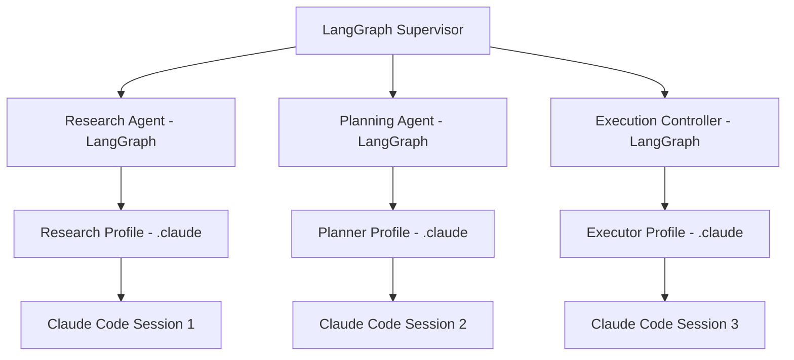

# Multi-Agent Orchestration Framework Plan
## LangGraph + Claude Code Integration

## TODO List
- [x] Research LangGraph architecture and agent orchestration patterns
- [x] Design multi-agent system architecture
- [ ] Set up LangGraph/LangChain infrastructure
- [ ] Create research agent configuration
- [ ] Create planning agent configuration
- [ ] Create execution agent configuration
- [ ] Implement feedback collection system
- [ ] Set up monitoring and self-improvement mechanisms
- [ ] Create integration with Claude Code ecosystem
- [ ] Test and validate the framework

## How .claude Agents and Orchestration Agents Work Together

### Two-Layer Agent Architecture

The framework operates on two distinct but interconnected layers:

#### 1. **Orchestration Layer (LangGraph Agents)**
- **Location**: `orchestration/agents/`
- **Purpose**: High-level decision making and workflow coordination
- **Execution**: Runs in Python/Node.js runtime
- **Scope**: Cross-project, abstract reasoning
- **State**: Managed by LangGraph's StateGraph

#### 2. **Execution Layer (Claude Code Agents)**
- **Location**: `.claude/agents/`
- **Purpose**: Direct code manipulation and tool execution
- **Execution**: Runs within Claude Code sessions
- **Scope**: Project-specific, concrete actions
- **State**: Managed by Claude Code context

### Integration Pattern



### Communication Flow

1. **LangGraph Agent decides** what needs to be done
2. **Claude Code Agent executes** the actual work
3. **Results flow back** to LangGraph for next decision

### Example Workflow

#### Step 1: LangGraph Research Agent
```python
# orchestration/agents/research_agent.py
def research_node(state):
    # High-level decision: "We need to understand the authentication system"
    research_task = {
        "type": "code_analysis",
        "target": "authentication",
        "depth": "comprehensive"
    }

    # Dispatch to Claude Code
    result = dispatch_to_claude_agent(
        agent_profile="research",
        task=research_task,
        context=state["project_context"]
    )

    return {"research_results": result}
```

#### Step 2: Claude Code Research Agent
```json
// .claude/agents/research.json
{
  "name": "Research Agent",
  "trigger_command": "/research",
  "auto_execute": [
    "Grep(*auth*)",
    "Read(**/*auth*.py)",
    "mcp__github__search_code"
  ]
}
```

#### Step 3: Execution via MCP Bridge
```python
# orchestration/mcp_bridge.py
def dispatch_to_claude_agent(agent_profile, task, context):
    # Create Claude Code session
    session = ClaudeCodeSession(
        profile=f".claude/agents/{agent_profile}.json",
        context_files=context.get("files", [])
    )

    # Execute task through MCP server
    return session.execute_task(task)
```

### Key Differences

| Aspect | LangGraph Agents | Claude Code Agents |
|--------|-----------------|-------------------|
| **Focus** | Strategy & Coordination | Execution & Implementation |
| **Tools** | Abstract tools (task decomposition, planning) | Concrete tools (Edit, Bash, Git) |
| **Memory** | Long-term, cross-session | Session-specific, file-based |
| **State** | Graph state, checkpoints | File system, git state |
| **Language** | Python/TypeScript | JSON configuration + rules |

### Synchronization Mechanisms

1. **Shared State Store**
   ```python
   # orchestration/state/shared_state.py
   class SharedState:
       def __init__(self):
           self.langgraph_state = {}  # High-level state
           self.claude_state = {}     # Execution state
           self.task_master_state = {} # Task tracking
   ```

2. **Event Bridge**
   ```javascript
   // .claude/hooks/sync-to-langgraph.js
   exports.onTaskComplete = async (task) => {
       await fetch('http://localhost:8000/orchestrator/event', {
           method: 'POST',
           body: JSON.stringify({
               type: 'task_complete',
               task_id: task.id,
               results: task.results
           })
       });
   };
   ```

3. **Bidirectional Communication**
   - **LangGraph → Claude**: Via MCP server commands
   - **Claude → LangGraph**: Via webhooks and file system

### Practical Implementation

#### LangGraph Orchestrator initiates:
```python
async def orchestrate_feature(feature_request):
    # 1. LangGraph plans the approach
    plan = await planning_agent.plan(feature_request)

    # 2. Dispatch research to Claude Code
    research = await mcp_client.call(
        server="claude_research",
        method="analyze_codebase",
        params={"focus": plan.research_areas}
    )

    # 3. Generate implementation tasks
    tasks = await planning_agent.create_tasks(research)

    # 4. Execute via Claude Code
    for task in tasks:
        result = await mcp_client.call(
            server="claude_executor",
            method="implement_task",
            params={"task": task, "context": research}
        )

        # 5. Collect feedback
        feedback = await feedback_agent.analyze(result)

        # 6. Iterate if needed
        if feedback.needs_revision:
            await improvement_agent.revise(task, feedback)
```

#### Claude Code executes:
```markdown
# .claude/commands/execute-task.md
Execute orchestrated task: $TASK_ID

1. Fetch task details from orchestrator
2. Load relevant context files
3. Implement according to specifications
4. Run tests
5. Report results back to orchestrator
```

### Benefits of This Architecture

1. **Separation of Concerns**
   - LangGraph handles reasoning and planning
   - Claude Code handles concrete execution

2. **Scalability**
   - Multiple Claude Code sessions can run in parallel
   - Each handles different parts of the codebase

3. **Flexibility**
   - Can swap execution agents (Claude Code, GitHub Copilot, etc.)
   - Can change orchestration logic without affecting execution

4. **Observability**
   - LangGraph provides high-level traces
   - Claude Code provides detailed execution logs

## Architecture Overview

### Core Components

1. **LangGraph Orchestration Layer**
   - Central graph-based workflow orchestration
   - State management and persistence
   - Human-in-the-loop capabilities
   - Streaming and monitoring

2. **Claude Code Agent Layer**
   - Individual specialized agents via MCP servers
   - Custom commands and hooks
   - Rule-based behaviors
   - Local execution context

3. **LangSmith Monitoring Layer**
   - Trace collection and analysis
   - Performance metrics
   - Self-improvement feedback loops
   - Evaluation frameworks

## Implementation Plan

### Phase 1: Infrastructure Setup

#### 1.1 LangGraph Core
```python
# Core dependencies
pip install langgraph langchain langsmith langchain-anthropic langchain-openai
```

#### 1.2 Project Structure
```
MADF/
├── orchestration/
│   ├── graphs/
│   │   ├── main_supervisor.py
│   │   ├── research_workflow.py
│   │   ├── planning_workflow.py
│   │   └── execution_workflow.py
│   ├── agents/
│   │   ├── research_agent.py
│   │   ├── planning_agent.py
│   │   ├── execution_agent.py
│   │   └── feedback_agent.py
│   ├── state/
│   │   └── shared_state.py
│   └── config/
│       └── langgraph.json
├── .claude/
│   ├── agents/
│   │   ├── research.json
│   │   ├── planner.json
│   │   └── executor.json
│   ├── commands/
│   │   ├── orchestrate.md
│   │   └── analyze-progress.md
│   └── hooks/
│       ├── pre-execution.sh
│       └── post-completion.sh
└── monitoring/
    ├── langsmith_config.py
    └── metrics_collector.py
```

### Phase 2: Agent Definitions

#### 2.1 Research Agent
**Purpose**: Gather information, analyze requirements, explore solutions

**LangGraph Implementation**:
```python
from langgraph.prebuilt import create_react_agent
from langchain_anthropic import ChatAnthropic
from langchain.tools import Tool

research_agent = create_react_agent(
    model=ChatAnthropic(model="claude-3-5-sonnet-20241022"),
    tools=[
        perplexity_search,
        documentation_fetcher,
        code_analyzer,
        github_search
    ],
    checkpointer=MemorySaver()
)
```

**Claude Code Configuration** (`.claude/agents/research.json`):
```json
{
  "name": "Research Agent",
  "role": "Information gathering and analysis",
  "tools": [
    "WebSearch",
    "WebFetch",
    "mcp__context7__*",
    "mcp__github__search_*",
    "Grep",
    "Read"
  ],
  "context_files": [
    "docs/research_guidelines.md",
    "docs/knowledge_base.md"
  ]
}
```

#### 2.2 Planning Agent
**Purpose**: Break down tasks, create execution plans, manage dependencies

**LangGraph Implementation**:
```python
planning_agent = create_react_agent(
    model=ChatAnthropic(model="claude-3-5-sonnet-20241022"),
    tools=[
        task_decomposer,
        dependency_analyzer,
        priority_scorer,
        taskmaster_integration
    ],
    system_prompt=PLANNING_PROMPT
)
```

**Task Master Integration**:
```python
from taskmaster_tools import (
    parse_prd,
    expand_task,
    analyze_complexity,
    set_dependencies
)
```

#### 2.3 Execution Agent
**Purpose**: Implement code, run tests, fix issues

**Claude Code Configuration**:
```json
{
  "name": "Execution Agent",
  "role": "Code implementation and testing",
  "tools": [
    "Edit",
    "Write",
    "MultiEdit",
    "Bash",
    "mcp__task-master-ai__*",
    "TodoWrite"
  ],
  "auto_approve_patterns": [
    "npm test",
    "python -m pytest",
    "git add",
    "git commit"
  ]
}
```

### Phase 3: Orchestration Graph

#### 3.1 Main Supervisor Graph
```python
from langgraph.graph import StateGraph, END
from langgraph.checkpoint import MemorySaver

class OrchestratorState(TypedDict):
    messages: Annotated[list[AnyMessage], add_messages]
    current_task: str
    research_complete: bool
    plan_approved: bool
    execution_status: str
    feedback: list[str]
    metrics: dict

def create_orchestrator():
    workflow = StateGraph(OrchestratorState)

    # Add nodes
    workflow.add_node("research", research_node)
    workflow.add_node("planning", planning_node)
    workflow.add_node("human_review", human_review_node)
    workflow.add_node("execution", execution_node)
    workflow.add_node("feedback", feedback_node)
    workflow.add_node("improvement", improvement_node)

    # Add edges with conditions
    workflow.add_edge("research", "planning")
    workflow.add_conditional_edges(
        "planning",
        lambda x: "human_review" if x["needs_approval"] else "execution"
    )
    workflow.add_edge("human_review", "execution")
    workflow.add_edge("execution", "feedback")
    workflow.add_conditional_edges(
        "feedback",
        lambda x: "improvement" if x["needs_improvement"] else END
    )
    workflow.add_edge("improvement", "execution")

    # Set entry point
    workflow.set_entry_point("research")

    # Compile with persistence
    checkpointer = MemorySaver()
    return workflow.compile(checkpointer=checkpointer)
```

### Phase 4: Claude Code Integration

#### 4.1 MCP Server Configuration
```json
{
  "mcpServers": {
    "orchestrator": {
      "command": "python",
      "args": ["orchestration/mcp_server.py"],
      "env": {
        "LANGSMITH_API_KEY": "${LANGSMITH_API_KEY}",
        "LANGCHAIN_TRACING_V2": "true"
      }
    }
  }
}
```

#### 4.2 Custom Commands
**`.claude/commands/orchestrate.md`**:
```markdown
Orchestrate a complete development workflow for: $ARGUMENTS

Steps:
1. Initialize orchestration graph
2. Start research phase with query: $ARGUMENTS
3. Generate development plan
4. Get human approval if needed
5. Execute implementation
6. Collect feedback and metrics
7. Apply improvements if necessary
```

#### 4.3 Hooks for Progress Monitoring
**`.claude/hooks/execution-monitor.sh`**:
```bash
#!/bin/bash
# Monitor execution progress and send to LangSmith

if [[ "$1" == "Edit" || "$1" == "Write" ]]; then
    curl -X POST "http://localhost:8000/track_progress" \
        -H "Content-Type: application/json" \
        -d "{\"action\": \"$1\", \"file\": \"$2\", \"timestamp\": \"$(date -u +%Y-%m-%dT%H:%M:%SZ)\"}"
fi
```

### Phase 5: Feedback & Self-Improvement

#### 5.1 Metrics Collection
```python
class MetricsCollector:
    def __init__(self, langsmith_client):
        self.client = langsmith_client
        self.metrics = {
            "task_completion_rate": 0,
            "code_quality_score": 0,
            "test_coverage": 0,
            "execution_time": 0,
            "retry_count": 0,
            "human_interventions": 0
        }

    def track_execution(self, task_id, result):
        # Track task execution metrics
        pass

    def analyze_performance(self):
        # Analyze collected metrics
        return self.client.evaluate(
            self.metrics,
            evaluators=["correctness", "efficiency", "quality"]
        )
```

#### 5.2 Self-Improvement Loop
```python
def improvement_node(state):
    # Analyze feedback
    analysis = analyze_feedback(state["feedback"])

    # Generate improvements
    improvements = generate_improvements(analysis)

    # Update agent prompts/tools
    for improvement in improvements:
        if improvement.type == "prompt":
            update_agent_prompt(improvement.agent, improvement.new_prompt)
        elif improvement.type == "tool":
            add_tool_to_agent(improvement.agent, improvement.tool)

    return {"improvements_applied": improvements}
```

### Phase 6: Deployment & Testing

#### 6.1 Local Development Server
```python
# orchestration/server.py
from langgraph.server import LangGraphServer

app = LangGraphServer(
    graph=create_orchestrator(),
    config={
        "streaming": True,
        "human_in_the_loop": True,
        "persistence": "postgres://localhost/orchestrator"
    }
)

if __name__ == "__main__":
    app.run(host="0.0.0.0", port=8000)
```

#### 6.2 Testing Framework
```python
# tests/test_orchestration.py
async def test_full_workflow():
    orchestrator = create_orchestrator()

    # Test research phase
    result = await orchestrator.ainvoke({
        "messages": [HumanMessage("Research authentication patterns")],
        "current_task": "auth_implementation"
    })

    assert result["research_complete"] == True
    assert len(result["plan"]["tasks"]) > 0
```

## Key Features

### 1. Parallel Execution
- Multiple agents working on independent tasks
- Efficient resource utilization
- Reduced development time

### 2. Human-in-the-Loop
- Approval gates for critical decisions
- Manual intervention points
- Quality control checkpoints

### 3. Memory & Persistence
- Cross-session memory
- State recovery after failures
- Historical context retention

### 4. Streaming & Real-time Updates
- Live progress monitoring
- Immediate feedback incorporation
- Dynamic plan adjustment

### 5. Self-Improvement
- Performance metric tracking
- Automatic prompt optimization
- Tool selection learning

## Implementation Timeline

### Week 1: Core Infrastructure
- Set up LangGraph environment
- Create basic agent definitions
- Implement simple orchestration graph

### Week 2: Agent Specialization
- Develop research agent with web search
- Create planning agent with Task Master
- Build execution agent with Claude Code tools

### Week 3: Integration & Testing
- Connect all components
- Implement monitoring with LangSmith
- Create test scenarios

### Week 4: Optimization & Deployment
- Add self-improvement mechanisms
- Optimize performance
- Deploy to production environment

## Success Metrics

1. **Task Completion Rate**: >90% automated completion
2. **Code Quality**: Passes all linting and tests
3. **Development Speed**: 3x faster than manual
4. **Human Intervention**: <10% of tasks require manual input
5. **Self-Improvement**: 20% performance gain over time

## Next Steps

1. Initialize LangGraph project structure
2. Install required dependencies
3. Create basic agent implementations
4. Test individual components
5. Build orchestration graph
6. Integrate with Claude Code
7. Set up monitoring
8. Deploy and iterate