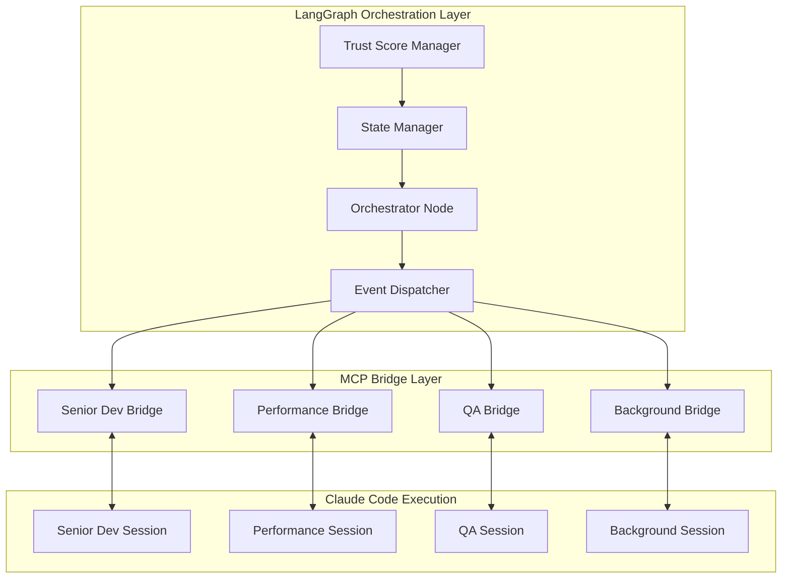
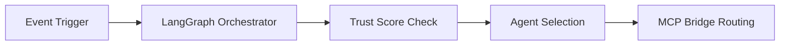
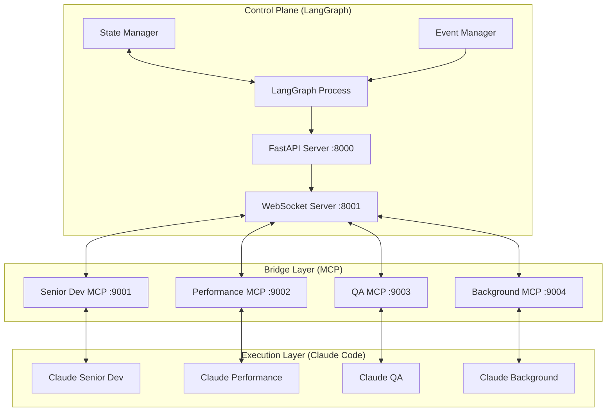
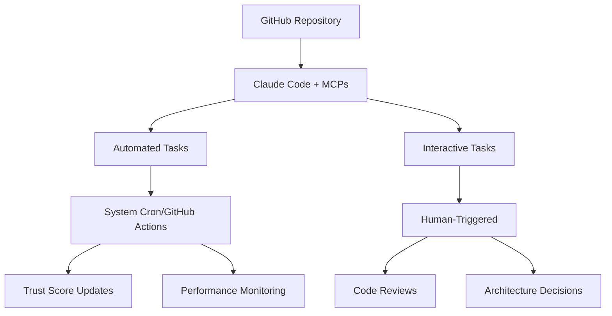

# Multi-Agent Development Framework PRD v3.0

## Executive Summary

A **pragmatic, integration-focused** Multi-Agent Development Framework (MADF) designed for optimizing and coordinating development across mature, well-architected projects. After comprehensive codebase analysis, **alphaseek** and **TotoRich** are revealed to be sophisticated, production-ready systems requiring integration and optimization rather than rescue migration.

**Key Discovery**: Original assumptions about "legacy 70k LOC" codebases were incorrect - these are modern, professional platforms requiring framework integration, not migration.

**Framework Philosophy**: Start simple, measure everything, scale based on proven value. 

**Potential Path**: PRD creation - Task - Migration exiting code - testing - develop factors - pick factors for a strategy - research - set risk management parameters - back test - optimise parameters for high sharpre results

## 1. Product Strategy & Priorities

### 1.1 Primary Directive
**🎯 Multi-Project Integration & Optimization Focus**
- Build **madfm** multi-agent development framework management first
- Integrate mature **alphaseek** quantitative finance platform into unified development workflow
- Coordinate **TotoRich** full-stack financial platform development  
- Extract and share reusable components across project ecosystem
- Optimize development processes and enable cross-project collaboration

### 1.2 Integration Objectives
- for alpha seek setup factor-based architectures and use components of past mature architectures as see fit
- Enable component sharing and cross-project development
- Establish unified CI/CD and development workflows
- Optimize development velocity through intelligent automation

### 1.3 Integration Targets & Actual Status

**🔍 ACTUAL PROJECT ECOSYSTEM DISCOVERED:**

| Project | Actual Status | Integration Priority | Integration Strategy |
|---------|-------------|-------------------|--------------------|
| **madfm** | Multi-agent development platform management | **Priority 0** | Multi-agent management |
| **alphaseek** | Production-ready quantitative platform | **Priority 1** | Framework integration + component extraction |
| **TotoRich** | Mature full-stack financial platform | **Priority 2** | Development workflow optimization |
| **Additional Projects** | 5 active projects identified | **Priority 3** | Cross-project coordination |

**PROJECT ANALYSIS FINDINGS:**
- **madfm/**: Sophisticated agent management system build up first before anything else
- **alpha-seek/**: Sophisticated quant platform with Beta status, 80% test coverage, professional pyproject.toml
- **totorich/**: Complete full-stack financial platform with backend/frontend/mobile architecture  
- **1ClkMan, citybadge, hedgemonkey, noq, legalvamp, storewise**: Additional well-organized projects
- **scripts/**: Professional validation, Bloomberg integration, and data management infrastructure
- **docs/**: Comprehensive technical documentation including detailed project structure guides


### 1.4 Multi-Factor Maturity Assessment
Beyond just LOC, projects graduate stages based on:

| Stage | Primary Trigger | Secondary Indicators | Overhead Level |
|-------|----------------|----------------------|----------------|
| **Prototype** | <10k LOC | No users, no revenue | **5%**: Git + basic docs |
| **Early Stage** | 10k-50k LOC | 1+ paying customers OR 100+ active users | **15%**: Testing + monitoring |
| **Growth Stage** | 50k+ LOC | Consistent revenue OR 1000+ users OR critical dependencies | **25%**: Full CI/CD + security |
| **Scale Stage** | 200k+ LOC | Scale economics proven | **40%**: Enterprise practices |

**Current Status:**
- **alphaseek**: 80k LOC + personal daily use → **Growth Stage**
- **TotoRich**: Mature full-stack platform → **Growth Stage**
- **Others**: <5k LOC + no users → **Prototype Stage**

## 2. Hybrid Multi-Agent Development Framework Architecture

### 2.0 Hybrid Architecture Overview: LangGraph + Claude Code + MCP Bridge

The framework implements a **hybrid orchestration model** combining:
- **LangGraph Orchestration Layer**: Central coordination, event routing, state management
- **Claude Code Execution Environments**: Specialized agent sessions for code implementation
- **MCP Bridge Servers**: Bi-directional communication between LangGraph and Claude Code



### 2.1 Core Architecture: 3 Foundational Agents + HR-Managed Dynamic Specialists

The framework implements a **3 foundational + HR-managed specialists** approach, replacing the rigid 3-agent system:

#### 2.1.1 Foundational Team (Always Present)
```
Core Team:
├── Research Agent     # Information gathering and analysis
├── PM Agent    # Task planning, coordination, context distribution, propose agent required, have knowledge of agent types
└── HR Agent          # Performance monitoring(report), Agent lifecycle management proposal to human to decide
```

#### 2.1.2 Dynamic Specialist Pool (HR-Managed only turns active when called)
```
Specialist Agents (HR-managed):
├── Implementation Agent    # Code generation, development
├── Testing Agent          # Quality assurance, test creation  
├── Database Agent         # Database design, optimization
├── API Agent             # API design, integration
├── Frontend Agent        # UI/UX development
├── Security Agent        # Security analysis, hardening
└── [Custom Specialists]  # Domain-specific as needed
```

### 2.2 Agent Responsibilities

#### Research Agent
```yaml
role: "Information Collector & Analyzer"
responsibilities:
  - Analyze existing codebase and requirements
  - Research best practices and patterns
  - Gather context for PM and specialists
  - Maintain project knowledge base
  - MCP, command, hooks, rules, agent setup best practices
  - record errors made and group similar error together, add count
  - Receive request from HR agent on error problem to research and suggest improvement on rules, hooks, command, tools and agent

output_format:
  - Structured analysis reports
  - Context packages for other agents
  - Research recommendations
  - Knowledge synthesis
```

#### PM Agent  
```yaml
role: "Task Coordinator & Context Distributor"
responsibilities:
  - Convert research into actionable tasks
  - Create task breakdown based on complexity and dependencies
  - Analyze task patterns to identify needed specialists ask HR for creation
  - Assign tasks to appropriate agents (core + specialists) which can run parallel, which can be run independently by agent overnight
  - Manage context distribution and handoffs
  - Track project progress and blockers
  - answer specialist agent call to provide more context

output_format:
  - Task specifications with context
  - Project timelines and dependencies
  - Agent assignments and priorities
  - Progress reports and status updates
```

#### HR Agent (The Innovation)
```yaml
role: "Agent Lifecycle Manager & Performance Monitor"
responsibilities:
  - answer PM agent call to agent creation with specific job descriptions
  - Monitor specialist agent performance and errors
  - Collect performance metrics and learning patterns
  - Analyse error log in that poor performance agent 
  - Suggest creation/retirement decisions based on empirical data
  - always keep at least 1 copy of agent of different type

decision_framework:
  evaluation_period: "15 task cycles"
  performance_metrics:
    - task_success_rate: ">80% required"
    - error_frequency: "<2 per 10 tasks" 
    - efficiency_improvement: ">15% vs baseline"
    - cost_effectiveness: "positive ROI"
  
keep_criteria:
  - Consistent performance above thresholds
  - Unique value not provided by other agents
  - Positive trend in learning/improvement
  
retire_criteria:
  - Performance below thresholds for 2 evaluation periods trigger agent error analysis
  - Aanalyse error log in that agent and analyse the reason and get research agent for improvement suggestions
  - Ask human to approve improvement plan with other agents
  - High error rate without improvement
  
```

### 2.2.1 LangGraph Orchestration Components

```python
# langgraph_orchestrator.py
from langgraph.graph import StateGraph, State
from typing import TypedDict, Literal, List, Dict
import asyncio

class OrchestratorState(TypedDict):
    """Central state managed by LangGraph"""
    current_task: Dict
    agent_assignments: Dict[str, str]
    trust_scores: Dict[str, float]
    event_queue: List[Dict]
    execution_results: List[Dict]
    mcp_bridge_status: Dict[str, bool]

class HybridOrchestrator:
    def __init__(self):
        self.graph = StateGraph(OrchestratorState)
        self.setup_nodes()

    def setup_nodes(self):
        # Core orchestration nodes
        self.graph.add_node("event_dispatcher", self.dispatch_events)
        self.graph.add_node("trust_evaluator", self.evaluate_trust)
        self.graph.add_node("task_router", self.route_to_agent)
        self.graph.add_node("result_aggregator", self.aggregate_results)

    async def dispatch_events(self, state: OrchestratorState):
        """Route events to appropriate Claude Code sessions via MCP"""
        event = state["event_queue"][0]

        if event["priority"] == "critical":
            # Direct routing to Senior Dev Claude session
            await self.mcp_bridge.send_to_claude(
                session="senior_dev",
                task=event["task"],
                context=event["context"]
            )
        return state
```

### 2.2.2 MCP Bridge Server Specifications

```javascript
// mcp_bridge_server.js
class MCPBridgeServer {
    constructor(agentType) {
        this.agentType = agentType;
        this.langgraphEndpoint = process.env.LANGGRAPH_ENDPOINT;
        this.claudeSessionId = null;
        this.stateSync = new Map();
    }

    // Bi-directional communication methods
    async receiveFromLangGraph(task) {
        // Receive task from LangGraph orchestrator
        const claudeCommand = this.translateToClaudeCommand(task);
        return await this.executeInClaude(claudeCommand);
    }

    async sendToLangGraph(result) {
        // Send execution results back to orchestrator
        const orchestratorUpdate = {
            agentType: this.agentType,
            sessionId: this.claudeSessionId,
            result: result,
            trustMetrics: this.calculateLocalTrustMetrics(result),
            timestamp: Date.now()
        };

        return await fetch(`${this.langgraphEndpoint}/update`, {
            method: 'POST',
            body: JSON.stringify(orchestratorUpdate)
        });
    }

    translateToClaudeCommand(task) {
        // Convert LangGraph task to Claude Code executable format
        const commandMap = {
            'implement_feature': `task-master show ${task.id} && implement`,
            'run_tests': `npm test ${task.testPath}`,
            'optimize_query': `analyze-performance ${task.queryId}`,
            'review_code': `review-pr ${task.prNumber}`
        };

        return commandMap[task.type] || task.customCommand;
    }
}
```

### 2.2.3 Claude Code Session Management

```yaml
# claude_sessions.yaml
sessions:
  senior_dev:
    model: claude-3-5-sonnet-20241022
    workspace: /projects/alphaseek
    mcp_servers:
      - task-master-ai
      - github
      - mcp_bridge_senior
    trust_level: high
    allowed_operations:
      - multi_file_changes
      - architecture_decisions
      - dependency_updates

  performance:
    model: claude-3-5-haiku-20241022
    workspace: /projects/alphaseek
    mcp_servers:
      - mcp_bridge_performance
      - database_profiler
    trust_level: medium
    allowed_operations:
      - query_optimization
      - index_management
      - caching_strategies

  qa:
    model: claude-3-5-sonnet-20241022
    workspace: /projects/alphaseek-tests
    mcp_servers:
      - mcp_bridge_qa
      - playwright
      - jest_runner
    trust_level: high
    allowed_operations:
      - test_generation
      - test_execution
      - coverage_analysis

  background:
    model: claude-3-5-haiku-20241022
    workspace: /projects/maintenance
    mcp_servers:
      - mcp_bridge_background
    trust_level: low
    allowed_operations:
      - formatting
      - documentation
      - simple_refactoring
```

### 2.3 Hybrid Workflow: Event-Driven Task Execution

#### Phase 1: Event Reception & Orchestration (LangGraph)


#### Phase 2: Specialist Creation & Assignment
```python
# HR Agent Decision Process
class HRAgent:
    def analyze_task_requirements(self, tasks, current_agents):
        """Identify what specialist agents are needed"""
        needed_specialists = []
        
        for task in tasks:
            if self.requires_database_expertise(task) and not self.has_agent('database'):
                needed_specialists.append(self.create_agent_spec('database', task))
            
            if self.requires_api_expertise(task) and not self.has_agent('api'):
                needed_specialists.append(self.create_agent_spec('api', task))
        
        return needed_specialists
    
    def create_agent_spec(self, agent_type, triggering_task):
        """Create detailed job description for new agent"""
        return {
            'agent_type': agent_type,
            'job_description': self.generate_job_description(agent_type),
            'success_criteria': self.define_success_criteria(agent_type),
            'initial_context': self.prepare_context(triggering_task),
            'evaluation_schedule': '10 tasks, then review',
            'created_date': datetime.now()
        }
```

#### Phase 3: Performance Monitoring & Evaluation
```python
class PerformanceMonitor:
    def track_agent_performance(self, agent_id, task_result):
        """Log every task result for performance analysis"""
        self.performance_log.append({
            'agent_id': agent_id,
            'task_id': task_result.task_id,
            'success': task_result.success,
            'duration': task_result.duration,
            'error_count': task_result.error_count,
            'quality_score': task_result.quality_score,
            'cost': task_result.cost,
            'timestamp': datetime.now()
        })
    
    def evaluate_agent_after_cycles(self, agent_id, cycle_count=10):
        """Make hire/fire decision based on empirical data"""
        recent_performance = self.get_recent_performance(agent_id, cycle_count)
        
        metrics = {
            'success_rate': self.calculate_success_rate(recent_performance),
            'avg_duration': self.calculate_avg_duration(recent_performance),
            'error_rate': self.calculate_error_rate(recent_performance),
            'quality_trend': self.calculate_quality_trend(recent_performance),
            'cost_efficiency': self.calculate_cost_efficiency(recent_performance)
        }
        
        decision = self.make_hire_fire_decision(metrics)
        return decision
```

### 2.4 Agent Allocation by Project Stage (HR-Managed)

#### Growth Stage (alphaseek + TotoRich): 3 Foundational + Variable Specialists
- 3 Foundational Agents (Research, PM, HR) - Always active
- 2-4 Specialist Agents - Created/managed by HR based on project needs
- Dynamic scaling based on task complexity and performance data

#### Prototype Stage (5 projects): Foundational + 1 Specialist
- 3 Foundational Agents (shared across projects)
- 1 Implementation Agent (handles simple development tasks)

## 3. Event-Driven Workflow System

### 3.1 Trigger-Based Task Assignment

Instead of rigid daily schedules, the system responds to **events**:

```yaml
# High-Priority Triggers (Interrupt current work)
critical_bug_reported:
  projects: [alphaseek]
  action: Reassign 2 agents to bug investigation
  timeout: 4 hours

security_vulnerability:
  projects: [all]
  action: Hard stop all deployments, security review
  timeout: 24 hours

# Standard Triggers (Queue for next available agent)
feature_request_approved:
  projects: [alphaseek]
  action: Assign to Senior Development Agent
  priority: high

simple_crud_needed:
  projects: [prototype_stage]
  action: Assign to Background Processing Agent
  priority: low

# Automated Triggers (No human intervention)
tests_failing:
  action: Assign to QA Agent for investigation
  max_attempts: 3

performance_degradation:
  threshold: ">2x baseline response time"
  action: Assign to Performance Agent
  priority: medium
```

### 3.2 Daily Operating Windows (Based on Claude Code Pro Limits)

```
7:00 AM - 12:00 PM: High-Intensity Window 1
├── alphaseek critical & high-priority tasks
├── Complex problem solving with Senior Agent
├── Human collaboration on architecture decisions

1:00 PM - 6:00 PM: High-Intensity Window 2  
├── alphaseek testing & optimization
├── Component extraction for reuse
├── Prototype project simple tasks

6:00 PM - 11:00 PM: Human Review & Planning
├── Review agent outputs and decisions
├── Plan next day's priorities
├── Handle any escalated issues

11:00 PM - 7:00 AM: Autonomous Background Mode
├── Code formatting, documentation
├── Simple refactoring within established patterns
├── Hard stop on any ambiguous decisions
```

## 4. Simplified Performance Measurement

### 4.1 Three-Metric Trust Score System (Addressing Complexity)

Based on critique feedback, we're simplifying to **3 core metrics**:

```javascript
Trust Score = (
  (Task Completion Rate × 50) +           // % of assigned tasks completed successfully
  (Build Success Rate × 30) +             // % of commits that don't break builds  
  (Human Override Rate × -20)             // % of decisions human had to reverse (penalty)
) / 100

Behavioral Changes by Trust Level:
├── 80-100: Full autonomy on assigned tasks
├── 60-79:  Supervised complex tasks, autonomous simple tasks
├── 40-59:  Simple tasks only with human review
├── <40:    Retraining required, human oversight on all tasks
```

**Why This Works Better:**
- **Task Completion Rate**: Measures actual productivity
- **Build Success Rate**: Measures code quality and stability
- **Human Override Rate**: Measures decision quality (penalty for reversals)
- **Removed**: Code coverage (can be gamed), component reuse (too complex to measure accurately)

### 4.2 HR Agent Performance Evaluation Framework

```python
class AgentPerformanceEvaluator:
    def __init__(self):
        self.evaluation_criteria = {
            'implementation': {
                'success_rate_threshold': 0.80,
                'avg_error_threshold': 2.0,
                'quality_score_threshold': 0.75,
                'efficiency_improvement_threshold': 0.15
            },
            'database': {
                'success_rate_threshold': 0.85,  # Higher for data integrity
                'performance_improvement_threshold': 0.20,
                'query_optimization_score': 0.80
            },
            'api': {
                'success_rate_threshold': 0.90,  # Higher for integrations
                'documentation_quality': 0.80,
                'integration_reliability': 0.85
            }
        }
    
    def make_decision(self, agent_type, performance_data):
        """Make data-driven hire/fire decision"""
        criteria = self.evaluation_criteria[agent_type]
        scores = self.calculate_scores(performance_data)
        
        decision = {
            'action': 'keep' if self.meets_criteria(scores, criteria) else 'fire',
            'confidence': self.calculate_confidence(scores, criteria),
            'reasoning': self.generate_reasoning(scores, criteria),
            'improvement_suggestions': self.generate_improvements(scores)
        }
        
        return decision
```

### 4.3 Agent Creation Logic

```python
class HRAgentCreationSystem:
    def identify_needed_specialists(self, project_analysis):
        """Analyze project needs and propose specialists"""
        specialist_needs = {}
        
        # Pattern recognition from task analysis
        if self.detect_database_heavy_tasks(project_analysis):
            specialist_needs['database'] = {
                'confidence': 0.85,
                'justification': 'Multiple complex database operations detected',
                'expected_workload': '40% of remaining tasks'
            }
        
        if self.detect_api_integration_tasks(project_analysis):
            specialist_needs['api'] = {
                'confidence': 0.92,
                'justification': 'External API integrations required',
                'expected_workload': '25% of remaining tasks'
            }
        
        return specialist_needs
    
    def generate_job_description(self, agent_type):
        """Create specific job description for agent type"""
        job_descriptions = {
            'database': {
                'primary_role': 'Database design, optimization, and query generation',
                'key_skills': ['SQL optimization', 'Schema design', 'Index management'],
                'success_metrics': ['Query performance', 'Schema efficiency', 'Data integrity'],
                'context_needs': ['Database requirements', 'Performance constraints', 'Data models']
            },
            'api': {
                'primary_role': 'API design, integration, and documentation',
                'key_skills': ['REST design', 'Authentication', 'Error handling'],
                'success_metrics': ['API reliability', 'Integration success', 'Documentation quality'],
                'context_needs': ['Integration requirements', 'Authentication needs', 'Data formats']
            }
        }
        return job_descriptions.get(agent_type)
```

## 5. Realistic Cost Management

### 5.1 Complete Budget Breakdown (Monthly)

```
Core Tools:
├── GitHub Free: $0 (public repos)
├── GitHub Actions: $0 (2000 minutes free)
├── Cursor Auto Pro: Already owned
├── Claude Code Pro: Already owned
├── Notion Free: $0

Estimated Hidden Costs:
├── Claude API calls (background agent): ~$50-100/month
├── Cursor API overages: ~$20-50/month  
├── GitHub storage (over 1GB): ~$5-10/month
├── Domain names (.dev domains): ~$12/year each
├── SSL certificates: $0 (Let's Encrypt)

Realistic Monthly Total: $75-160
Budget Alerts:
├── 70% of budget: Review usage patterns
├── 85% of budget: Reduce background processing
├── 95% of budget: Emergency protocols (pause non-critical)
```

### 5.2 Cost Monitoring Agent

**New Agent Type**: Budget Monitoring Agent
**Purpose**: Track API usage, compute costs, and efficiency metrics
**Daily Reports**: Cost per feature, ROI analysis, optimization suggestions

## 6. Pragmatic Component Strategy

### 6.1 Component Maturity Gates

Before extracting components from alphaseek for reuse:

```
Gate 1: Stability Test
├── Component unchanged for 2+ weeks
├── Zero bugs reported in recent usage  
├── Clear interface boundaries identified

Gate 2: Generalizability Assessment  
├── Remove alphaseek-specific business logic
├── Identify configuration parameters needed
├── Document integration requirements

Gate 3: Pilot Testing
├── Implement in 1 prototype project first
├── Measure integration effort vs. building from scratch
├── Validate component saves development time

Gate 4: Wide Deployment
├── Only after successful pilot
├── Version control and backward compatibility plan
├── Maintenance ownership assigned
```

### 6.2 Weekly (Not Daily) Component Review

**Frequency**: Every Friday during human review session
**Process**: Review alphaseek changes from the week, identify 1-2 potential components
**Criterion**: Only extract components with clear multi-project value

## 7. Enhanced Quality Assurance

### 7.1 Mandatory Test-Driven Development

**For ALL agents on ALL tasks above simple formatting:**

```
1. Requirements Analysis (Agent + Human)
├── Agent parses requirements into testable specifications
├── Human validates understanding and edge cases
├── Define success criteria and failure modes

2. Test Creation (Agent)
├── Write failing tests first (TDD approach)
├── Include edge cases and error conditions
├── Create both unit and integration tests where applicable

3. Implementation (Agent)
├── Write minimal code to pass tests
├── Iterate until all tests pass consistently
├── Refactor for maintainability once green

4. Validation (Human + Automated)
├── Human reviews test quality and coverage
├── Automated systems verify build success
├── Performance benchmarks where applicable
```

### 7.2 alphaseek-Specific Quality Gates

**Logical Correctness Validation**:
- **Mathematical Accuracy**: Calculations produce correct numerical results
- **Business Logic Sanity**: Results align with real-world financial/market expectations
- **Data Relationship Integrity**: Ensure derived metrics make sense relative to base data
- **Human Review Points**: Clear visualizations for human verification of logic

## 8. Risk Mitigation & Fallback Plans

### 8.1 Agent Failure Protocols

```yaml
trust_score_drops_below_40:
  immediate_action: Remove agent from active task queue
  investigation: Review last 10 tasks for pattern analysis
  retraining: Update system prompts based on failure patterns
  timeline: 48 hours to restore or replace agent

critical_bug_in_production:
  immediate_action: Hard stop all deployments
  rollback: Automated revert to last known good state
  investigation: Senior Development Agent + human collaboration
  timeline: 4 hours to resolution or escalation

human_override_rate_exceeds_30%:
  immediate_action: Reduce agent autonomy level  
  investigation: Review decision patterns and training data
  adjustment: Refine system prompts and decision criteria
  timeline: Weekly review and adjustment cycle
```

### 8.2 Budget Overrun Response

**Proactive Monitoring**: Daily cost tracking with trend analysis
**Alert Thresholds**: 70%, 85%, 95% of monthly budget
**Automatic Responses**:
- 70%: Switch to more efficient models where possible
- 85%: Pause background processing, focus on alphaseek only
- 95%: Emergency mode - human approval required for all agent tasks

## 9. HR-Managed Development Lifecycle

### Phase 1 (Week 1-2): Foundational Agent Setup & HR Framework
- **Deploy 3 foundational agents** (Research, PM, HR) 
- **Implement HR agent evaluation framework** with performance monitoring
- **Analyze existing project architectures** (alphaseek, TotoRich, others)
- **Create specialist agent job descriptions** and success criteria
- **Establish task pattern recognition system** for agent needs analysis

### Phase 2 (Week 3-4): Dynamic Agent Creation & Integration
- **HR agent analyzes task patterns** and creates first specialist agents
- **Deploy 2-3 specialist agents** based on alphaseek/TotoRich needs
- **Implement performance tracking system** for 10-20 task evaluation cycles
- **Begin empirical data collection** for hire/fire decisions
- **Establish specialist agent context distribution workflows**

### Phase 3 (Month 2): Performance-Based Optimization
- **Execute first HR evaluation cycles** after 10-20 tasks per agent
- **Make data-driven hire/fire decisions** based on empirical performance
- **Optimize specialist agent job descriptions** based on success patterns
- **Scale successful agent types** while retiring underperforming agents
- **Implement cost-per-task monitoring** and ROI tracking

### Phase 4 (Month 3+): Mature HR-Driven Organization
- **Establish predictable agent lifecycle management** with consistent evaluation
- **Implement agent mentoring system** for struggling specialists
- **Create agent fleet optimization** based on seasonal project patterns
- **Develop advanced specialist types** based on emerging project needs
- **Scale to enterprise-level agent management** with human oversight dashboard

### 9.1 Migration as Development Phase (Not Separate Process)

**Migration Philosophy**: Integration and optimization of existing mature codebases, not rescue operations.

**Migration Triggers**:
- New project needs integration with existing ecosystem
- Mature project requires workflow optimization
- Component extraction needed for cross-project reuse
- Performance optimization required

**Migration Process**:
1. **Analysis Phase**: Understand existing architecture and capabilities
2. **Integration Phase**: Connect to unified development workflow
3. **Optimization Phase**: Extract components and optimize processes
4. **Validation Phase**: Ensure functionality preservation and performance improvement

## 10. Success Metrics & ROI Validation

### 10.1 Baseline Measurement (Before Framework)
**Establish baseline metrics before implementing framework:**
- **Current Development Velocity**: Features delivered per month
- **Time per Feature**: Hours spent on average feature development
- **Bug Rate**: Issues per 1000 LOC in current development
- **Code Quality**: Test coverage, build success rate
- **Human Productivity**: Time spent on routine vs. creative tasks

### 10.2 Framework Success Criteria (Addressing ROI Concerns)

**Primary Success Metrics:**
- **Velocity Improvement**: 20%+ increase in features delivered per month
- **Quality Maintenance**: No increase in bug rate, maintain test coverage
- **Cost Efficiency**: Framework cost < 30% of time savings value
- **Human Satisfaction**: Reduced time on routine tasks, increased focus on strategy

**Secondary Success Metrics:**
- **Agent Trust Scores**: Average trust score > 70 within 2 months
- **Component Reuse**: 3+ components successfully reused across projects
- **Automation Rate**: 60%+ of routine tasks automated within 3 months

### 10.3 ROI Validation Framework

**Monthly ROI Calculation:**
```
ROI = (Time Savings Value - Framework Cost) / Framework Cost × 100

Time Savings Value = Hours Saved × Developer Hourly Rate
Framework Cost = API costs + tool costs + human oversight time
```

**Success Thresholds:**
- **Month 1**: Break-even (ROI = 0%)
- **Month 2**: 50% ROI
- **Month 3**: 100% ROI
- **Month 6**: 200% ROI

**Abort Criteria:**
- **Month 2**: If ROI < 25%, reduce scope or pause framework
- **Month 3**: If ROI < 50%, consider framework redesign
- **Month 6**: If ROI < 100%, evaluate framework continuation

### 10.4 HR Agent Reporting & Dashboard System

#### Daily Agent Performance Summary
```yaml
# Generated every 24 hours by HR Agent
daily_hr_report:
  date: "2025-09-12"
  agent_fleet_status:
    total_active_agents: 5
    agents_created_today: 1
    agents_evaluated_today: 0
    agents_fired_today: 0
  
  performance_highlights:
    best_performer:
      agent: "database_agent_001"
      success_rate: 0.95
      efficiency_gain: "40% above baseline"
    
    attention_needed:
      agent: "api_agent_003"
      success_rate: 0.72
      issues: "Below threshold, 3 tasks remaining until review"
      
    cost_efficiency:
      daily_cost: "$12.40"
      cost_per_successful_task: "$0.31"
      trending: "down 15% vs last week"
```

#### Weekly HR Dashboard
```yaml
weekly_hr_dashboard:
  week_ending: "2025-09-12"
  
  organizational_health:
    total_agents_managed: 8
    hiring_decisions: 2
    firing_decisions: 1
    agent_utilization_rate: 0.78
    
  performance_trends:
    fleet_success_rate: 0.84  # trending up
    average_task_time: "8.2 minutes"  # trending down
    error_rate: 0.12  # trending down
    cost_per_task: "$0.28"  # trending down
    
  hiring_analysis:
    agents_created:
      - type: "security_agent"
        reason: "Security tasks identified in 6 recent projects"
        performance_after_5_tasks: "Meeting expectations"
        
    agents_fired:
      - type: "frontend_agent_002"
        reason: "65% success rate, high error count"
        tasks_reassigned_to: "implementation_agent_001"
        cost_savings: "$45/week"
        
  recommendations_for_human:
    - priority: "high"
      recommendation: "Consider creating DevOps specialist - 12 deployment tasks detected"
      expected_roi: "30% deployment time reduction"
```

#### Human Escalation Triggers (Automatic Alerts)
```python
class HumanEscalationSystem:
    def check_escalation_conditions(self):
        alerts = []
        
        # HR escalations
        if self.agent_fire_rate > 0.5:  # >50% fire rate
            alerts.append({
                'type': 'hr_critical',
                'message': 'High agent failure rate detected',
                'action_required': 'Review hiring criteria and job descriptions'
            })
            
        if self.fleet_success_rate < 0.7:  # <70% success rate
            alerts.append({
                'type': 'hr_performance',
                'message': 'Fleet performance below acceptable threshold',
                'action_required': 'Review agent training and context quality'
            })
            
        # PM escalations  
        if self.project_delay_risk > 0.8:  # >80% delay probability
            alerts.append({
                'type': 'pm_timeline',
                'message': 'Project delay highly likely',
                'action_required': 'Review timeline and resource allocation'
            })
            
        return alerts
```

## 11. Hybrid Architecture Technical Implementation

### 11.0 Hybrid System Components Overview



### 11.1 LangGraph Orchestrator Implementation

```python
# langgraph_main.py
import asyncio
from fastapi import FastAPI
from langgraph.graph import StateGraph
from langgraph.checkpoint.memory import MemorySaver
import uvicorn

app = FastAPI()

class MADFOrchestrator:
    def __init__(self):
        self.graph = self._build_graph()
        self.memory = MemorySaver()
        self.mcp_connections = {}

    def _build_graph(self):
        builder = StateGraph(OrchestratorState)

        # Add core nodes
        builder.add_node("event_intake", self.process_event)
        builder.add_node("trust_evaluation", self.evaluate_trust)
        builder.add_node("agent_dispatch", self.dispatch_to_agent)
        builder.add_node("result_collection", self.collect_results)
        builder.add_node("hr_management", self.manage_agents)

        # Add conditional edges
        builder.add_conditional_edges(
            "event_intake",
            self.route_by_priority,
            {
                "critical": "agent_dispatch",
                "normal": "trust_evaluation",
                "background": "hr_management"
            }
        )

        builder.add_edge("trust_evaluation", "agent_dispatch")
        builder.add_edge("agent_dispatch", "result_collection")
        builder.add_edge("result_collection", END)

        builder.set_entry_point("event_intake")

        return builder.compile(checkpointer=self.memory)

    async def process_event(self, state):
        """Process incoming events and classify them"""
        event = state["current_event"]

        # Classify event priority
        if "security" in event["type"] or "critical" in event["type"]:
            state["priority"] = "critical"
            state["assigned_agent"] = "senior_dev"
        elif "performance" in event["type"]:
            state["priority"] = "normal"
            state["assigned_agent"] = "performance"
        else:
            state["priority"] = "background"
            state["assigned_agent"] = "background"

        return state

    async def dispatch_to_agent(self, state):
        """Send task to appropriate Claude Code session via MCP"""
        agent_type = state["assigned_agent"]
        mcp_bridge = self.mcp_connections.get(agent_type)

        if mcp_bridge:
            result = await mcp_bridge.send_task({
                "task_id": state["task_id"],
                "command": state["claude_command"],
                "context": state["context"],
                "trust_level": state["trust_scores"][agent_type]
            })
            state["execution_result"] = result

        return state

@app.post("/trigger")
async def trigger_event(event: dict):
    """REST endpoint for triggering events"""
    config = {"configurable": {"thread_id": event.get("project_id", "default")}}
    result = await orchestrator.graph.ainvoke({"current_event": event}, config)
    return result

if __name__ == "__main__":
    orchestrator = MADFOrchestrator()
    uvicorn.run(app, host="0.0.0.0", port=8000)
```

### 11.2 MCP Bridge Server Implementation

```javascript
// mcp_bridge.js
const { Server } = require('@modelcontextprotocol/sdk/server/index.js');
const { StdioServerTransport } = require('@modelcontextprotocol/sdk/server/stdio.js');
const WebSocket = require('ws');
const { exec } = require('child_process');
const { promisify } = require('util');

const execAsync = promisify(exec);

class MCPBridgeServer {
    constructor(agentType, wsPort) {
        this.agentType = agentType;
        this.wsPort = wsPort;
        this.langgraphWs = null;
        this.claudeSession = null;
        this.server = new Server({
            name: `mcp-bridge-${agentType}`,
            version: '1.0.0',
        });

        this.setupHandlers();
        this.connectToLangGraph();
    }

    connectToLangGraph() {
        this.langgraphWs = new WebSocket(`ws://localhost:8001/${this.agentType}`);

        this.langgraphWs.on('message', async (data) => {
            const task = JSON.parse(data);
            const result = await this.executeInClaude(task);
            this.langgraphWs.send(JSON.stringify(result));
        });
    }

    async executeInClaude(task) {
        // Execute command in Claude Code session
        const command = this.buildClaudeCommand(task);

        try {
            const { stdout, stderr } = await execAsync(command);

            return {
                task_id: task.task_id,
                success: true,
                output: stdout,
                error: stderr,
                metrics: this.extractMetrics(stdout),
                timestamp: Date.now()
            };
        } catch (error) {
            return {
                task_id: task.task_id,
                success: false,
                error: error.message,
                timestamp: Date.now()
            };
        }
    }

    buildClaudeCommand(task) {
        // Build Claude Code CLI command
        const baseCmd = 'claude';
        const prompt = task.command;
        const args = [
            '-p', `"${prompt}"`,
            '--max-turns', task.max_turns || '5',
            '--json' // Output in JSON format
        ];

        if (task.workspace) {
            args.unshift('-w', task.workspace);
        }

        return `${baseCmd} ${args.join(' ')}`;
    }

    setupHandlers() {
        // MCP tool handlers for Claude Code to call
        this.server.setRequestHandler('report_status', async (params) => {
            // Claude Code reports status back to LangGraph
            if (this.langgraphWs) {
                this.langgraphWs.send(JSON.stringify({
                    type: 'status_update',
                    agent: this.agentType,
                    ...params
                }));
            }
            return { success: true };
        });

        this.server.setRequestHandler('get_context', async (params) => {
            // Claude Code requests additional context
            return this.fetchContextFromLangGraph(params);
        });
    }

    async start() {
        const transport = new StdioServerTransport();
        await this.server.connect(transport);
        console.log(`MCP Bridge ${this.agentType} started`);
    }
}

// Start bridge server
const agentType = process.argv[2] || 'senior_dev';
const bridge = new MCPBridgeServer(agentType);
bridge.start();
```

### 11.3 Claude Code Session Configuration

```json
// .mcp.json for each Claude Code session
{
  "mcpServers": {
    "mcp_bridge": {
      "command": "node",
      "args": ["./mcp_bridge.js", "senior_dev"],
      "env": {
        "LANGGRAPH_ENDPOINT": "ws://localhost:8001",
        "AGENT_TYPE": "senior_dev"
      }
    },
    "task-master-ai": {
      "command": "npx",
      "args": ["-y", "--package=task-master-ai", "task-master-ai"]
    },
    "github": {
      "command": "npx",
      "args": ["-y", "--package=@modelcontextprotocol/server-github", "mcp-server-github"]
    }
  }
}
```

### 11.4 Hybrid Architecture Folder Structure

```
MADF/
├── .claude/                          # Claude Code configuration
│   ├── agents/                       # Agent persona definitions
│   │   ├── senior_dev.json
│   │   ├── performance.json
│   │   ├── qa.json
│   │   └── background.json
│   ├── commands/                     # Custom slash commands
│   │   ├── orchestrate.md
│   │   └── trust-report.md
│   ├── mcp-servers.json             # Global MCP configuration
│   └── settings.local.json
│
├── .taskmaster/                      # Task Master configuration
│   ├── tasks/
│   │   └── tasks.json
│   ├── config.json
│   └── docs/
│       └── prd.txt
│
├── langgraph/                        # LangGraph orchestration layer
│   ├── __init__.py
│   ├── langgraph_main.py           # Main orchestrator
│   ├── nodes/                       # Graph nodes
│   │   ├── event_intake.py
│   │   ├── trust_evaluator.py
│   │   ├── agent_dispatcher.py
│   │   ├── result_collector.py
│   │   └── hr_manager.py
│   ├── state/                       # State management
│   │   ├── orchestrator_state.py
│   │   ├── agent_registry.py
│   │   └── trust_scores.py
│   ├── utils/                       # Utilities
│   │   ├── event_classifier.py
│   │   ├── metrics_calculator.py
│   │   └── logger.py
│   ├── api/                         # API endpoints
│   │   ├── rest_api.py
│   │   └── websocket_server.py
│   └── requirements.txt
│
├── mcp_bridges/                      # MCP Bridge servers
│   ├── package.json
│   ├── mcp_bridge.js               # Base bridge server
│   ├── bridges/                     # Agent-specific bridges
│   │   ├── senior_dev_bridge.js
│   │   ├── performance_bridge.js
│   │   ├── qa_bridge.js
│   │   └── background_bridge.js
│   ├── utils/                       # Bridge utilities
│   │   ├── command_translator.js
│   │   ├── metrics_extractor.js
│   │   └── state_sync.js
│   └── config/                      # Bridge configurations
│       ├── bridge_config.json
│       └── websocket_config.json
│
├── claude_sessions/                  # Claude Code session configs
│   ├── .mcp-senior.json            # Senior dev MCP config
│   ├── .mcp-performance.json       # Performance MCP config
│   ├── .mcp-qa.json                # QA MCP config
│   ├── .mcp-background.json        # Background MCP config
│   └── session_templates/          # Session initialization templates
│       ├── senior_dev_init.md
│       ├── performance_init.md
│       ├── qa_init.md
│       └── background_init.md
│
├── projects/                         # Project workspaces
│   ├── alphaseek/                  # Primary project
│   │   ├── src/
│   │   ├── tests/
│   │   └── .claude/                # Project-specific Claude config
│   ├── alphaseek-tests/            # Test workspace
│   │   └── e2e/
│   ├── totorich/                   # Secondary project
│   └── maintenance/                 # Maintenance workspace
│       └── scripts/
│
├── monitoring/                       # Monitoring & metrics
│   ├── dashboards/                 # Monitoring dashboards
│   │   ├── trust_scores.html
│   │   ├── agent_performance.html
│   │   └── cost_tracking.html
│   ├── logs/                        # Log files
│   │   ├── langgraph/
│   │   ├── mcp_bridges/
│   │   └── claude_sessions/
│   └── metrics/                     # Metrics storage
│       ├── trust_scores.json
│       ├── performance_data.json
│       └── cost_data.json
│
├── scripts/                          # Deployment & management scripts
│   ├── deploy_hybrid.sh            # Full deployment script
│   ├── start_orchestrator.sh       # Start LangGraph only
│   ├── start_bridges.sh            # Start MCP bridges only
│   ├── start_claude_sessions.sh    # Start Claude sessions
│   ├── stop_all.sh                 # Stop all components
│   ├── health_check.sh             # System health check
│   └── reset_state.sh              # Reset system state
│
├── tests/                            # Framework tests
│   ├── unit/                       # Unit tests
│   │   ├── test_orchestrator.py
│   │   ├── test_bridges.js
│   │   └── test_state_sync.py
│   ├── integration/                 # Integration tests
│   │   ├── test_langgraph_mcp.py
│   │   ├── test_mcp_claude.js
│   │   └── test_e2e_flow.py
│   └── fixtures/                    # Test fixtures
│       ├── mock_events.json
│       └── test_tasks.json
│
├── docs/                             # Documentation
│   ├── architecture/               # Architecture docs
│   │   ├── hybrid_overview.md
│   │   ├── langgraph_design.md
│   │   ├── mcp_bridge_design.md
│   │   └── claude_integration.md
│   ├── api/                        # API documentation
│   │   ├── rest_api.md
│   │   └── websocket_api.md
│   └── guides/                      # User guides
│       ├── setup_guide.md
│       ├── deployment_guide.md
│       └── troubleshooting.md
│
├── config/                           # Global configuration
│   ├── .env                        # Environment variables
│   ├── .env.example                # Example environment file
│   ├── docker-compose.yml          # Docker configuration
│   └── kubernetes/                 # K8s deployment configs
│       ├── orchestrator.yaml
│       ├── bridges.yaml
│       └── services.yaml
│
├── PRD/                             # Product Requirements
│   └── plan_madf.md               # This PRD document
│
├── .github/                         # GitHub configuration
│   ├── workflows/                  # GitHub Actions
│   │   ├── ci.yml
│   │   ├── deploy.yml
│   │   └── monitoring.yml
│   └── CODEOWNERS
│
├── package.json                     # Node.js dependencies
├── requirements.txt                 # Python dependencies
├── pyproject.toml                  # Python project config
├── README.md                       # Project documentation
└── .gitignore                      # Git ignore rules
```

### 11.5 Deployment Script

```bash
#!/bin/bash
# deploy_hybrid.sh

echo "Starting MADF Hybrid Architecture..."

# 1. Start LangGraph Orchestrator
echo "Starting LangGraph Orchestrator..."
cd langgraph && python langgraph_main.py &
LANGGRAPH_PID=$!

# 2. Wait for LangGraph to be ready
sleep 5

# 3. Start MCP Bridge Servers
echo "Starting MCP Bridge Servers..."
cd ../mcp_bridges
node bridges/senior_dev_bridge.js &
node bridges/performance_bridge.js &
node bridges/qa_bridge.js &
node bridges/background_bridge.js &

# 4. Start Claude Code Sessions (in separate terminals)
echo "Starting Claude Code Sessions..."
gnome-terminal -- bash -c "cd /projects/alphaseek && claude --mcp-config ../../claude_sessions/.mcp-senior.json"
gnome-terminal -- bash -c "cd /projects/alphaseek && claude --mcp-config ../../claude_sessions/.mcp-performance.json"
gnome-terminal -- bash -c "cd /projects/alphaseek-tests && claude --mcp-config ../../claude_sessions/.mcp-qa.json"
gnome-terminal -- bash -c "cd /projects/maintenance && claude --mcp-config ../../claude_sessions/.mcp-background.json"

echo "Hybrid Architecture Started!"
echo "LangGraph API: http://localhost:8000"
echo "WebSocket Bridge: ws://localhost:8001"
```

## 11. Execution Plan & Technical Implementation

Based on current Claude Code capabilities and MCP ecosystem, here's how to implement this framework:

### 11.1 Implementation Architecture



### 11.2 What Can Be Automated (Scheduled Tasks)

#### 11.2.1 System-Level Automation (External Schedulers)
**Implementation**: Linux/macOS cron jobs, Windows Task Scheduler, or GitHub Actions cron triggers

```bash
# Example cron entries for automated tasks
# Daily trust score calculation (7 AM)
0 7 * * * cd /path/to/project && claude -p "Calculate trust scores for all agents based on yesterday's commits and performance data" --output-format json > logs/trust-scores-$(date +%Y%m%d).json

# Weekly dashboard generation (Monday 8 AM)  
0 8 * * 1 cd /path/to/project && claude -p "/dashboard-weekly" --output-format json > reports/weekly-$(date +%Y%m%d).json

# Daily budget monitoring (6 AM)
0 6 * * * cd /path/to/project && claude -p "Analyze yesterday's API usage costs and token consumption. Alert if >70% of monthly budget" --output-format json

# Background processing queue (Every 2 hours during work day)
0 9,11,13,15,17 * * 1-5 cd /path/to/project && claude -p "/process-background-queue" 
```

#### 11.2.2 GitHub Actions Automation
**Implementation**: `.github/workflows/` directory with scheduled and event-triggered actions

```yaml
# .github/workflows/agent-monitoring.yml
name: Agent Performance Monitoring
on:
  schedule:
    - cron: '0 8 * * 1'  # Monday 8 AM weekly dashboard
  push:
    branches: [main]     # On every merge for trust score updates

jobs:
  monitor:
    runs-on: ubuntu-latest
    steps:
      - uses: anthropics/claude-code-action@v1
        with:
          anthropic_api_key: ${{ secrets.ANTHROPIC_API_KEY }}
          prompt: |
            Generate weekly agent performance dashboard:
            1. Calculate trust scores for all agents
            2. Analyze commit success rates and code quality metrics  
            3. Identify patterns in human override rates
            4. Generate optimization recommendations
            5. Update agent performance logs in Notion
          claude_args: "--max-turns 3"
```

#### 11.2.3 Fully Automated Tasks
- **Trust Score Calculation**: Based on git commit data, build success rates, test coverage
- **Budget Monitoring**: API usage tracking and cost projections  
- **Performance Metrics Collection**: Response times, error rates, completion statistics
- **Component Reuse Analysis**: Static analysis of import/dependency patterns
- **Error Pattern Recognition**: Log analysis for recurring issues
- **Background Task Processing**: Simple CRUD, formatting, documentation updates

### 11.3 MCP Research & Backup Strategy

#### 11.3.1 MCP Usage Summary & Backup Plans

| MCP Tool | Primary Usage | Backup MCP | Implementation Notes |
|----------|---------------|------------|-------------------|
| **Taskmaster** | Task management & prioritization | Manual checklists + GitHub Issues | Essential for workflow coordination |
| **Context7** | Large codebase analysis | Git-based file tracking + grep | Critical for alphaseek integration |
| **Notion** | Documentation & knowledge base | Local markdown files + Git | Documentation and progress tracking |
| **Sequential Thinking** | Complex problem solving | Structured decision trees | For complex architecture decisions |
| **Playwright** | E2E testing & automation | Manual testing + Jest | Quality assurance and testing |

**MCP Reliability Strategy**:
- **Primary MCPs**: Use for core functionality
- **Backup Systems**: Manual processes that can be activated immediately
- **Fallback Mode**: If MCPs fail, framework continues with reduced automation
- **Cost Efficiency**: Use free tiers where possible, upgrade only when proven value

#### 11.3.2 Claude Code Configuration Files
**Location**: `.claude/` directory (version-controlled)

```json
// .claude/settings.json - Agent personas and rules
{
  "agents": {
    "senior_dev": {
      "model": "claude-sonnet-4",
      "system_prompt": "You are an expert software architect. Always write tests first...",
      "max_file_changes": 10,
      "complexity_threshold": "high",
      "requires_human_review": ["architecture_decisions", "security_changes"]
    },
    "qa_agent": {
      "model": "claude-sonnet-4", 
      "system_prompt": "You are a quality engineer. Focus on edge cases...",
      "auto_run_tests": true,
      "test_coverage_threshold": 80
    }
  },
  "trust_thresholds": {
    "high_autonomy": 80,
    "supervised": 60, 
    "simple_only": 40
  },
  "project_stages": {
    "alphaseek": "growth",
    "1clickman": "prototype",
    "citybadge": "prototype"
  }
}
```

#### 11.3.2 Custom Slash Commands
**Location**: `.claude/commands/` directory

```markdown
<!-- .claude/commands/dashboard-weekly.md -->
Generate comprehensive weekly dashboard with following sections:

## Agent Performance
- Trust scores for each agent (current vs. previous week)
- Task completion rates and success metrics
- Human intervention frequency analysis

## Project Progress  
- alphaseek: Feature velocity, bug rates, performance improvements
- Other projects: LOC growth, milestone achievements
- Component reuse successes and failures

## Cost Analysis
- API usage trends and budget burn rate
- Cost per feature delivered
- Optimization opportunities identified

## Quality Metrics
- Test coverage changes
- Build success rates
- Code review feedback patterns

Output format: Update Notion dashboard + generate JSON summary for automated processing.
Use Context7 for cross-project analysis and Taskmaster for task prioritization data.

$ARGUMENTS
```

#### 11.3.3 GitHub Hooks Integration
**Location**: `.claude/hooks.json`

```json
{
  "hooks": {
    "before_commit": [
      "echo 'Running pre-commit agent quality checks...'",
      "claude -p 'Review staged changes for code quality, test coverage, and adherence to project patterns. Flag any issues.' --max-turns 2"
    ],
    "after_success": [
      "claude -p 'Update trust score for agent that made this commit based on build success and code quality.' --json"
    ],
    "on_failure": [
      "claude -p 'Analyze build failure and add to agent error log. If recurring pattern, flag for retraining.' --json"
    ]
  }
}
```

#### 11.3.4 MCP Server Configuration
**Implementation**: Configure MCPs for enhanced capabilities

```json
// .claude/mcp.json - MCP server configuration
{
  "servers": {
    "taskmaster": {
      "command": "npx",
      "args": ["@anthropic/mcp-taskmaster"],
      "env": {},
      "enabled": true
    },
    "context7": {
      "command": "npx", 
      "args": ["@anthropic/mcp-context7"],
      "config": {
        "max_context_size": "200k_tokens",
        "project_paths": ["./alphaseek", "./other-projects/*"]
      },
      "enabled_for_projects": ["alphaseek"]
    },
    "notion": {
      "command": "npx",
      "args": ["@anthropic/mcp-notion"],
      "env": {
        "NOTION_API_KEY": "$NOTION_API_KEY"
      },
      "enabled": true
    },
    "sequential_thinking": {
      "command": "npx",
      "args": ["@anthropic/mcp-sequential"],
      "enabled": true
    }
  }
}
```

### 11.4 Flexible Human Interaction Model (Addressing Bottleneck Concerns)

#### 11.4.1 Adaptive Human Review Schedule

**Instead of rigid 5-hour daily review**, use **flexible, event-driven human interaction**:

```yaml
High-Priority Human Tasks (Immediate Response):
├── Critical bugs or security issues
├── Production deployment decisions
├── Agent trust score drops below 40
├── Budget exceeds 85% threshold

Medium-Priority Human Tasks (Within 24 hours):
├── Architecture decisions for alphaseek
├── Business logic validation
├── Agent retraining when needed
├── Cross-project resource conflicts

Low-Priority Human Tasks (Weekly Review):
├── Strategic priority adjustments
├── Performance optimization validation
├── Framework evolution decisions
├── Budget allocation changes
```

#### 11.4.2 Human Bottleneck Mitigation

**Automated Decision Trees**: Pre-program common decisions to reduce human intervention
**Agent Self-Correction**: Agents learn from mistakes without human intervention
**Escalation Thresholds**: Only escalate when confidence is below threshold
**Batch Processing**: Group similar decisions for efficient human review

#### 11.4.3 Emergency Protocols

**Framework Failure Mode**: If human becomes bottleneck, framework automatically:
- Reduces agent autonomy levels
- Focuses on critical tasks only
- Queues non-essential work
- Sends daily summary for batch review

### 11.5 Implementation Timeline with Technical Steps

#### Phase 1 (Week 1): Foundation Setup
```bash
# Day 1-2: Repository and basic configuration
mkdir multiagent-framework && cd multiagent-framework
git init
mkdir .claude/{commands,hooks} logs reports outputs

# Create basic agent configurations
cat > .claude/settings.json << EOF
{
  "agents": { /* agent definitions from above */ }
}
EOF

# Day 3-4: MCP server setup  
npm install -g @anthropic/mcp-taskmaster @anthropic/mcp-notion
# Configure MCP servers according to .claude/mcp.json

# Day 5-7: Custom commands and hooks
# Create slash commands for common workflows
# Set up GitHub Actions for basic automation
# Test headless mode: claude -p "test prompt" --json
```

#### Phase 2 (Week 2): Automation Implementation
```bash
# Implement system cron jobs for scheduled tasks
crontab -e
# Add cron entries from section 11.2.1

# Set up GitHub Actions workflows
mkdir .github/workflows
# Create agent-monitoring.yml, trust-scoring.yml, etc.

# Test automated trust score calculation
claude -p "Calculate sample trust score using mock data" --json
```

#### Phase 3 (Week 3-4): Agent Training & Validation
```bash
# Train agents on alphaseek codebase
cd alphaseek
claude -p "/learn-codebase" --max-turns 5

# Implement TDD workflow validation
claude -p "Write test for simple feature, then implement it" --max-turns 10

# Measure baseline performance metrics
claude -p "/baseline-metrics" > reports/baseline-$(date +%Y%m%d).json
```

#### Phase 4 (Month 2+): Optimization & Scaling
- Monitor automated systems and refine based on performance data
- Gradually increase agent autonomy based on demonstrated trust scores
- Scale successful automation patterns to other projects
- Implement advanced features based on lessons learned

### 11.6 Monitoring and Maintenance Requirements

#### 11.6.1 Daily Checks (Automated + Human Review)
- **Automated**: Trust score calculations, budget monitoring, error log analysis
- **Human**: Review agent decisions, approve critical changes, validate alphaseek results

#### 11.6.2 Weekly Reviews (Mostly Automated)
- **Automated**: Generate dashboard, calculate ROI metrics, identify optimization opportunities
- **Human**: Strategic planning, agent performance evaluation, resource reallocation decisions

#### 11.6.3 Monthly Assessments (Human-Driven)
- **Agent Retraining**: Based on accumulated error patterns and performance data
- **Framework Evolution**: Add new capabilities, retire ineffective processes
- **Budget and Tool Evaluation**: Assess cost-effectiveness, consider upgrades

This implementation plan leverages existing Claude Code capabilities while working within current limitations, providing a concrete roadmap for building the multi-agent framework using available tools and automation options.

## 12. Framework Evolution & Decision Points

### 12.1 Start Simple, Scale Based on Value

**Phase 1 Decision Point (Month 1)**: 
- If ROI < 25%: Pause framework, return to manual development
- If ROI ≥ 25%: Continue with current scope

**Phase 2 Decision Point (Month 3)**:
- If ROI < 100%: Reduce scope, focus on highest-value agents only
- If ROI ≥ 100%: Expand to additional projects

**Phase 3 Decision Point (Month 6)**:
- If ROI < 200%: Optimize current framework, avoid new features
- If ROI ≥ 200%: Consider advanced features and full automation

### 12.2 Enhanced Benefits of HR-Managed Architecture

**✅ Empirical Decision Making**: 10-20 cycle evaluation provides statistically meaningful data
**✅ Natural Specialization**: Agents develop deep expertise in their domains  
**✅ Cost Optimization**: Fire underperforming agents to reduce costs
**✅ Quality Assurance**: Performance monitoring catches declining agents early
**✅ Dynamic Scaling**: Agents created only when needed based on actual task patterns
**✅ Human Oversight**: Intelligent reporting system without micromanagement
**✅ Continuous Improvement**: Agent replacement and optimization based on data

### 12.3 Success Guarantees

**Framework Success**: Measurable productivity gains with clear ROI
**Framework Failure**: Clean exit strategy with lessons learned
**Human Control**: Always maintain ability to override or pause framework
**Cost Control**: Budget alerts and automatic cost reduction measures
**Quality Maintenance**: No degradation in code quality or system stability

This framework provides a pragmatic, measurable approach to multi-agent development that addresses the key concerns while maintaining focus on actual business value and developer productivity.