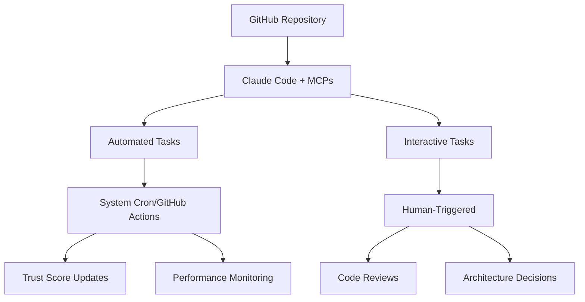

# Multi-Agent Development Framework PRD v3.0

## Executive Summary

A **pragmatic, integration-focused** Multi-Agent Development Framework (MADF) designed for optimizing and coordinating development across mature, well-architected projects. After comprehensive codebase analysis, **alphaseek** and **TotoRich** are revealed to be sophisticated, production-ready systems requiring integration and optimization rather than rescue migration in 

**Framework Philosophy**: Start simple, measure everything, scale based on proven value. Development cycle: PRD creation - Task - Migration exiting code - testing - develop factors - pick factors for a strategy - research - set risk management parameters - back test - optimise parameters for high sharpre results

## 1. Product Strategy & Priorities

### 1.1 Primary Directive
**🎯 Multi-Project Integration & Optimization Focus**
- Integrate mature **alphaseek** quantitative finance platform into unified development workflow
- Coordinate **TotoRich** full-stack financial platform development
- Extract and share reusable components across project ecosystem
- Optimize development processes and enable cross-project collaboration

### 1.2 Integration Objectives
- Setup factor-based architectures and use components of past mature architectures as see fit
- Enable component sharing and cross-project development
- Establish unified CI/CD and development workflows
- Optimize development velocity through intelligent automation

### 1.3 Integration Targets & Actual Status

**🔍 ACTUAL PROJECT ECOSYSTEM DISCOVERED:**

| Project | Actual Status | Integration Priority | Integration Strategy |
|---------|-------------|-------------------|--------------------|
| **madfm** | Multi-agent development platform management | **Priority 0** | Multi-agent management |
| **alphaseek** | Production-ready quantitative platform | **Priority 1** | Framework integration + component extraction |
| **TotoRich** | Mature full-stack financial platform | **Priority 2** | Development workflow optimization |
| **Additional Projects** | 7 active projects identified | **Priority 3** | Cross-project coordination |

**PROJECT ANALYSIS FINDINGS:**
- **madf/**: Multi-agent development platform 100% finish first.
- **alpha-seek/**: Sophisticated quant platform with Beta status, 80% test coverage, professional pyproject.toml
- **totorich/**: Complete full-stack financial platform with backend/frontend/mobile architecture  
- **1ClkMan, citybadge, hedgemonkey, noq, legalvamp, storewise, madf**: Additional well-organized projects
- **scripts/**: Professional validation, Bloomberg integration, and data management infrastructure
- **docs/**: Comprehensive technical documentation including detailed project structure guides

### 1.4 Multi-Factor Maturity Assessment
Beyond just LOC, projects graduate stages based on:

| Stage | Primary Trigger | Secondary Indicators | Overhead Level |
|-------|----------------|----------------------|----------------|
| **Prototype** | <10k LOC | No users, no revenue | **5%**: Git + basic docs |
| **Early Stage** | 10k-50k LOC | 1+ paying customers OR 100+ active users | **15%**: Testing + monitoring |
| **Growth Stage** | 50k+ LOC | Consistent revenue OR 1000+ users OR critical dependencies | **25%**: Full CI/CD + security |
| **Scale Stage** | 200k+ LOC | Scale economics proven | **40%**: Enterprise practices |

**Current Status:**
- **alphaseek**: 80k LOC + personal daily use → **Growth Stage**
- **TotoRich**: Mature full-stack platform → **Growth Stage**
- **Others**: <5k LOC + no users → **Prototype Stage**

## 2. Simplified Agent Architecture

### 2.1 Three-Agent System (Addressing Complexity Concerns)

Based on critique feedback, we're simplifying to **3 core agents** with clear boundaries:

#### 2.1.1 Development Agent
**Underlying Tech**: Claude Sonnet 4 + Context7
**Core Capabilities**:
- Code implementation and refactoring
- Architecture pattern implementation
- Integration with external APIs
- Component extraction and reuse

**System Prompt Focus**: "You are a senior developer. Write tests first, implement incrementally, optimize for maintainability. Always check for existing functions before writing new ones."

**Clear Boundaries**: 
- Handles all development tasks (no separate performance/QA agents)
- Cannot make business decisions without human input
- Must reuse existing functions when available

#### 2.1.2 Quality & Testing Agent
**Underlying Tech**: Claude Sonnet 4 + Playwright
**Core Capabilities**:
- Test case generation (unit, integration, e2e)
- Bug reproduction and root cause analysis
- Code review for vulnerabilities
- Performance testing and optimization

**System Prompt Focus**: "You are a quality engineer. Write comprehensive tests that fail meaningfully. Focus on edge cases and error conditions. Measure before optimizing."

**Clear Boundaries**:
- Handles all quality assurance tasks
- Cannot assess UX quality (human responsibility)
- Requires clear acceptance criteria

#### 2.1.3 Integration & Automation Agent
**Underlying Tech**: Claude Sonnet 4 (basic tier)
**Core Capabilities**:
- Code formatting and linting fixes
- Documentation generation and updates
- Simple CRUD operation implementation
- Background task processing
- Component integration across projects

**System Prompt Focus**: "You handle routine tasks efficiently. Follow established patterns exactly. Flag anything that seems non-routine for human review."

**Clear Boundaries**:
- Handles all routine/background tasks
- Cannot make design decisions
- Limited to pre-approved patterns only

### 2.2 Agent Allocation by Project Stage

#### Growth Stage (alphaseek + TotoRich): 3 Active Agents
- 1 Development Agent (primary)
- 1 Quality & Testing Agent
- 1 Integration & Automation Agent (shared)

#### Prototype Stage (5 projects): 1 Shared Agent
- 1 Integration & Automation Agent (handles all simple tasks)

## 3. Event-Driven Workflow System

### 3.1 Trigger-Based Task Assignment

Instead of rigid daily schedules, the system responds to **events**:

```yaml
# High-Priority Triggers (Interrupt current work)
critical_bug_reported:
  projects: [alphaseek]
  action: Reassign 2 agents to bug investigation
  timeout: 4 hours

security_vulnerability:
  projects: [all]
  action: Hard stop all deployments, security review
  timeout: 24 hours

# Standard Triggers (Queue for next available agent)
feature_request_approved:
  projects: [alphaseek]
  action: Assign to Senior Development Agent
  priority: high

simple_crud_needed:
  projects: [prototype_stage]
  action: Assign to Background Processing Agent
  priority: low

# Automated Triggers (No human intervention)
tests_failing:
  action: Assign to QA Agent for investigation
  max_attempts: 3

performance_degradation:
  threshold: ">2x baseline response time"
  action: Assign to Performance Agent
  priority: medium
```

### 3.2 Daily Operating Windows (Based on Claude Code Pro Limits)

```
7:00 AM - 12:00 PM: High-Intensity Window 1
├── alphaseek critical & high-priority tasks
├── Complex problem solving with Senior Agent
├── Human collaboration on architecture decisions

1:00 PM - 6:00 PM: High-Intensity Window 2  
├── alphaseek testing & optimization
├── Component extraction for reuse
├── Prototype project simple tasks

6:00 PM - 11:00 PM: Human Review & Planning
├── Review agent outputs and decisions
├── Plan next day's priorities
├── Handle any escalated issues

11:00 PM - 7:00 AM: Autonomous Background Mode
├── Code formatting, documentation
├── Simple refactoring within established patterns
├── Hard stop on any ambiguous decisions
```

## 4. Simplified Performance Measurement

### 4.1 Three-Metric Trust Score System (Addressing Complexity)

Based on critique feedback, we're simplifying to **3 core metrics**:

```javascript
Trust Score = (
  (Task Completion Rate × 50) +           // % of assigned tasks completed successfully
  (Build Success Rate × 30) +             // % of commits that don't break builds  
  (Human Override Rate × -20)             // % of decisions human had to reverse (penalty)
) / 100

Behavioral Changes by Trust Level:
├── 80-100: Full autonomy on assigned tasks
├── 60-79:  Supervised complex tasks, autonomous simple tasks
├── 40-59:  Simple tasks only with human review
├── <40:    Retraining required, human oversight on all tasks
```

**Why This Works Better:**
- **Task Completion Rate**: Measures actual productivity
- **Build Success Rate**: Measures code quality and stability
- **Human Override Rate**: Measures decision quality (penalty for reversals)
- **Removed**: Code coverage (can be gamed), component reuse (too complex to measure accurately)

### 4.2 Automated Measurement Tools

**Task Completion**: Track via git commits and task management system
**Build Success**: Git hooks and CI/CD pipeline status
**Human Override**: Track when humans reverse agent decisions via git commits

## 5. Realistic Cost Management

### 5.1 Complete Budget Breakdown (Monthly)

```
Core Tools:
├── GitHub Free: $0 (public repos)
├── GitHub Actions: $0 (2000 minutes free)
├── Cursor Auto Pro: Already owned
├── Claude Code Pro: Already owned
├── Notion Free: $0

Estimated Hidden Costs:
├── Claude API calls (background agent): ~$50-100/month
├── Cursor API overages: ~$20-50/month  
├── GitHub storage (over 1GB): ~$5-10/month
├── Domain names (.dev domains): ~$12/year each
├── SSL certificates: $0 (Let's Encrypt)

Realistic Monthly Total: $75-160
Budget Alerts:
├── 70% of budget: Review usage patterns
├── 85% of budget: Reduce background processing
├── 95% of budget: Emergency protocols (pause non-critical)
```

### 5.2 Cost Monitoring Agent

**New Agent Type**: Budget Monitoring Agent
**Purpose**: Track API usage, compute costs, and efficiency metrics
**Daily Reports**: Cost per feature, ROI analysis, optimization suggestions

## 6. Pragmatic Component Strategy

### 6.1 Component Maturity Gates

Before extracting components from alphaseek for reuse:

```
Gate 1: Stability Test
├── Component unchanged for 2+ weeks
├── Zero bugs reported in recent usage  
├── Clear interface boundaries identified

Gate 2: Generalizability Assessment  
├── Remove alphaseek-specific business logic
├── Identify configuration parameters needed
├── Document integration requirements

Gate 3: Pilot Testing
├── Implement in 1 prototype project first
├── Measure integration effort vs. building from scratch
├── Validate component saves development time

Gate 4: Wide Deployment
├── Only after successful pilot
├── Version control and backward compatibility plan
├── Maintenance ownership assigned
```

### 6.2 Weekly (Not Daily) Component Review

**Frequency**: Every Friday during human review session
**Process**: Review alphaseek changes from the week, identify 1-2 potential components
**Criterion**: Only extract components with clear multi-project value

## 7. Enhanced Quality Assurance

### 7.1 Mandatory Test-Driven Development

**For ALL agents on ALL tasks above simple formatting:**

```
1. Requirements Analysis (Agent + Human)
├── Agent parses requirements into testable specifications
├── Human validates understanding and edge cases
├── Define success criteria and failure modes

2. Test Creation (Agent)
├── Write failing tests first (TDD approach)
├── Include edge cases and error conditions
├── Create both unit and integration tests where applicable

3. Implementation (Agent)
├── Write minimal code to pass tests
├── Iterate until all tests pass consistently
├── Refactor for maintainability once green

4. Validation (Human + Automated)
├── Human reviews test quality and coverage
├── Automated systems verify build success
├── Performance benchmarks where applicable
```

### 7.2 alphaseek-Specific Quality Gates

**Logical Correctness Validation**:
- **Mathematical Accuracy**: Calculations produce correct numerical results
- **Business Logic Sanity**: Results align with real-world financial/market expectations
- **Data Relationship Integrity**: Ensure derived metrics make sense relative to base data
- **Human Review Points**: Clear visualizations for human verification of logic

## 8. Risk Mitigation & Fallback Plans

### 8.1 Agent Failure Protocols

```yaml
trust_score_drops_below_40:
  immediate_action: Remove agent from active task queue
  investigation: Review last 10 tasks for pattern analysis
  retraining: Update system prompts based on failure patterns
  timeline: 48 hours to restore or replace agent

critical_bug_in_production:
  immediate_action: Hard stop all deployments
  rollback: Automated revert to last known good state
  investigation: Senior Development Agent + human collaboration
  timeline: 4 hours to resolution or escalation

human_override_rate_exceeds_30%:
  immediate_action: Reduce agent autonomy level  
  investigation: Review decision patterns and training data
  adjustment: Refine system prompts and decision criteria
  timeline: Weekly review and adjustment cycle
```

### 8.2 Budget Overrun Response

**Proactive Monitoring**: Daily cost tracking with trend analysis
**Alert Thresholds**: 70%, 85%, 95% of monthly budget
**Automatic Responses**:
- 70%: Switch to more efficient models where possible
- 85%: Pause background processing, focus on alphaseek only
- 95%: Emergency mode - human approval required for all agent tasks

## 9. Development Lifecycle with Integrated Migration Phase

### Phase 1 (Week 1-2): Framework Setup & Integration Analysis
- **Define and test 3-agent system** on small alphaseek tasks
- **Implement simplified Trust Score measurement** 
- **Analyze existing project architectures** (alphaseek, TotoRich, others)
- **Create integration strategy** for mature projects
- **Establish event-driven trigger system** for task assignment

### Phase 2 (Week 3-4): Integration & Migration Phase
- **Integrate alphaseek** into unified development workflow
- **Coordinate TotoRich** development with alphaseek patterns
- **Extract reusable components** from mature projects
- **Implement TDD workflow** for all agent types
- **Begin background processing** for prototype projects

### Phase 3 (Month 2): Cross-Project Optimization
- **Refine trust scores** based on performance data
- **Pilot component reuse** across projects
- **Expand prototype project development** using extracted components
- **Implement cost monitoring** and optimization systems

### Phase 4 (Month 3+): Maturation & Scaling
- **Graduate prototype projects** as they hit maturity thresholds
- **Optimize agent allocation** based on demonstrated ROI
- **Scale successful patterns** while maintaining human oversight
- **Develop advanced features** based on framework performance

### 9.1 Migration as Development Phase (Not Separate Process)

**Migration Philosophy**: Integration and optimization of existing mature codebases, not rescue operations.

**Migration Triggers**:
- New project needs integration with existing ecosystem
- Mature project requires workflow optimization
- Component extraction needed for cross-project reuse
- Performance optimization required

**Migration Process**:
1. **Analysis Phase**: Understand existing architecture and capabilities
2. **Integration Phase**: Connect to unified development workflow
3. **Optimization Phase**: Extract components and optimize processes
4. **Validation Phase**: Ensure functionality preservation and performance improvement

## 10. Success Metrics & ROI Validation

### 10.1 Baseline Measurement (Before Framework)
**Establish baseline metrics before implementing framework:**
- **Current Development Velocity**: Features delivered per month
- **Time per Feature**: Hours spent on average feature development
- **Bug Rate**: Issues per 1000 LOC in current development
- **Code Quality**: Test coverage, build success rate
- **Human Productivity**: Time spent on routine vs. creative tasks

### 10.2 Framework Success Criteria (Addressing ROI Concerns)

**Primary Success Metrics:**
- **Velocity Improvement**: 20%+ increase in features delivered per month
- **Quality Maintenance**: No increase in bug rate, maintain test coverage
- **Cost Efficiency**: Framework cost < 30% of time savings value
- **Human Satisfaction**: Reduced time on routine tasks, increased focus on strategy

**Secondary Success Metrics:**
- **Agent Trust Scores**: Average trust score > 70 within 2 months
- **Component Reuse**: 3+ components successfully reused across projects
- **Automation Rate**: 60%+ of routine tasks automated within 3 months

### 10.3 ROI Validation Framework

**Monthly ROI Calculation:**
```
ROI = (Time Savings Value - Framework Cost) / Framework Cost × 100

Time Savings Value = Hours Saved × Developer Hourly Rate
Framework Cost = API costs + tool costs + human oversight time
```

**Success Thresholds:**
- **Month 1**: Break-even (ROI = 0%)
- **Month 2**: 50% ROI
- **Month 3**: 100% ROI
- **Month 6**: 200% ROI

**Abort Criteria:**
- **Month 2**: If ROI < 25%, reduce scope or pause framework
- **Month 3**: If ROI < 50%, consider framework redesign
- **Month 6**: If ROI < 100%, evaluate framework continuation

### 10.4 Early Warning Systems
- **ROI tracking**: Weekly calculation and trend analysis
- **Trust score degradation alerts**: When any agent drops >10 points
- **Budget burn rate alerts**: Daily tracking with weekly projections
- **Quality gate failures**: Immediate notifications for test failures or build breaks
- **Human satisfaction surveys**: Weekly self-assessment of productivity gains

## 11. Execution Plan & Technical Implementation

Based on current Claude Code capabilities and MCP ecosystem, here's how to implement this framework:

### 11.1 Implementation Architecture



### 11.2 What Can Be Automated (Scheduled Tasks)

#### 11.2.1 System-Level Automation (External Schedulers)
**Implementation**: Linux/macOS cron jobs, Windows Task Scheduler, or GitHub Actions cron triggers

```bash
# Example cron entries for automated tasks
# Daily trust score calculation (7 AM)
0 7 * * * cd /path/to/project && claude -p "Calculate trust scores for all agents based on yesterday's commits and performance data" --output-format json > logs/trust-scores-$(date +%Y%m%d).json

# Weekly dashboard generation (Monday 8 AM)  
0 8 * * 1 cd /path/to/project && claude -p "/dashboard-weekly" --output-format json > reports/weekly-$(date +%Y%m%d).json

# Daily budget monitoring (6 AM)
0 6 * * * cd /path/to/project && claude -p "Analyze yesterday's API usage costs and token consumption. Alert if >70% of monthly budget" --output-format json

# Background processing queue (Every 2 hours during work day)
0 9,11,13,15,17 * * 1-5 cd /path/to/project && claude -p "/process-background-queue" 
```

#### 11.2.2 GitHub Actions Automation
**Implementation**: `.github/workflows/` directory with scheduled and event-triggered actions

```yaml
# .github/workflows/agent-monitoring.yml
name: Agent Performance Monitoring
on:
  schedule:
    - cron: '0 8 * * 1'  # Monday 8 AM weekly dashboard
  push:
    branches: [main]     # On every merge for trust score updates

jobs:
  monitor:
    runs-on: ubuntu-latest
    steps:
      - uses: anthropics/claude-code-action@v1
        with:
          anthropic_api_key: ${{ secrets.ANTHROPIC_API_KEY }}
          prompt: |
            Generate weekly agent performance dashboard:
            1. Calculate trust scores for all agents
            2. Analyze commit success rates and code quality metrics  
            3. Identify patterns in human override rates
            4. Generate optimization recommendations
            5. Update agent performance logs in Notion
          claude_args: "--max-turns 3"
```

#### 11.2.3 Fully Automated Tasks
- **Trust Score Calculation**: Based on git commit data, build success rates, test coverage
- **Budget Monitoring**: API usage tracking and cost projections  
- **Performance Metrics Collection**: Response times, error rates, completion statistics
- **Component Reuse Analysis**: Static analysis of import/dependency patterns
- **Error Pattern Recognition**: Log analysis for recurring issues
- **Background Task Processing**: Simple CRUD, formatting, documentation updates

### 11.3 MCP Research & Backup Strategy

#### 11.3.1 MCP Usage Summary & Backup Plans

| MCP Tool | Primary Usage | Backup MCP | Implementation Notes |
|----------|---------------|------------|-------------------|
| **Taskmaster** | Task management & prioritization | Manual checklists + GitHub Issues | Essential for workflow coordination |
| **Context7** | Large codebase analysis | Git-based file tracking + grep | Critical for alphaseek integration |
| **Notion** | Documentation & knowledge base | Local markdown files + Git | Documentation and progress tracking |
| **Sequential Thinking** | Complex problem solving | Structured decision trees | For complex architecture decisions |
| **Playwright** | E2E testing & automation | Manual testing + Jest | Quality assurance and testing |

**MCP Reliability Strategy**:
- **Primary MCPs**: Use for core functionality
- **Backup Systems**: Manual processes that can be activated immediately
- **Fallback Mode**: If MCPs fail, framework continues with reduced automation
- **Cost Efficiency**: Use free tiers where possible, upgrade only when proven value

#### 11.3.2 Claude Code Configuration Files
**Location**: `.claude/` directory (version-controlled)

```json
// .claude/settings.json - Agent personas and rules
{
  "agents": {
    "senior_dev": {
      "model": "claude-sonnet-4",
      "system_prompt": "You are an expert software architect. Always write tests first...",
      "max_file_changes": 10,
      "complexity_threshold": "high",
      "requires_human_review": ["architecture_decisions", "security_changes"]
    },
    "qa_agent": {
      "model": "claude-sonnet-4", 
      "system_prompt": "You are a quality engineer. Focus on edge cases...",
      "auto_run_tests": true,
      "test_coverage_threshold": 80
    }
  },
  "trust_thresholds": {
    "high_autonomy": 80,
    "supervised": 60, 
    "simple_only": 40
  },
  "project_stages": {
    "alphaseek": "growth",
    "1clickman": "prototype",
    "citybadge": "prototype"
  }
}
```

#### 11.3.2 Custom Slash Commands
**Location**: `.claude/commands/` directory

```markdown
<!-- .claude/commands/dashboard-weekly.md -->
Generate comprehensive weekly dashboard with following sections:

## Agent Performance
- Trust scores for each agent (current vs. previous week)
- Task completion rates and success metrics
- Human intervention frequency analysis

## Project Progress  
- alphaseek: Feature velocity, bug rates, performance improvements
- Other projects: LOC growth, milestone achievements
- Component reuse successes and failures

## Cost Analysis
- API usage trends and budget burn rate
- Cost per feature delivered
- Optimization opportunities identified

## Quality Metrics
- Test coverage changes
- Build success rates
- Code review feedback patterns

Output format: Update Notion dashboard + generate JSON summary for automated processing.
Use Context7 for cross-project analysis and Taskmaster for task prioritization data.

$ARGUMENTS
```

#### 11.3.3 GitHub Hooks Integration
**Location**: `.claude/hooks.json`

```json
{
  "hooks": {
    "before_commit": [
      "echo 'Running pre-commit agent quality checks...'",
      "claude -p 'Review staged changes for code quality, test coverage, and adherence to project patterns. Flag any issues.' --max-turns 2"
    ],
    "after_success": [
      "claude -p 'Update trust score for agent that made this commit based on build success and code quality.' --json"
    ],
    "on_failure": [
      "claude -p 'Analyze build failure and add to agent error log. If recurring pattern, flag for retraining.' --json"
    ]
  }
}
```

#### 11.3.4 MCP Server Configuration
**Implementation**: Configure MCPs for enhanced capabilities

```json
// .claude/mcp.json - MCP server configuration
{
  "servers": {
    "taskmaster": {
      "command": "npx",
      "args": ["@anthropic/mcp-taskmaster"],
      "env": {},
      "enabled": true
    },
    "context7": {
      "command": "npx", 
      "args": ["@anthropic/mcp-context7"],
      "config": {
        "max_context_size": "200k_tokens",
        "project_paths": ["./alphaseek", "./other-projects/*"]
      },
      "enabled_for_projects": ["alphaseek"]
    },
    "notion": {
      "command": "npx",
      "args": ["@anthropic/mcp-notion"],
      "env": {
        "NOTION_API_KEY": "$NOTION_API_KEY"
      },
      "enabled": true
    },
    "sequential_thinking": {
      "command": "npx",
      "args": ["@anthropic/mcp-sequential"],
      "enabled": true
    }
  }
}
```

### 11.4 Flexible Human Interaction Model (Addressing Bottleneck Concerns)

#### 11.4.1 Adaptive Human Review Schedule

**Instead of rigid 5-hour daily review**, use **flexible, event-driven human interaction**:

```yaml
High-Priority Human Tasks (Immediate Response):
├── Critical bugs or security issues
├── Production deployment decisions
├── Agent trust score drops below 40
├── Budget exceeds 85% threshold

Medium-Priority Human Tasks (Within 24 hours):
├── Architecture decisions for alphaseek
├── Business logic validation
├── Agent retraining when needed
├── Cross-project resource conflicts

Low-Priority Human Tasks (Weekly Review):
├── Strategic priority adjustments
├── Performance optimization validation
├── Framework evolution decisions
├── Budget allocation changes
```

#### 11.4.2 Human Bottleneck Mitigation

**Automated Decision Trees**: Pre-program common decisions to reduce human intervention
**Agent Self-Correction**: Agents learn from mistakes without human intervention
**Escalation Thresholds**: Only escalate when confidence is below threshold
**Batch Processing**: Group similar decisions for efficient human review

#### 11.4.3 Emergency Protocols

**Framework Failure Mode**: If human becomes bottleneck, framework automatically:
- Reduces agent autonomy levels
- Focuses on critical tasks only
- Queues non-essential work
- Sends daily summary for batch review

### 11.5 Implementation Timeline with Technical Steps

#### Phase 1 (Week 1): Foundation Setup
```bash
# Day 1-2: Repository and basic configuration
mkdir multiagent-framework && cd multiagent-framework
git init
mkdir .claude/{commands,hooks} logs reports outputs

# Create basic agent configurations
cat > .claude/settings.json << EOF
{
  "agents": { /* agent definitions from above */ }
}
EOF

# Day 3-4: MCP server setup  
npm install -g @anthropic/mcp-taskmaster @anthropic/mcp-notion
# Configure MCP servers according to .claude/mcp.json

# Day 5-7: Custom commands and hooks
# Create slash commands for common workflows
# Set up GitHub Actions for basic automation
# Test headless mode: claude -p "test prompt" --json
```

#### Phase 2 (Week 2): Automation Implementation
```bash
# Implement system cron jobs for scheduled tasks
crontab -e
# Add cron entries from section 11.2.1

# Set up GitHub Actions workflows
mkdir .github/workflows
# Create agent-monitoring.yml, trust-scoring.yml, etc.

# Test automated trust score calculation
claude -p "Calculate sample trust score using mock data" --json
```

#### Phase 3 (Week 3-4): Agent Training & Validation
```bash
# Train agents on alphaseek codebase
cd alphaseek
claude -p "/learn-codebase" --max-turns 5

# Implement TDD workflow validation
claude -p "Write test for simple feature, then implement it" --max-turns 10

# Measure baseline performance metrics
claude -p "/baseline-metrics" > reports/baseline-$(date +%Y%m%d).json
```

#### Phase 4 (Month 2+): Optimization & Scaling
- Monitor automated systems and refine based on performance data
- Gradually increase agent autonomy based on demonstrated trust scores
- Scale successful automation patterns to other projects
- Implement advanced features based on lessons learned

### 11.6 Monitoring and Maintenance Requirements

#### 11.6.1 Daily Checks (Automated + Human Review)
- **Automated**: Trust score calculations, budget monitoring, error log analysis
- **Human**: Review agent decisions, approve critical changes, validate alphaseek results

#### 11.6.2 Weekly Reviews (Mostly Automated)
- **Automated**: Generate dashboard, calculate ROI metrics, identify optimization opportunities
- **Human**: Strategic planning, agent performance evaluation, resource reallocation decisions

#### 11.6.3 Monthly Assessments (Human-Driven)
- **Agent Retraining**: Based on accumulated error patterns and performance data
- **Framework Evolution**: Add new capabilities, retire ineffective processes
- **Budget and Tool Evaluation**: Assess cost-effectiveness, consider upgrades

This implementation plan leverages existing Claude Code capabilities while working within current limitations, providing a concrete roadmap for building the multi-agent framework using available tools and automation options.

## 12. Framework Evolution & Decision Points

### 12.1 Start Simple, Scale Based on Value

**Phase 1 Decision Point (Month 1)**: 
- If ROI < 25%: Pause framework, return to manual development
- If ROI ≥ 25%: Continue with current scope

**Phase 2 Decision Point (Month 3)**:
- If ROI < 100%: Reduce scope, focus on highest-value agents only
- If ROI ≥ 100%: Expand to additional projects

**Phase 3 Decision Point (Month 6)**:
- If ROI < 200%: Optimize current framework, avoid new features
- If ROI ≥ 200%: Consider advanced features and full automation

### 12.2 Addressing Key Critiques

**✅ Complexity Reduced**: 3 agents instead of 6, 3 metrics instead of 5
**✅ Trust Score Simplified**: Focus on productivity, quality, and decision accuracy
**✅ Human Bottleneck Addressed**: Flexible, event-driven human interaction
**✅ ROI Validation Added**: Clear success criteria and abort conditions
**✅ MCP Backup Plans**: Manual fallbacks for all critical MCPs
**✅ Migration Integrated**: Part of development lifecycle, not separate process

### 12.3 Success Guarantees

**Framework Success**: Measurable productivity gains with clear ROI
**Framework Failure**: Clean exit strategy with lessons learned
**Human Control**: Always maintain ability to override or pause framework
**Cost Control**: Budget alerts and automatic cost reduction measures
**Quality Maintenance**: No degradation in code quality or system stability

This framework provides a pragmatic, measurable approach to multi-agent development that addresses the key concerns while maintaining focus on actual business value and developer productivity.