# Technical Alignment Document: PRD ↔ Architecture

**Version**: 1.0
**Date**: 2025-01-23
**Author**: PM Agent John

## Executive Summary

This document resolves critical disconnects between the current PRD v4.1 and Architecture v1.0 documents, providing clear technical guidance for Epic 1 implementation. The primary misalignments have been identified and corrected to ensure successful 2-3 week Phase 1 delivery.

## Critical Disconnects Identified

### 1. **Data Source Mismatch**
**PRD Reality**: Free news APIs (NewsAPI, Yahoo Finance, Alpha Vantage, Google News)
**Architecture Assumption**: Bloomberg Terminal API via localhost:8194

**Resolution**: Epic 1 implementation uses free news APIs only. Bloomberg Terminal integration deferred to Phase 2 based on prototype learnings.

### 2. **Deployment Architecture Mismatch**
**PRD Reality**: Local Python/Node.js hybrid with file-based messaging
**Architecture Assumption**: Cloud deployment with web UI and database infrastructure

**Resolution**: Epic 1 implements local-first architecture with potential cloud migration in Phase 3.

### 3. **Scale and Complexity Mismatch**
**PRD Reality**: Weekly 50-80 word summaries for single user research tool
**Architecture Assumption**: Real-time dashboard with multi-user enterprise features

**Resolution**: Epic 1 focuses on prototype foundation with incremental sophistication approach.

## Corrected Technical Architecture for Epic 1

### Technology Stack Alignment

| Component | PRD Requirement | Architecture Document | **Epic 1 Implementation** |
|-----------|-----------------|----------------------|---------------------------|
| **Frontend** | No web UI (Phase 1) | Next.js + Vercel | ❌ **None** - Claude Code interface only |
| **Backend** | Python LangGraph + Node.js bridge | Express.js + PostgreSQL | ✅ **Python LangGraph + Node.js HTTP bridge** |
| **Database** | File-based JSON with Pydantic | PostgreSQL + Redis | ✅ **SQLite checkpoints + JSON state files** |
| **API Integration** | Free news APIs via mcp-use | Bloomberg Terminal API | ✅ **NewsAPI + Yahoo Finance + Alpha Vantage** |
| **Authentication** | Environment variables | NextAuth.js + JWT | ✅ **API keys in .env files** |
| **Deployment** | Local development | Vercel + Railway | ✅ **Local Python + Node.js processes** |

### Data Flow Architecture

```mermaid
graph TB
    subgraph "Claude Code Interface"
        CC[Claude Code User Request]
    end

    subgraph "LangGraph Orchestration (Python)"
        PA[Planning Agent<br/>Load BMAD Plan]
        RA[Research Agent<br/>Collect News Data]
        DA[Dev Agent<br/>Generate Commentary]
        PMA[PM Agent<br/>Validate & Deliver]
    end

    subgraph "HTTP Bridge Service (Node.js)"
        NEWS[News API Bridge<br/>mcp-use clients]
    end

    subgraph "Data Sources (External)"
        NEWSAPI[NewsAPI]
        YAHOO[Yahoo Finance]
        ALPHA[Alpha Vantage]
        GOOGLE[Google News]
    end

    subgraph "Output"
        HEDGE[hedgemonkey project<br/>weekly commentary files]
    end

    CC --> PA
    PA --> RA
    RA --> NEWS
    NEWS --> NEWSAPI
    NEWS --> YAHOO
    NEWS --> ALPHA
    NEWS --> GOOGLE
    RA --> DA
    DA --> PMA
    PMA --> HEDGE

    style PA fill:#e1f5fe
    style RA fill:#f3e5f5
    style DA fill:#e8f5e8
    style PMA fill:#fff3e0
```



## Implementation Specification for Epic 1

### Directory Structure (Corrected)
```
MADF/ (root)
├── langgraph_core/              # NEW - Python LangGraph system
│   ├── agents/                  # 4-agent implementations
│   │   ├── planning.py         # BMAD plan integration
│   │   ├── research.py         # News collection via HTTP bridge
│   │   ├── dev.py              # Commentary generation
│   │   └── pm.py               # Validation and delivery
│   ├── models/                  # Pydantic state models
│   │   ├── state.py            # WorkflowState model
│   │   ├── plan.py             # BMAD plan models
│   │   └── news.py             # News data models
│   ├── workflows/               # LangGraph workflows
│   │   └── weekly_research.py  # Main orchestration
│   └── utils/                   # Supporting utilities
├── mcp_bridge/                  # NEW - Node.js HTTP bridge
│   ├── src/
│   │   ├── news_service.ts     # mcp-use news collection
│   │   └── api_clients/        # API client implementations
│   └── package.json
├── docs/
│   ├── prd/                    # Re-sharded PRD (completed)
│   ├── architecture/           # Re-sharded Architecture (completed)
│   └── stories/epic-1/         # Epic 1 story breakdown (completed)
├── projects/hedgemonkey/        # Output destination
│   └── reports/weekly/         # Commentary files
├── .claude/                     # Existing Claude Code infrastructure
└── claude_interface.py         # NEW - Claude Code integration
```

### API Integration Specifications

#### News Data Collection Requirements
```python
# Target APIs for Epic 1 (no Bloomberg Terminal)
API_CONFIGURATIONS = {
    "newsapi": {
        "primary_use": "Comprehensive financial news search",
        "rate_limit": "1000/day",
        "coverage": "Global news with business category filtering",
        "cost": "Free tier available"
    },
    "yahoo_finance": {
        "primary_use": "Market data and financial news",
        "rate_limit": "Unlimited",
        "coverage": "Major currency pairs, indices",
        "cost": "Free"
    },
    "alpha_vantage": {
        "primary_use": "Economic indicators and sentiment",
        "rate_limit": "25/day",
        "coverage": "Economic data, news sentiment",
        "cost": "Free tier available"
    },
    "google_news": {
        "primary_use": "Supplementary coverage and verification",
        "rate_limit": "Unlimited (RSS)",
        "coverage": "Global news aggregation",
        "cost": "Free"
    }
}
```

#### Geographic Coverage Mapping
```python
# EM Asia + US market coverage
GEOGRAPHIC_COVERAGE = {
    "EM_Asia": {
        "countries": ["CN", "TW", "KR", "HK", "SG", "TH", "MY", "PH", "ID", "IN"],
        "currencies": ["CNY", "TWD", "KRW", "HKD", "SGD", "THB", "MYR", "PHP", "IDR", "INR"],
        "search_terms": ["yuan", "won", "rupiah", "baht", "ringgit", "peso", "rupee"]
    },
    "US": {
        "currencies": ["USD"],
        "markets": ["DXY", "Treasury yields", "Fed policy"],
        "search_terms": ["dollar", "fed", "fomc", "treasury", "yield"]
    }
}
```

### Performance and Cost Targets (Revised)

| Metric | Architecture Document Target | **Epic 1 Realistic Target** |
|--------|------------------------------|------------------------------|
| **Workflow Execution Time** | <5 minutes | **<30 minutes** (includes API collection time) |
| **Token Usage per Workflow** | Not specified | **<50,000 tokens** |
| **API Costs per Commentary** | Not specified | **<$5** (primarily LLM costs) |
| **Memory Usage** | <20% increase | **<4GB peak** (Python + Node.js) |
| **Success Rate** | Not specified | **>90%** (normal conditions) |
| **Geographic Coverage** | Not specified | **100%** (required EM Asia + US regions) |

### State Management Specifications

#### LangGraph State Model (Corrected)
```python
from pydantic import BaseModel, Field
from typing import Dict, List, Optional, Any
from datetime import datetime

class WorkflowState(BaseModel):
    """Core state model for LangGraph workflow execution"""

    # Workflow tracking
    workflow_id: str = Field(..., description="Unique workflow identifier")
    current_agent: str = Field(..., description="Currently active agent")
    timestamp: datetime = Field(default_factory=datetime.utcnow)

    # BMAD plan integration
    plan: Optional[Dict[str, Any]] = Field(None, description="Loaded BMAD plan")
    plan_approved: bool = Field(False, description="Human approval status")

    # Research data
    research_data: Optional[Dict[str, Any]] = Field(None, description="Collected news data")
    research_summary: Optional[Dict[str, Any]] = Field(None, description="Research processing summary")

    # Generated content
    generated_content: Optional[Dict[str, Any]] = Field(None, description="Commentary content")
    word_count: int = Field(0, description="Total word count")

    # Validation and delivery
    validation_status: Optional[str] = Field(None, description="PM agent validation result")
    output_path: Optional[str] = Field(None, description="Delivered file path")

    # Error tracking and recovery
    errors: List[str] = Field(default_factory=list, description="Error messages")
    retry_count: int = Field(0, description="Retry attempts")

    # Performance metrics
    metadata: Dict[str, Any] = Field(default_factory=dict, description="Execution metadata")

    class Config:
        """Pydantic configuration for state management"""
        json_encoders = {
            datetime: lambda v: v.isoformat()
        }
```

## Phase Progression Strategy

### Epic 1 Foundation (2-3 weeks)
- ✅ **Scope**: Prototype 4-agent system with free news APIs
- ✅ **Output**: Weekly 50-80 word summaries via Claude Code interface
- ✅ **Architecture**: Local Python/Node.js hybrid with file-based messaging
- ✅ **Success Criteria**: Working prototype demonstrating multi-agent coordination

### Phase 2 Sophistication (4-5 weeks) - Future
- **Enhanced Features**: Bloomberg Terminal integration, advanced validation
- **UI Development**: Web dashboard for human oversight (HITL)
- **Scaling**: Multi-user support, advanced analytics
- **Architecture Evolution**: Database integration, cloud deployment options

### Phase 3 Production (ongoing) - Future
- **Enterprise Features**: Full monitoring, alerting, deployment automation
- **Advanced Analytics**: Integration with existing alphaseek project
- **Scalability**: Container orchestration, multi-region deployment
- **Sophistication**: Machine learning, autonomous optimization

## Implementation Priority Matrix

### **High Priority (Epic 1 Phase 1)**
1. ✅ LangGraph 4-agent system with Pydantic state management
2. ✅ Free news API integration via mcp-use HTTP bridge
3. ✅ Claude Code interface for user interaction
4. ✅ File-based output to hedgemonkey project
5. ✅ Manual BMAD planning workflow integration

### **Medium Priority (Phase 2)**
- Bloomberg Terminal API integration
- Web dashboard for human oversight
- Advanced validation and quality checks
- Multi-user access and permissions
- Enhanced error handling and recovery

### **Low Priority (Phase 3)**
- Real-time streaming capabilities
- Advanced analytics and reporting
- Container deployment and scaling
- Machine learning optimization
- Enterprise monitoring and alerting

## Risk Assessment and Mitigation

### **Resolved Technical Risks**
- ✅ **Data Source Complexity**: Simplified to free APIs, Bloomberg deferred
- ✅ **Deployment Complexity**: Local-first approach reduces infrastructure risk
- ✅ **Scale Premature Optimization**: Focus on single-user prototype first

### **Remaining Implementation Risks**
- **mcp-use Integration Complexity**: Mitigate with simple HTTP bridge, extensive testing
- **LangGraph Learning Curve**: Mitigate with minimal viable workflow, iterative refinement
- **API Rate Limiting**: Mitigate with caching, fallback sources, quota monitoring
- **Multi-language Coordination**: Mitigate with clear interfaces, comprehensive error handling

## Success Metrics Alignment

### Epic 1 Definition of Done
- [ ] ✅ 4-agent LangGraph system operational
- [ ] ✅ Free news API data collection functional
- [ ] ✅ Weekly commentary generation (50-80 words)
- [ ] ✅ Claude Code interface integration
- [ ] ✅ File delivery to hedgemonkey project
- [ ] ✅ Manual BMAD planning workflow proven
- [ ] ✅ End-to-end prototype demonstration

### Quality Gates
- **Technical Quality**: All Epic 1 stories (1.1-1.6) completed with acceptance criteria
- **Performance Quality**: <30 minute execution time, <$5 cost per commentary
- **Output Quality**: Human validation confirms professional commentary standards
- **Integration Quality**: Seamless Claude Code user experience

## Conclusion

This technical alignment document resolves the critical disconnects between PRD v4.1 and Architecture v1.0, providing clear implementation guidance for Epic 1. The corrected architecture focuses on:

1. **Free news APIs** instead of Bloomberg Terminal
2. **Local development** instead of cloud deployment
3. **Prototype foundation** instead of production-scale features
4. **Single-user research tool** instead of multi-user enterprise platform

This alignment enables successful Epic 1 delivery within the 2-3 week timeline while establishing the foundation for Phase 2 and Phase 3 sophistication enhancements.

---

**Next Actions:**
1. Dev agents begin Epic 1 Story 1.1 (LangGraph Setup)
2. Architecture document updated to reflect corrected technical approach
3. Epic 1 shards updated with final requirements
4. Implementation tracking begins through story completion