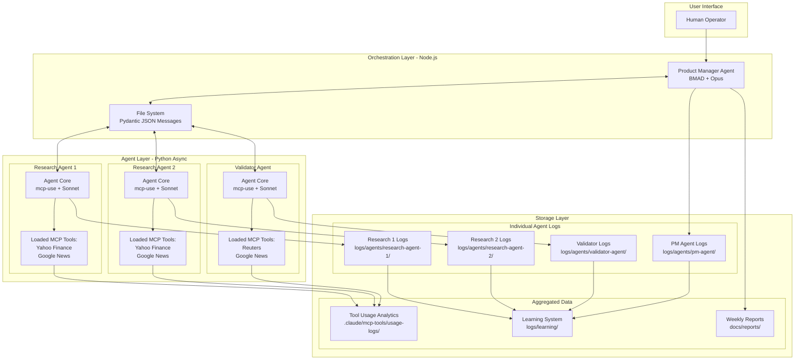
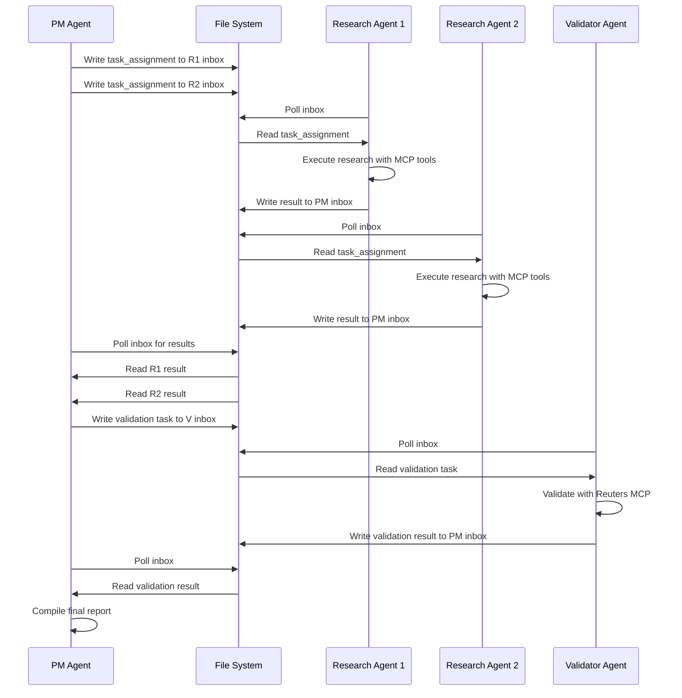
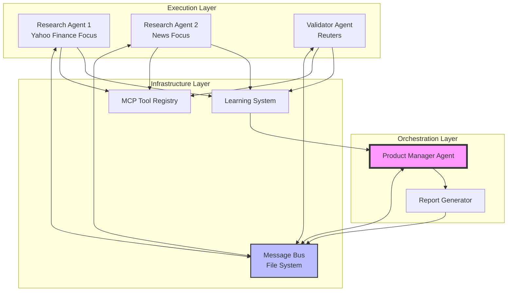
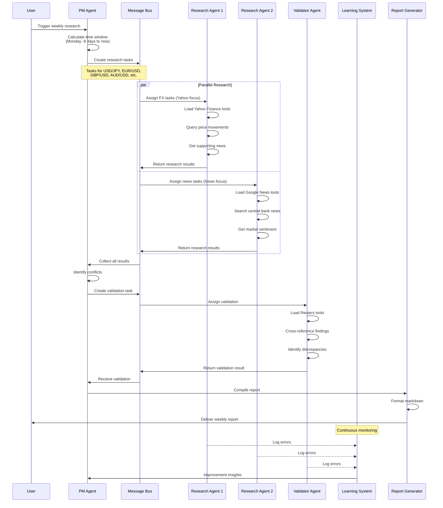
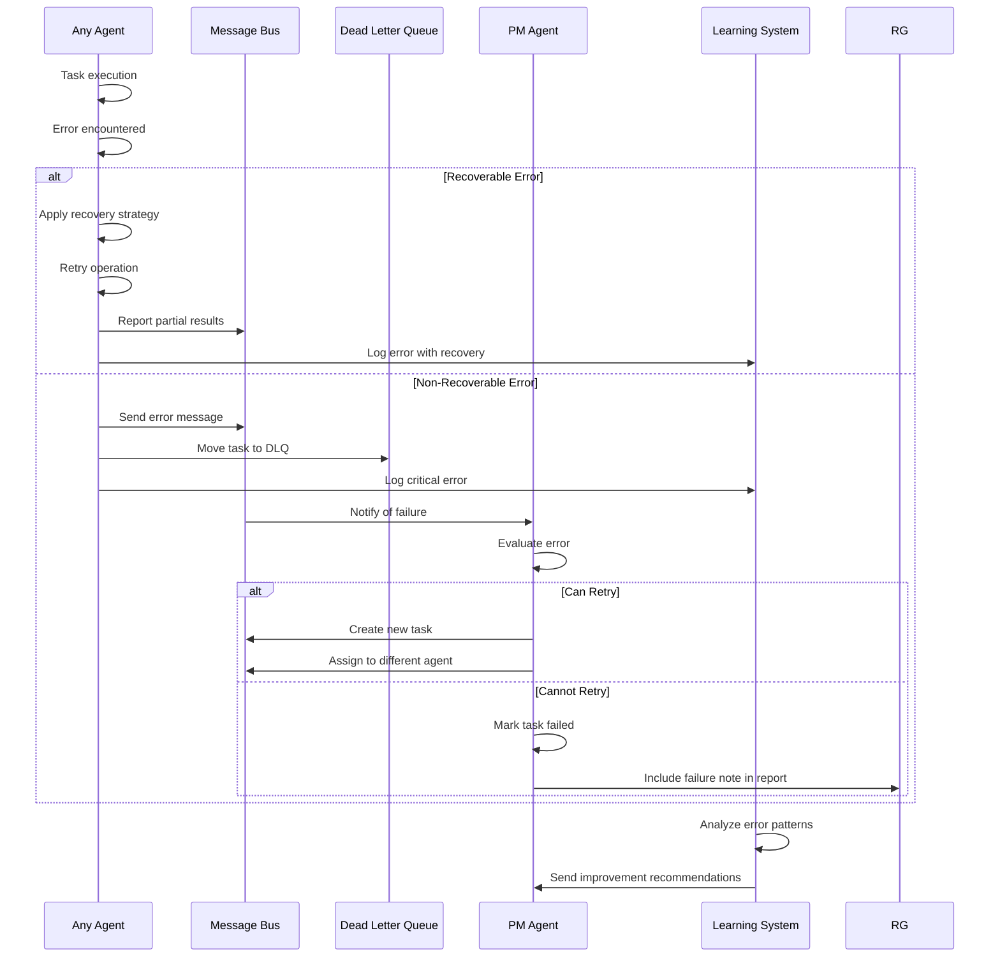

# Multi-Agent Financial Research Framework Architecture

**Version:** 1.0
**Date:** 2025-09-21
**Author:** Winston (Architect)

## 1. Introduction

This document outlines the complete fullstack architecture for **Multi-Agent Financial Research Framework**, including backend systems, frontend implementation, and their integration. It serves as the single source of truth for AI-driven development, ensuring consistency across the entire technology stack.

This unified approach combines what would traditionally be separate backend and frontend architecture documents, streamlining the development process for modern fullstack applications where these concerns are increasingly intertwined.

### Starter Template or Existing Project

**Current Project State:** Brownfield - Existing MADF Infrastructure

The Multi-Agent Development Framework (MADF) already exists with:
- Node.js MCP server configurations (`.mcp.json`)
- Claude Code integration infrastructure
- Directory structure under `.claude/`
- Python mcp-use library integration (v0.1.18)

**Constraints from Existing Infrastructure:**
- Must maintain compatibility with existing MCP server infrastructure
- File-based communication must integrate with `.claude/` directory structure
- New agent configurations must follow established patterns
- Environment variables must use existing dotenv patterns

### Change Log

| Date | Version | Description | Author |
|------|---------|-------------|---------|
| 2025-09-21 | v1.0 | Initial fullstack architecture for Phase 1 financial research agents | Winston (Architect) |

## 2. High Level Architecture

### Technical Summary

The Multi-Agent Financial Research Framework implements a hybrid orchestration architecture using BMAD framework (Node.js) for high-level coordination and Python-based agents with mcp-use library for direct MCP tool loading and execution. The system deploys 4 specialized agents - a Product Manager orchestrator and 3 research/validation agents - communicating through file-based JSON messaging with Pydantic validation for type safety and crash resilience. Each Python agent uses mcp-use to dynamically load and access tools from multiple MCP servers (Yahoo Finance, Google News, Reuters) within the agent's runtime, eliminating external server dependencies. This architecture achieves the PRD's 48-hour MVP goal by maximizing code reuse, implementing proven patterns, and focusing on Asia/G10 FX and interest rate market intelligence generation.

### Platform and Infrastructure Choice

**Platform:** Hybrid Local/Cloud Development
**Key Services:**
- Local development environment (Windows/Unix)
- MCP tools loaded directly via mcp-use library
- File system for agent coordination with Pydantic schemas
- Python async runtime for agents with embedded MCP tools
- Node.js runtime for BMAD orchestration

**Deployment Host and Regions:** Initially local development with potential cloud migration post-MVP

### Repository Structure

**Structure:** Monorepo extending existing MADF structure
**Monorepo Tool:** npm workspaces (existing)
**Package Organization:**
- Root MADF framework (existing)
- `.claude/agents/` - Agent personas and BMAD configurations (PM Agent)
- `.claude/mcp-tools/` - Documentation of essential tool lists, MCP source mapping, usage analytics
  - `tool-registry.json` - Maps tools to their MCP sources
  - `usage-logs/` - Tool usage frequency tracking
  - `essential-tools.json` - Per-agent essential tool lists
- `agents/python/` - Python mcp-use agent implementations
  - `research/` - Research agent variants
  - `validator/` - Validation agent
  - `shared/` - Pydantic models, utilities
- `logs/` - Centralized logging directory
  - `agents/` - Per-agent error and activity logs
    - `pm-agent/` - Product Manager logs
    - `research-agent-1/` - Research Agent 1 logs
    - `research-agent-2/` - Research Agent 2 logs
    - `validator-agent/` - Validator logs
  - `learning/` - Aggregated learning data
- `tasks/` - Agent task definitions and workflows
- `docs/` - Architecture and reports output

### High Level Architecture Diagram



### Architectural Patterns

- **Orchestrator-Worker Pattern:** Product Manager agent orchestrates worker agents - _Rationale:_ Clear separation of coordination logic from execution, enabling scalable agent addition
- **File-Based Message Queue with Pydantic:** JSON files with Pydantic validation act as typed persistent message queue - _Rationale:_ Type safety, crash resilience, and debugging visibility without external dependencies
- **Embedded MCP Tools via mcp-use:** Each agent loads MCP tools directly into runtime - _Rationale:_ Eliminates separate server processes, simplifies deployment, enables dynamic tool selection
- **Async Event-Driven Processing:** Python asyncio for concurrent operations - _Rationale:_ Efficient resource usage for I/O-bound financial data fetching
- **Tool Usage Analytics:** Track and log tool usage patterns for optimization - _Rationale:_ Data-driven optimization of essential tool lists and cost management
- **Error-Driven Learning:** Structured error logging for continuous improvement - _Rationale:_ Builds foundation for Phase 2 ML enhancement without upfront complexity
- **Hybrid Language Architecture:** Node.js orchestration + Python execution - _Rationale:_ Leverages best tools for each layer while maintaining clear boundaries

## 3. Tech Stack

This is the DEFINITIVE technology selection for the entire project. All development must use these exact versions.

### Technology Stack Table

| Category | Technology | Version | Purpose | Rationale |
|----------|-----------|---------|---------|-----------|
| Frontend Language | N/A | N/A | No web UI in Phase 1 | CLI/file-based interaction for MVP |
| Frontend Framework | N/A | N/A | No web UI in Phase 1 | Focus on agent functionality first |
| UI Component Library | N/A | N/A | No web UI in Phase 1 | Future Phase 3 consideration |
| State Management | File System | OS Native | Agent state persistence | Simple, crash-resilient approach |
| Backend Language | Python + Node.js | 3.11+ / 20.x | Agent execution + Orchestration | Hybrid leveraging strengths |
| Backend Framework | mcp-use + BMAD | 0.1.18 / Latest | MCP tool access + Agent orchestration | Proven libraries for each layer |
| API Style | File-based JSON | Pydantic 2.x | Inter-agent communication | Type-safe, debuggable messaging |
| Database | JSON Files | Native | Message queue and logs | Zero-dependency persistence |
| Cache | In-memory + File | Native | Tool response caching | Reduce API calls and costs |
| File Storage | Local FS | OS Native | Reports and logs | Simple deployment for MVP |
| Authentication | API Keys | Env Variables | MCP tool authentication | Standard secure key management |
| Frontend Testing | N/A | N/A | No frontend in Phase 1 | Future consideration |
| Backend Testing | pytest + unittest | 7.x / Built-in | Agent testing | Python standard testing tools |
| E2E Testing | Custom Scripts | Python | End-to-end agent workflows | Simulate full research cycle |
| Build Tool | npm + pip | Latest / Latest | Dependency management | Standard for each language |
| Bundler | N/A | N/A | No bundling needed | Direct script execution |
| IaC Tool | N/A | N/A | Local deployment initially | Future cloud migration |
| CI/CD | GitHub Actions | Latest | Future automation | When ready for production |
| Monitoring | Custom Logging | Python logging | Agent activity tracking | Built-in Python capabilities |
| Logging | JSON + stdout | Native | Structured logging | Machine-readable for learning |
| CSS Framework | N/A | N/A | No UI in Phase 1 | Future consideration |

### Additional Stack Components

| Category | Technology | Version | Purpose | Rationale |
|----------|-----------|---------|---------|-----------|
| Async Runtime | asyncio | Python 3.11+ | Concurrent agent operations | Native Python async support |
| LLM Integration | LangChain | 0.1.x | Anthropic Claude integration | Simplified LLM tool calling |
| Message Validation | Pydantic | 2.x | Type-safe messaging | Runtime validation and docs |
| MCP Tool Loading | mcp-use | 0.1.18 | Dynamic MCP tool access | Multi-server tool loading |
| Orchestration Model | Claude Opus | Latest | PM Agent decisions | Complex reasoning capability |
| Execution Model | Claude Sonnet | Latest | Research/Validation | Cost-effective tool calling |
| Environment Management | dotenv | Existing | Configuration management | Consistent with MADF |
| Time Handling | pendulum | 2.x | Timezone-aware dates | Critical for market timing |

## 4. Data Models

Define the core data models/entities that will be shared between frontend and backend for agent communication and coordination.

### AgentMessage

**Purpose:** Core message format for all inter-agent communication via file system

**Key Attributes:**
- `message_id`: str (UUID) - Unique message identifier
- `timestamp`: datetime - ISO 8601 timestamp with timezone
- `from_agent`: str - Sending agent identifier
- `to_agent`: str - Target agent identifier or "broadcast"
- `message_type`: str - "task_assignment", "result", "error", "status"
- `payload`: Dict[str, Any] - Message-specific content
- `correlation_id`: Optional[str] - Links related messages
- `priority`: int - Message priority (1-5)

**TypeScript Interface:**
```typescript
interface AgentMessage {
  message_id: string;
  timestamp: string;
  from_agent: string;
  to_agent: string;
  message_type: "task_assignment" | "result" | "error" | "status";
  payload: Record<string, any>;
  correlation_id?: string;
  priority: number;
}
```

**Relationships:**
- Parent of: TaskAssignment, ResearchResult, ValidationResult
- References: AgentError (via correlation_id)

### TaskAssignment

**Purpose:** Specific task assigned by PM Agent to research/validation agents

**Key Attributes:**
- `task_id`: str (UUID) - Unique task identifier
- `task_type`: str - "research_fx", "research_rates", "validate"
- `target_market`: str - "Asia", "G10", specific currency pair
- `time_window`: TimeWindow - Date range for research
- `mcp_tools`: List[str] - Suggested MCP tools to use
- `deadline`: datetime - Task completion deadline
- `retry_count`: int - Number of retry attempts
- `context`: Dict[str, Any] - Additional task context

### ResearchResult

**Purpose:** Research findings from research agents

**Key Attributes:**
- `result_id`: str (UUID) - Unique result identifier
- `task_id`: str - Original task identifier
- `agent_id`: str - Reporting agent identifier
- `market_data`: List[MarketEvent] - Discovered market events
- `sources`: List[DataSource] - MCP tools and queries used
- `confidence_score`: float - 0.0-1.0 confidence in findings
- `processing_time`: float - Seconds taken to complete
- `errors_encountered`: List[str] - Non-fatal errors during research

### MarketEvent

**Purpose:** Individual market event or data point discovered during research

**Key Attributes:**
- `event_type`: str - "fx_movement", "rate_decision", "economic_data"
- `currency_pair`: Optional[str] - e.g., "USD/JPY"
- `central_bank`: Optional[str] - e.g., "BOJ", "Fed"
- `event_date`: datetime - When event occurred
- `description`: str - Event description
- `impact`: str - "high", "medium", "low"
- `source_url`: Optional[str] - Original source link
- `raw_data`: Dict[str, Any] - Original MCP tool response

### ValidationResult

**Purpose:** Validation findings comparing multiple research results

**Key Attributes:**
- `validation_id`: str (UUID) - Unique validation identifier
- `research_results`: List[str] - Result IDs being validated
- `conflicts`: List[ConflictRecord] - Detected conflicts
- `verified_events`: List[str] - Event IDs confirmed valid
- `authoritative_sources`: List[DataSource] - Reuters/AP sources used
- `recommendation`: str - Final recommendation on conflicts

### AgentError

**Purpose:** Standardized error tracking for learning system

**Key Attributes:**
- `error_id`: str (UUID) - Unique error identifier
- `timestamp`: datetime - When error occurred
- `agent_id`: str - Agent that encountered error
- `error_type`: str - Error categorization
- `error_message`: str - Detailed error description
- `mcp_tool`: Optional[str] - Tool that caused error
- `recovery_action`: Optional[str] - How agent recovered
- `impact`: str - "high", "medium", "low"
- `context`: Dict[str, Any] - Task context during error

## 5. API Specification

Based on the file-based messaging architecture, this section defines the "API" as the file system message protocol between agents.

### File-Based Message Protocol

**Message Directory Structure:**
```yaml
messages/
├── inbox/                      # Incoming messages for agents
│   ├── pm-agent/              # PM Agent inbox
│   ├── research-agent-1/      # Research Agent 1 inbox
│   ├── research-agent-2/      # Research Agent 2 inbox
│   └── validator-agent/       # Validator inbox
├── outbox/                    # Processed messages (archive)
│   └── {date}/               # Daily archives
├── broadcast/                 # Broadcast messages to all agents
└── dead-letter/              # Failed messages for retry
```

**Message File Format:**
```yaml
# Filename: {timestamp}_{from_agent}_{to_agent}_{message_id}.json
# Example: 20250921_143022_pm-agent_research-agent-1_uuid123.json
```

### Message Type Specifications

**Task Assignment Message:**
```python
class TaskAssignmentMessage(BaseModel):
    message_id: str
    timestamp: datetime
    from_agent: Literal["pm-agent"]
    to_agent: str  # Target research or validator agent
    message_type: Literal["task_assignment"]
    priority: int = Field(ge=1, le=5)
    correlation_id: Optional[str] = None
    payload: TaskAssignment
```

**Research Result Message:**
```python
class ResearchResultMessage(BaseModel):
    message_id: str
    timestamp: datetime
    from_agent: str  # Research agent ID
    to_agent: Literal["pm-agent"]
    message_type: Literal["result"]
    priority: int = Field(ge=1, le=5)
    correlation_id: str  # References original task
    payload: ResearchResult
```

### Message Flow Sequences



## 6. Components

### Product Manager Agent (BMAD/Node.js)

**Responsibility:** Orchestrates all agent activities, distributes research tasks, aggregates results, and compiles final reports using BMAD framework with Claude Opus model for complex decision-making.

**Key Interfaces:**
- Task distribution via file system messages to research agents
- Result aggregation from research and validation agents
- Report generation to docs/reports/ directory
- Status monitoring of all agent activities

**Dependencies:** BMAD framework, Claude Opus API, File system access, Pydantic models (via JSON)

**Technology Stack:** Node.js 20.x, BMAD framework, Claude Opus model, JSON file I/O

### Research Agent Core (Python/mcp-use)

**Responsibility:** Base implementation for research agents that loads MCP tools dynamically, executes financial data queries, and reports findings with confidence scores.

**Key Interfaces:**
- Message polling from file system inbox
- MCP tool loading and execution via mcp-use
- Result reporting with Pydantic validation
- Error logging to agent-specific directories

**Dependencies:** mcp-use library, LangChain Anthropic, asyncio, Pydantic models, MCP tool configurations

**Technology Stack:** Python 3.11+, mcp-use 0.1.18, LangChain, Claude Sonnet, asyncio

### Research Agent 1 (Yahoo Finance Focus)

**Responsibility:** Specializes in market price data and technical indicators from Yahoo Finance, with supplementary news from Google News.

**Key Interfaces:**
- Inherits from Research Agent Core
- Primary: Yahoo Finance MCP tools
- Secondary: Google News MCP tools
- Custom query strategies for FX pairs

**Dependencies:** Research Agent Core, Yahoo Finance MCP config, Google News MCP config

### Research Agent 2 (News Focus)

**Responsibility:** Specializes in news sentiment and central bank communications from Google News, with price validation from Yahoo Finance.

**Key Interfaces:**
- Inherits from Research Agent Core
- Primary: Google News MCP tools
- Secondary: Yahoo Finance MCP tools
- NLP for sentiment extraction

**Dependencies:** Research Agent Core, Google News MCP config, Yahoo Finance MCP config

### Validator Agent (Python/mcp-use)

**Responsibility:** Cross-references research findings against authoritative sources (Reuters), identifies conflicts, and provides resolution recommendations.

**Key Interfaces:**
- Message polling for validation tasks
- Reuters MCP tool access
- Conflict detection algorithms
- Validation result reporting

**Dependencies:** mcp-use library, Reuters MCP config, Conflict resolution logic, Research result parser

### Message Bus (File System)

**Responsibility:** Provides reliable, crash-resilient communication between all agents through structured file directories and atomic operations.

**Key Interfaces:**
- Inbox directories per agent
- Broadcast directory for system-wide messages
- Dead-letter queue for failed messages
- Archive system for processed messages

**Dependencies:** Operating system file system, File locking mechanisms

### MCP Tool Registry

**Responsibility:** Maintains registry of available MCP tools, tracks usage statistics, and manages essential tool lists per agent.

**Key Interfaces:**
- Tool discovery and registration
- Usage analytics logging
- Essential tool list management
- Cost tracking per tool usage

**Dependencies:** MCP tool configurations, Usage log storage

### Learning System Aggregator

**Responsibility:** Collects error logs from all agents, identifies patterns, and generates improvement recommendations for continuous system enhancement.

**Key Interfaces:**
- Error log collection from all agents
- Pattern detection algorithms
- Metrics calculation and trending
- Improvement report generation

**Dependencies:** Agent error logs, Statistical analysis libraries

### Component Interaction Diagram



## 7. External APIs

### Yahoo Finance API (via MCP)

- **Purpose:** Real-time and historical market data for FX pairs and related financial instruments
- **Documentation:** Accessed through yahoo-finance-mcp server configuration
- **Base URL(s):** Handled internally by MCP server
- **Authentication:** API key if required, managed by MCP server
- **Rate Limits:** Dependent on tier, typically 100 requests/minute for free tier

**Key Endpoints Used:**
- `get_quote` - Current FX pair quotes and prices
- `get_historical` - Historical price data for trend analysis
- `search_symbols` - Find currency pair symbols

**Integration Notes:** MCP server handles rate limiting and caching. Agents should batch requests where possible to minimize API calls.

### Google News API (via MCP)

- **Purpose:** News articles and sentiment for currency markets and central bank communications
- **Documentation:** Accessed through google-news-mcp server configuration
- **Base URL(s):** Handled internally by MCP server
- **Authentication:** API key managed by MCP server
- **Rate Limits:** Varies by plan, typically 1000 requests/day

**Key Endpoints Used:**
- `search_news` - Search for market-specific news
- `get_headlines` - Top financial headlines
- `filter_by_date` - Time-windowed news retrieval

**Integration Notes:** Focus queries on specific currency pairs and central banks. Use date filters to ensure "this week" accuracy.

### Reuters API (via MCP)

- **Purpose:** Authoritative financial news source for validation and fact-checking
- **Documentation:** Accessed through reuters-mcp server configuration
- **Base URL(s):** Handled internally by MCP server
- **Authentication:** Premium API key required, managed by MCP server
- **Rate Limits:** Premium tier dependent, typically 500 requests/hour

**Key Endpoints Used:**
- `get_market_news` - Verified market news and analysis
- `get_central_bank_news` - Official central bank communications
- `verify_story` - Fact-check against Reuters database

**Integration Notes:** Reserved for validation agent to minimize costs. Used as authoritative source for conflict resolution.

## 8. Core Workflows

### Weekly Research Workflow



### Error Recovery Workflow



## 9. Database Schema

Since we're using file-based JSON storage instead of a traditional database, our "schema" is defined by directory structures and JSON document formats:

### File System Database Structure

```plaintext
data/
├── messages/                        # Message queue "tables"
│   ├── inbox/                      # Active messages
│   │   ├── pm-agent/
│   │   ├── research-agent-1/
│   │   ├── research-agent-2/
│   │   └── validator-agent/
│   ├── outbox/                     # Processed messages
│   │   └── 2025-09-21/
│   ├── broadcast/                  # System-wide messages
│   └── dead-letter/               # Failed messages
│
├── logs/                           # Logging "tables"
│   ├── agents/
│   │   ├── pm-agent/
│   │   │   ├── errors/
│   │   │   └── decisions/
│   │   ├── research-agent-1/
│   │   │   ├── errors/
│   │   │   ├── queries/
│   │   │   └── results/
│   │   ├── research-agent-2/
│   │   │   ├── errors/
│   │   │   ├── queries/
│   │   │   └── results/
│   │   └── validator-agent/
│   │       ├── errors/
│   │       ├── conflicts/
│   │       └── resolutions/
│   └── learning/
│       ├── error-patterns.json
│       └── improvement-metrics.json
│
├── cache/                          # Response cache "tables"
│   ├── yahoo-finance/
│   │   └── {date}/
│   ├── google-news/
│   │   └── {date}/
│   └── reuters/
│       └── {date}/
│
├── reports/                        # Report storage
│   ├── weekly/
│   │   └── 2025-W38-asia-g10-fx.md
│   ├── drafts/
│   └── templates/
│
└── state/                          # Agent state persistence
    ├── pm-agent-state.json
    ├── research-agent-1-state.json
    ├── research-agent-2-state.json
    └── validator-agent-state.json
```

### Data Retention Policies

```python
RETENTION_POLICIES = {
    "messages": {
        "inbox": "24 hours",      # Active messages
        "outbox": "7 days",        # Processed messages
        "dead-letter": "30 days"   # Failed messages for analysis
    },
    "logs": {
        "errors": "90 days",       # Error logs for learning
        "queries": "7 days",       # Query logs for optimization
        "results": "30 days"       # Results for validation
    },
    "cache": {
        "yahoo-finance": "5 minutes",  # Real-time data
        "google-news": "15 minutes",   # News updates
        "reuters": "10 minutes"         # Authoritative data
    },
    "reports": {
        "weekly": "1 year",        # Historical reports
        "drafts": "7 days"         # Temporary drafts
    }
}
```

## 10. Unified Project Structure

```plaintext
MADF/
├── .github/                           # CI/CD workflows (future)
│   └── workflows/
│       └── test.yaml
├── agents/                            # Agent implementations
│   ├── python/                        # Python agents
│   │   ├── research/                  # Research agents
│   │   │   ├── __init__.py
│   │   │   ├── base_agent.py         # Base research agent class
│   │   │   ├── yahoo_agent.py        # Yahoo Finance focused
│   │   │   └── news_agent.py         # News focused
│   │   ├── validator/                 # Validation agent
│   │   │   ├── __init__.py
│   │   │   └── validator_agent.py
│   │   └── shared/                    # Shared utilities
│   │       ├── __init__.py
│   │       ├── models.py             # Pydantic models
│   │       ├── message_bus.py        # File system messaging
│   │       └── mcp_loader.py         # MCP tool loading
│   └── orchestrator/                  # Node.js PM Agent
│       ├── pm-agent.js               # BMAD orchestrator
│       ├── package.json
│       └── config.json
├── .claude/                           # Claude Code configurations
│   ├── agents/                        # BMAD agent personas
│   │   └── pm-agent.yaml             # PM Agent persona
│   ├── mcp-tools/                    # MCP tool management
│   │   ├── configs/                  # MCP server configs
│   │   │   ├── yahoo-finance.json
│   │   │   ├── google-news.json
│   │   │   └── reuters.json
│   │   ├── tool-registry.json        # Tool to server mapping
│   │   ├── essential-tools.json      # Per-agent tool lists
│   │   └── usage-logs/               # Tool usage analytics
│   └── settings.local.json           # Local Claude settings
├── data/                              # Data storage
│   ├── messages/                      # Message queue
│   │   ├── inbox/
│   │   ├── outbox/
│   │   ├── broadcast/
│   │   └── dead-letter/
│   ├── cache/                         # API response cache
│   │   ├── yahoo-finance/
│   │   ├── google-news/
│   │   └── reuters/
│   └── state/                         # Agent state files
├── logs/                              # Centralized logging
│   ├── agents/                        # Per-agent logs
│   │   ├── pm-agent/
│   │   ├── research-agent-1/
│   │   ├── research-agent-2/
│   │   └── validator-agent/
│   └── learning/                      # Learning system data
│       ├── error-patterns.json
│       └── improvement-metrics.json
├── docs/                              # Documentation
│   ├── architecture.md               # This document
│   ├── prd.md                        # Product requirements
│   └── reports/                       # Generated reports
│       ├── weekly/
│       └── templates/
├── scripts/                           # Utility scripts
│   ├── setup.py                      # Environment setup
│   ├── start-agents.sh               # Launch all agents
│   ├── stop-agents.sh                # Stop all agents
│   └── cleanup.py                    # Data retention cleanup
├── tests/                             # Test suites
│   ├── unit/                         # Unit tests
│   │   ├── test_models.py
│   │   └── test_message_bus.py
│   ├── integration/                   # Integration tests
│   │   └── test_agent_communication.py
│   └── e2e/                          # End-to-end tests
│       └── test_weekly_research.py
├── .env.example                       # Environment template
├── .mcp.json                         # MCP server configs (existing)
├── package.json                      # Node.js dependencies
├── requirements.txt                  # Python dependencies
├── pyproject.toml                    # Python project config
└── README.md                         # Project documentation
```

## 11. Development Workflow

### Local Development Setup

#### Prerequisites
```bash
# Required software
node --version  # v20.x or higher
python --version  # 3.11 or higher
npm --version  # Latest
pip --version  # Latest
```

#### Initial Setup
```bash
# Clone repository
git clone <repository-url>
cd MADF

# Install Node.js dependencies
npm install

# Set up Python virtual environment
python -m venv venv
source venv/bin/activate  # On Windows: venv\Scripts\activate

# Install Python dependencies
pip install -r requirements.txt

# Copy environment template
cp .env.example .env

# Edit .env with your API keys
# ANTHROPIC_API_KEY=your_key
# YAHOO_FINANCE_API_KEY=your_key
# GOOGLE_NEWS_API_KEY=your_key
# REUTERS_API_TOKEN=your_key

# Create required directories
python scripts/setup.py

# Verify setup
npm run verify
python -m pytest tests/unit/test_models.py
```

#### Development Commands
```bash
# Start all services
./scripts/start-agents.sh

# Start PM Agent only
cd agents/orchestrator && npm start

# Start Research Agent 1 only
cd agents/python && python -m research.yahoo_agent

# Start Research Agent 2 only
cd agents/python && python -m research.news_agent

# Start Validator Agent only
cd agents/python && python -m validator.validator_agent

# Run tests
npm test  # Node.js tests
pytest  # Python tests

# Monitor logs
tail -f logs/agents/*/errors/*.json

# Clean up old data
python scripts/cleanup.py
```

### Environment Configuration

#### Required Environment Variables
```bash
# .env file

# LLM Configuration
ANTHROPIC_API_KEY=sk-ant-xxx
CLAUDE_MODEL_ORCHESTRATOR=claude-3-opus-latest
CLAUDE_MODEL_EXECUTION=claude-3-sonnet-latest

# MCP Tool APIs
YAHOO_FINANCE_API_KEY=xxx
GOOGLE_NEWS_API_KEY=xxx
REUTERS_API_TOKEN=xxx

# System Configuration
LOG_LEVEL=INFO
MESSAGE_POLL_INTERVAL=1.0
CACHE_TTL_SECONDS=300
MAX_RETRY_ATTEMPTS=3

# File Paths (relative to project root)
MESSAGE_DIR=data/messages
LOG_DIR=logs
CACHE_DIR=data/cache
STATE_DIR=data/state
```

## 12. Deployment Architecture

### Deployment Strategy

**Frontend Deployment:** N/A (No frontend in Phase 1)

**Backend Deployment:**
- **Platform:** Local development initially
- **Build Command:** `pip install -r requirements.txt && npm install`
- **Deployment Method:** Process managers (PM2 for Node.js, supervisor for Python)

### Environments

| Environment | Frontend URL | Backend URL | Purpose |
|------------|--------------|-------------|---------|
| Development | N/A | localhost | Local development and testing |
| Staging | N/A | TBD | Pre-production testing (Phase 2) |
| Production | N/A | TBD | Live environment (Phase 2) |

## 13. Security and Performance

### Security Requirements

**Backend Security:**
- Input Validation: Pydantic models validate all messages
- Rate Limiting: Built into MCP tool configurations
- API Key Security: Environment variables, never committed

**Authentication Security:**
- Token Storage: API keys in environment variables only
- Session Management: Stateless agents, no sessions
- Credential Rotation: Manual rotation supported via env updates

### Performance Optimization

**Backend Performance:**
- Response Time Target: <5 seconds per MCP tool query
- Message Processing: <1 second per message
- Caching Strategy: 5-15 minute TTL based on data type
- Concurrent Agents: Support 4 agents with <20% memory increase

## 14. Testing Strategy

### Testing Pyramid
```
        E2E Tests (5%)
       /              \
    Integration Tests (25%)
   /                    \
Unit Tests (70% coverage target)
```

### Test Organization

#### Python Tests
```plaintext
tests/
├── unit/
│   ├── test_models.py          # Pydantic model tests
│   ├── test_message_bus.py     # Message handling tests
│   └── test_mcp_loader.py      # MCP loading tests
├── integration/
│   ├── test_agent_flow.py      # Agent communication
│   └── test_mcp_integration.py # MCP tool tests
└── e2e/
    └── test_research_cycle.py  # Full workflow test
```

## 15. Coding Standards

### Critical Fullstack Rules

- **Type Safety:** All messages must use Pydantic models for validation
- **Error Handling:** All agents must implement try-catch with error logging
- **Message Format:** Always use standardized JSON message format
- **Tool Usage:** Log every MCP tool call for analytics
- **State Management:** Agent state must be persisted to state/ directory
- **File Operations:** Use atomic operations for all file writes
- **Time Handling:** Always use UTC timestamps with timezone info
- **API Keys:** Never hardcode keys, always use environment variables

### Naming Conventions

| Element | Frontend | Backend | Example |
|---------|----------|---------|---------|
| Python Files | - | snake_case | `message_bus.py` |
| Python Classes | - | PascalCase | `ResearchAgent` |
| Python Functions | - | snake_case | `load_mcp_tools()` |
| Node.js Files | - | kebab-case | `pm-agent.js` |
| Message Files | - | timestamp_from_to_id | `20250921_pm_r1_uuid.json` |
| Log Files | - | date/agent_timestamp | `2025-09-21/r1_1430.json` |

## 16. Error Handling Strategy

### Error Response Format
```python
class ApiError(BaseModel):
    error: Dict[str, Any] = {
        "code": str,          # Error code
        "message": str,       # Human-readable message
        "details": dict,      # Additional context
        "timestamp": str,     # ISO timestamp
        "agent_id": str,      # Agent that errored
        "correlation_id": str # Related task ID
    }
```

## 17. Monitoring and Observability

### Monitoring Stack

- **Agent Monitoring:** Custom Python logging to JSON files
- **Message Monitoring:** File system watchers for message queues
- **Error Tracking:** Aggregated error logs with pattern detection
- **Performance Monitoring:** Agent state files with metrics

### Key Metrics

**Agent Metrics:**
- Tasks completed per hour
- Error rate per agent
- Average processing time
- MCP tool usage frequency

**System Metrics:**
- Message queue depth
- Dead letter queue size
- Cache hit rate
- Memory usage per agent

## 18. Implementation Timeline

### Phase 1: Financial Research Platform (48-hour MVP)

**Day 1 (16-20 hours):**
- Set up Python environment with mcp-use (2-3 hours)
- Implement PM Agent foundation with BMAD (6-8 hours)
- Design JSON message protocol and Pydantic models (2-3 hours)
- Basic file-based communication system (4-6 hours)

**Day 2 (16-20 hours):**
- Research agents with mcp-use multi-server (8-10 hours)
- Validator agent implementation (4-6 hours)
- End-to-end integration testing (4 hours)

### Next Steps

1. Review this architecture document for completeness
2. Set up development environment following Section 11
3. Begin implementation starting with PM Agent
4. Configure MCP tools for financial data sources
5. Deploy and test with sample weekly research cycle

---

**Document Status:** Complete and ready for implementation
**Next Action:** Begin Phase 1 development following the 48-hour timeline