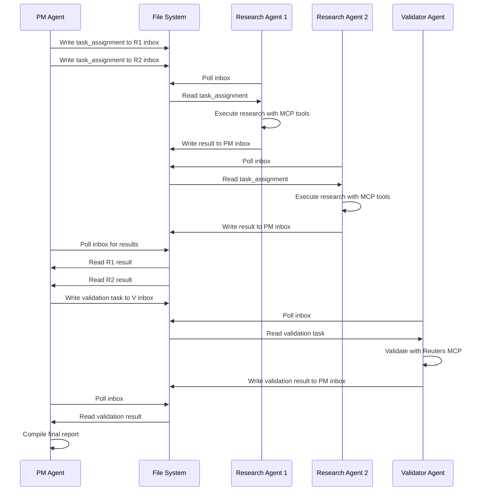

# 5. API Specification

Based on the file-based messaging architecture, this section defines the "API" as the file system message protocol between agents.

## File-Based Message Protocol

**Message Directory Structure:**
```yaml
messages/
├── inbox/                      # Incoming messages for agents
│   ├── pm-agent/              # PM Agent inbox
│   ├── research-agent-1/      # Research Agent 1 inbox
│   ├── research-agent-2/      # Research Agent 2 inbox
│   └── validator-agent/       # Validator inbox
├── outbox/                    # Processed messages (archive)
│   └── {date}/               # Daily archives
├── broadcast/                 # Broadcast messages to all agents
└── dead-letter/              # Failed messages for retry
```

**Message File Format:**
```yaml
# Filename: {timestamp}_{from_agent}_{to_agent}_{message_id}.json
# Example: 20250921_143022_pm-agent_research-agent-1_uuid123.json
```

## Message Type Specifications

**Task Assignment Message:**
```python
class TaskAssignmentMessage(BaseModel):
    message_id: str
    timestamp: datetime
    from_agent: Literal["pm-agent"]
    to_agent: str  # Target research or validator agent
    message_type: Literal["task_assignment"]
    priority: int = Field(ge=1, le=5)
    correlation_id: Optional[str] = None
    payload: TaskAssignment
```

**Research Result Message:**
```python
class ResearchResultMessage(BaseModel):
    message_id: str
    timestamp: datetime
    from_agent: str  # Research agent ID
    to_agent: Literal["pm-agent"]
    message_type: Literal["result"]
    priority: int = Field(ge=1, le=5)
    correlation_id: str  # References original task
    payload: ResearchResult
```

## Message Flow Sequences


