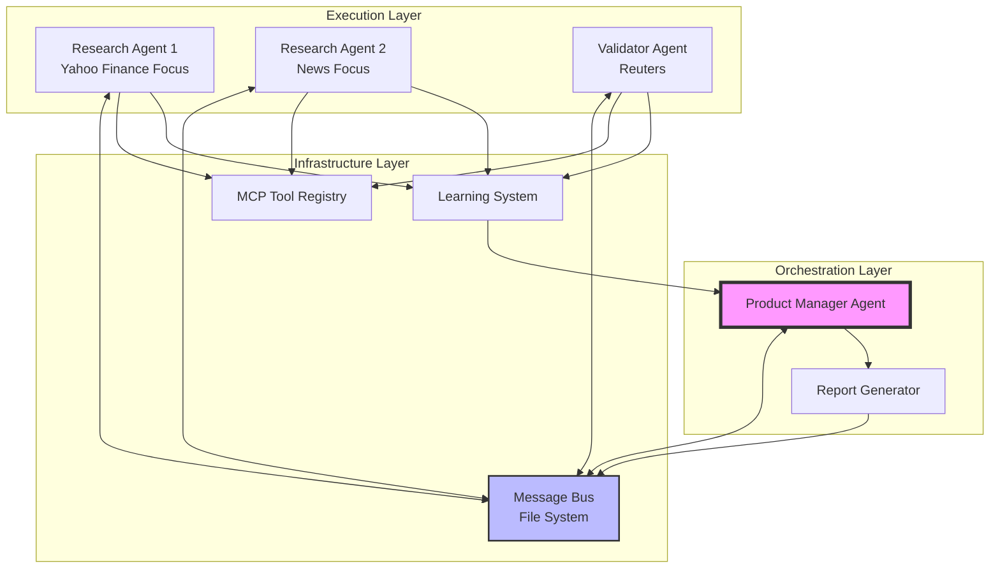

# 6. Components

## Product Manager Agent (BMAD/Node.js)

**Responsibility:** Orchestrates all agent activities, distributes research tasks, aggregates results, and compiles final reports using BMAD framework with Claude Opus model for complex decision-making.

**Key Interfaces:**
- Task distribution via file system messages to research agents
- Result aggregation from research and validation agents
- Report generation to docs/reports/ directory
- Status monitoring of all agent activities

**Dependencies:** BMAD framework, Claude Opus API, File system access, Pydantic models (via JSON)

**Technology Stack:** Node.js 20.x, BMAD framework, Claude Opus model, JSON file I/O

## Research Agent Core (Python/mcp-use)

**Responsibility:** Base implementation for research agents that loads MCP tools dynamically, executes financial data queries, and reports findings with confidence scores.

**Key Interfaces:**
- Message polling from file system inbox
- MCP tool loading and execution via mcp-use
- Result reporting with Pydantic validation
- Error logging to agent-specific directories

**Dependencies:** mcp-use library, LangChain Anthropic, asyncio, Pydantic models, MCP tool configurations

**Technology Stack:** Python 3.11+, mcp-use 0.1.18, LangChain, Claude Sonnet, asyncio

## Research Agent 1 (Yahoo Finance Focus)

**Responsibility:** Specializes in market price data and technical indicators from Yahoo Finance, with supplementary news from Google News.

**Key Interfaces:**
- Inherits from Research Agent Core
- Primary: Yahoo Finance MCP tools
- Secondary: Google News MCP tools
- Custom query strategies for FX pairs

**Dependencies:** Research Agent Core, Yahoo Finance MCP config, Google News MCP config

## Research Agent 2 (News Focus)

**Responsibility:** Specializes in news sentiment and central bank communications from Google News, with price validation from Yahoo Finance.

**Key Interfaces:**
- Inherits from Research Agent Core
- Primary: Google News MCP tools
- Secondary: Yahoo Finance MCP tools
- NLP for sentiment extraction

**Dependencies:** Research Agent Core, Google News MCP config, Yahoo Finance MCP config

## Validator Agent (Python/mcp-use)

**Responsibility:** Cross-references research findings against authoritative sources (Reuters), identifies conflicts, and provides resolution recommendations.

**Key Interfaces:**
- Message polling for validation tasks
- Reuters MCP tool access
- Conflict detection algorithms
- Validation result reporting

**Dependencies:** mcp-use library, Reuters MCP config, Conflict resolution logic, Research result parser

## Message Bus (File System)

**Responsibility:** Provides reliable, crash-resilient communication between all agents through structured file directories and atomic operations.

**Key Interfaces:**
- Inbox directories per agent
- Broadcast directory for system-wide messages
- Dead-letter queue for failed messages
- Archive system for processed messages

**Dependencies:** Operating system file system, File locking mechanisms

## MCP Tool Registry

**Responsibility:** Maintains registry of available MCP tools, tracks usage statistics, and manages essential tool lists per agent.

**Key Interfaces:**
- Tool discovery and registration
- Usage analytics logging
- Essential tool list management
- Cost tracking per tool usage

**Dependencies:** MCP tool configurations, Usage log storage

## Learning System Aggregator

**Responsibility:** Collects error logs from all agents, identifies patterns, and generates improvement recommendations for continuous system enhancement.

**Key Interfaces:**
- Error log collection from all agents
- Pattern detection algorithms
- Metrics calculation and trending
- Improvement report generation

**Dependencies:** Agent error logs, Statistical analysis libraries

## Component Interaction Diagram

